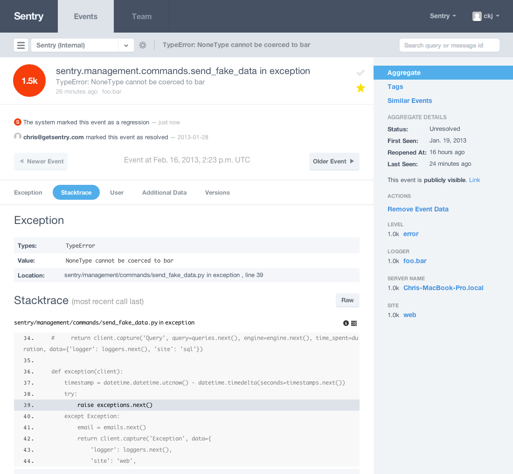

Sentry
======

Sentry is a modern error logging and aggregation platform.

It's important to note that Sentry should not be thought of as a log stream,
but as an aggregator. It fits somewhere in-between a simple metrics
solution (such as `Graphite <http://graphite.wikidot.com/>`_) and a full-on
log stream aggregator (like `Logstash <http://logstash.net/>`_).

Users Guide
-----------

.. toctree::
   :maxdepth: 2

   getting-started/index
   getting-started/nginx
   upgrading/index
   config/index
   queue/index
   buffer/index
   nodestore/index
   throttling/index
   tsdb/index
   inbound-mail/index
   beacon
   performance/index
   cli/index
   client/index
   plugins/index
   faq/index

Developers
----------

.. toctree::
   :maxdepth: 2

   contributing/index
   developer/client/index
   developer/plugins/index
   developer/interfaces/index

Internals
---------

.. toctree::
   :maxdepth: 1

   internals/options

Reference
---------

.. toctree::
   :maxdepth: 1

   changelog/index
   license/index

Resources
---------

* `Transifex <https://www.transifex.com/projects/p/sentry/>`_ (Translate Sentry!)
* `Bug Tracker <http://github.com/getsentry/sentry/issues>`_
* `Code <http://github.com/getsentry/sentry>`_
* `Mailing List <https://groups.google.com/group/getsentry>`_
* `IRC <irc://irc.freenode.net/sentry>`_  (irc.freenode.net, #sentry)

Screenshots
-----------

Aggregated Events
`````````````````

.. image:: images/group_list.png
   :alt: aggregated events

Event Details
`````````````


Deprecation Notes
-----------------

Milestones releases are 1.3 or 1.4, and our deprecation policy is to a two version step. For example,
a feature will be deprecated in 1.3, and completely removed in 1.4.
