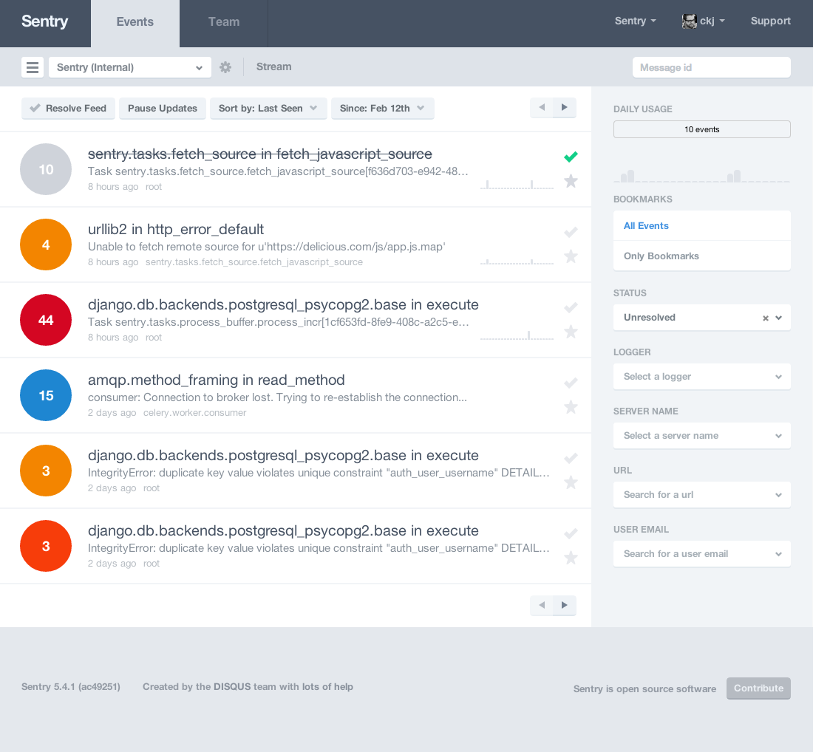

Sentry
======

Sentry is a realtime event logging and aggregation platform. At it's core it
specializes in monitoring errors and extracting all the information needed
to do a proper post-mortum without any of the hassle of the standard user
feedback loop.

Users Guide
-----------

.. toctree::
   :maxdepth: 2

   install/index
   config/index
   cli/index
   client/index
   interfaces/index
   plugins/index

Reference
---------

.. toctree::
   :maxdepth: 1

   contributing/index
   changelog/index
   license/index

Resources
---------

* `Bug Tracker <http://github.com/dcramer/sentry/issues>`_
* `Code <http://github.com/dcramer/sentry>`_
* `Mailing List <https://groups.google.com/group/disqus-opensource>`_
* `IRC <irc://irc.freenode.net/sentry>`_  (irc.freenode.net, #sentry)

Screenshots
-----------

Aggregated Events
`````````````````



Event Details
`````````````
.. image:: images/event.png
   :alt: event details

Deprecation Notes
-----------------

Milestones releases are 1.3 or 1.4, and our deprecation policy is to a two version step. For example,
a feature will be deprecated in 1.3, and completely removed in 1.4.
