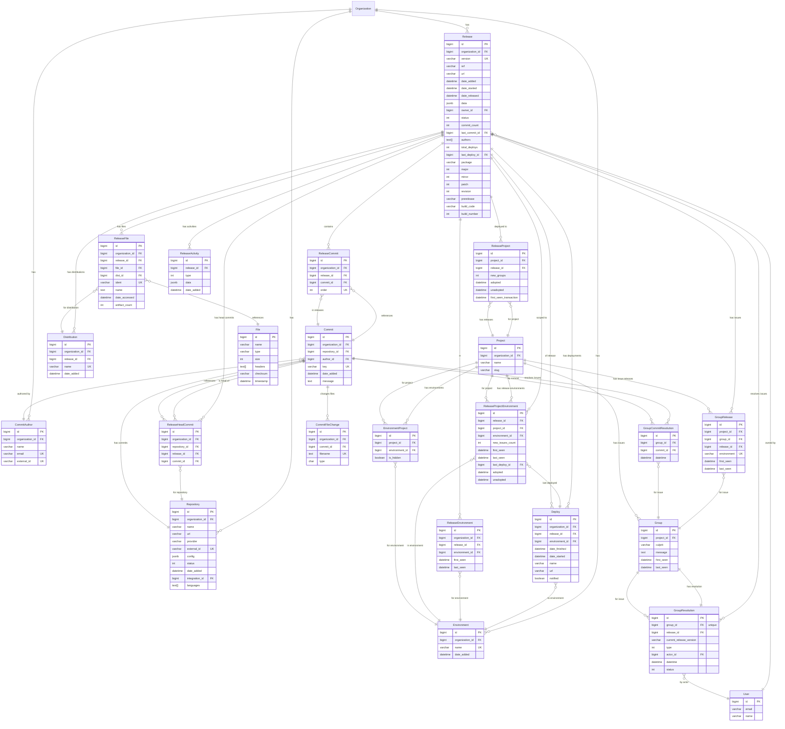

# Sentry Release & Deployment Data Model

## Entity Relationship Diagram



## Key Relationships Explained

### Release Scoping (Three Levels)

1. **Organization-Environment**: `ReleaseEnvironment` tracks release presence in environments at org level
2. **Project**: `ReleaseProject` tracks which projects use a release
3. **Project-Environment**: `ReleaseProjectEnvironment` tracks release adoption per project+environment combination

### Commit Tracking

- **ReleaseCommit**: Ordered list of all commits included in a release (many-to-many with ordering)
- **ReleaseHeadCommit**: Tracks the HEAD commit for each repository in a release (one per repo per release)

### Deployment Flow

```
Release → Deploy → Environment
         ↓
    ReleaseProjectEnvironment.last_deploy_id
```

### Issue Resolution

- **GroupRelease**: Tracks when issues first/last appear in a release
- **GroupResolution**: Marks issues as resolved in a specific release (or next release)
- **GroupCommitResolution**: Links specific commits that fix issues

### File Artifacts

- **ReleaseFile**: Source maps, debug symbols, etc.
- **Distribution**: Variants of a release (e.g., different app builds)
- Files can be scoped to specific distributions

## Materialized Statistics

The Release model maintains denormalized counters for performance:

- `commit_count`: Total commits in release
- `total_deploys`: Number of deployments
- `last_commit_id`: Most recent commit
- `last_deploy_id`: Most recent deployment
- `authors`: Array of commit author names

## Semantic Versioning Support

Releases store parsed semantic version components:

- `package`: Package name
- `major`, `minor`, `patch`, `revision`: Version numbers
- `prerelease`: Pre-release identifier (alpha, beta, rc)
- `build_code`, `build_number`: Build metadata

This enables efficient semver queries and comparisons.

## Adoption Lifecycle

Both `ReleaseProject` and `ReleaseProjectEnvironment` track:

- `adopted`: When release became active
- `unadopted`: When release was replaced

States:

- **ADOPTED**: Currently active release
- **LOW_ADOPTION**: Has been seen but not adopted
- **REPLACED**: Previously adopted, now superseded

## Unique Constraints

| Model                     | Unique Together                                            |
| ------------------------- | ---------------------------------------------------------- |
| Release                   | (organization_id, version)                                 |
| Repository                | (organization_id, provider, external_id)                   |
| Environment               | (organization_id, name)                                    |
| Commit                    | (repository_id, key)                                       |
| CommitAuthor              | (organization_id, email) OR (organization_id, external_id) |
| ReleaseProject            | (project_id, release_id)                                   |
| ReleaseCommit             | (release_id, commit_id) AND (release_id, order)            |
| ReleaseHeadCommit         | (repository_id, release_id)                                |
| ReleaseEnvironment        | (organization_id, release_id, environment_id)              |
| ReleaseProjectEnvironment | (project_id, release_id, environment_id)                   |
| Distribution              | (release_id, name)                                         |
| CommitFileChange          | (commit_id, filename)                                      |
| GroupRelease              | (group_id, release_id, environment)                        |
