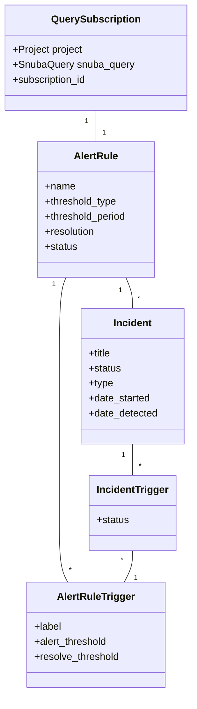
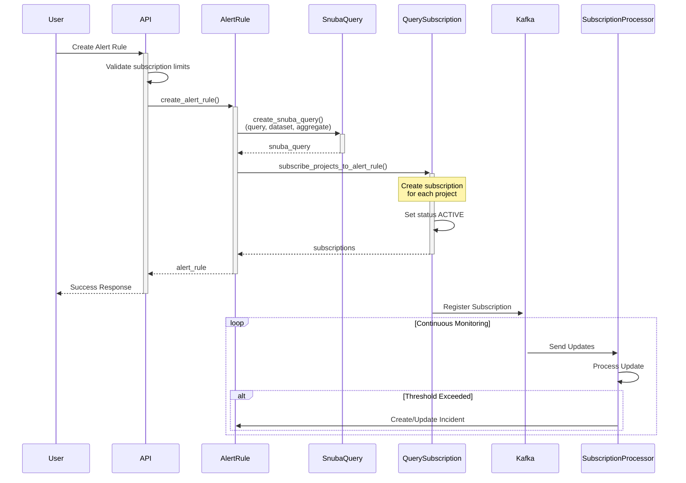
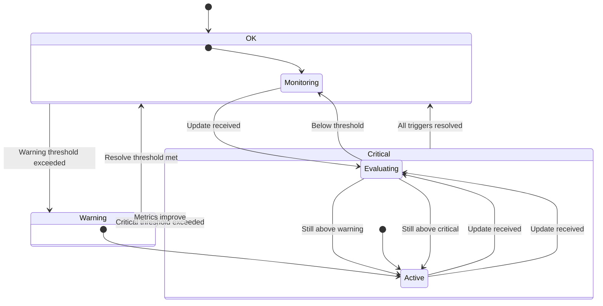

# Sentry Subscription System

This document provides a comprehensive overview of Sentry's subscription system, including component relationships, processing flow, and state management.

## 1. Core Components and Relationships

The following diagram shows the relationships between key components in Sentry's subscription and alerting system:



### Component Descriptions

#### QuerySubscription

- Represents a subscription to monitor specific metrics
- Links to a Project and contains a Snuba query for data collection
- Has a unique subscription ID for tracking

#### AlertRule

- Defines the conditions for triggering alerts
- Contains threshold types and evaluation periods
- Can have multiple triggers for different severity levels

#### AlertRuleTrigger

- Defines specific threshold levels (e.g., Warning/Critical)
- Contains alert and resolve thresholds
- Linked to an AlertRule

#### Incident

- Represents an active or resolved alert
- Contains metadata about when the incident started and was detected
- Tracks the current status of the alert

#### IncidentTrigger

- Links incidents to their triggering conditions
- Tracks the status of individual triggers within an incident

## 2. Subscription Creation Flow

The following diagram illustrates how subscriptions are created and processed:



### Flow Description

1. **User Initiates Alert Rule Creation**

   - User configures alert conditions through API
   - System validates organization hasn't exceeded subscription limits

2. **Alert Rule Creation**

   - Creates AlertRule object with threshold conditions
   - Initializes SnubaQuery for data collection
   - Sets up triggers and actions

3. **Subscription Setup**

   - Creates QuerySubscription for each project
   - Links subscriptions to SnubaQuery
   - Activates monitoring

4. **Monitoring Phase**
   - Kafka receives and sends metric updates
   - SubscriptionProcessor evaluates conditions
   - Triggers incidents when thresholds are exceeded

### Implementation Details

#### Subscription Creation Points

1. **Alert Rules (Primary Path)**

```python
create_alert_rule()
  -> subscribe_projects_to_alert_rule()
    -> bulk_create_snuba_subscriptions()
      -> create_snuba_subscription()
```

- Main entry point for subscription creation
- Creates subscriptions for all projects associated with the alert rule
- Handles subscription limits and validation

2. **Direct Creation**

- Available through `create_snuba_subscription()` in `src/sentry/snuba/subscriptions.py`
- Used for custom monitoring needs outside of alert rules

#### Subscription States

```python
class Status(Enum):
    ACTIVE = 0    # Subscription is active and monitoring
    CREATING = 1  # Initial creation in progress
    UPDATING = 2  # Changes being applied
    DELETING = 3  # Marked for deletion
    DISABLED = 4  # Temporarily disabled
```

#### Creation Process

1. **Database Creation**

```python
subscription = QuerySubscription.objects.create(
    status=QuerySubscription.Status.CREATING.value,
    project=project,
    snuba_query=snuba_query,
    type=subscription_type,
    query_extra=query_extra,
)
```

2. **Snuba Integration**

- Asynchronous creation via `create_subscription_in_snuba` task
- 5-second delay to ensure database consistency
- Updates subscription status to ACTIVE upon successful creation

3. **Error Handling**

- `subscription_checker` task monitors stuck subscriptions
- Automatically repairs subscriptions in transition states older than 10 minutes
- Retries failed creation/update/deletion operations

#### Subscription Processing

1. **SubscriptionProcessor**

- Handles incoming data from Snuba
- Maintains state about alert rules and triggers
- Determines when to create or update incidents

2. **Key Features**

- Supports multiple trigger thresholds (warning/critical)
- Handles incident creation and resolution
- Manages subscription state and updates

### Kafka Message Format

The subscription system uses Kafka messages to communicate query results and updates. Here's the detailed message format:

#### Message Wrapper Format

```json
{
    "version": 3,
    "payload": {
        "subscription_id": "<string>",
        "result": {
            "data": [{"<metric_name>": <value>}],
            "meta": [{"name": "<column_name>", "type": "<data_type>"}]
        },
        "request": {
            "query": "<snuba_query>",
            "some": "data"
        },
        "entity": "<entity_name>",
        "timestamp": "<ISO-8601 timestamp>"
    }
}
```

#### QuerySubscriptionUpdate Type

After parsing, messages are converted to a structured format:

```python
class QuerySubscriptionUpdate(TypedDict):
    entity: str                # The entity being queried (e.g. "metrics_counters")
    subscription_id: str       # Unique identifier for the subscription
    values: Any               # The query result data
    timestamp: datetime       # UTC timestamp of when the result was generated
```

#### Message Topics

Messages are routed to different Kafka topics based on the dataset:

- `events-subscription-results`
- `transactions-subscription-results`
- `generic-metrics-subscription-results`
- `metrics-subscription-results`
- `eap-spans-subscription-results`

#### Validation Requirements

- All required fields must be present (subscription_id, result, timestamp, entity)
- Version must match expected version (currently 3)
- Timestamps must be valid ISO-8601 format
- Messages are validated against schema using `sentry_kafka_schemas`

#### Processing Flow

1. `QuerySubscriptionConsumer` receives message
2. Message format is validated
3. Corresponding subscription is looked up
4. Subscription status is verified as active
5. Appropriate subscriber callback is called
6. Errors and metrics are tracked

#### Example Valid Message

```json
{
  "version": 3,
  "payload": {
    "subscription_id": "1234",
    "result": {
      "data": [{"hello": 50}],
      "meta": [{"name": "count", "type": "UInt64"}]
    },
    "request": {
      "some": "data",
      "query": "MATCH (metrics_counters) SELECT sum(value) AS value BY tags[3] WHERE org_id = 1 AND project_id IN tuple(1) AND metric_id = 16 AND tags[3] IN tuple(13, 4)"
    },
    "entity": "metrics_counters",
    "timestamp": "2020-01-01T01:23:45.1234"
  }
}
```

## 3. Alert State Management

The following diagram shows how alerts transition between different states:



### State Descriptions

#### OK State

- Default state for all monitored metrics
- Continuously monitors incoming data
- Transitions to Warning when warning threshold is exceeded
- Internal cycle of monitoring and evaluation

#### Warning State

- Indicates metric has exceeded warning threshold
- Can escalate to Critical if conditions worsen
- Can resolve back to OK if metrics improve
- Maintains active monitoring and evaluation

#### Critical State

- Highest severity state
- Triggered when critical threshold is exceeded
- Can improve to Warning state if metrics improve
- Can resolve directly to OK if all triggers are resolved

### Transition Rules

1. **State Escalation**

   - OK → Warning: Warning threshold exceeded
   - Warning → Critical: Critical threshold exceeded

2. **State Resolution**

   - Critical → Warning: Metrics improve but still above warning
   - Warning → OK: Metrics return to normal
   - Critical → OK: All trigger conditions resolve

3. **Internal State Cycles**
   - Each major state (OK/Warning/Critical) has its own evaluation cycle
   - Continuous monitoring and evaluation within each state
   - State changes only occur when thresholds are crossed

## 4. Current Scale and Concerns

### Database Statistics

- 74,910 QuerySubscriptions
- 288,420 SnubaQueries
- 196,943 SnubaQueryEventTypes

### Recommendations

1. **Cleanup and Maintenance**

   - Implement regular cleanup of orphaned SnubaQueries
   - Audit alert rules with snapshots
   - Review query sharing efficiency

2. **Monitoring**

   - Add monitoring for SnubaQuery:QuerySubscription ratio
   - Track query reuse metrics
   - Monitor cleanup job effectiveness

3. **Process Improvements**
   - Review alert rule creation logic
   - Enhance query deduplication
   - Optimize event type combinations
