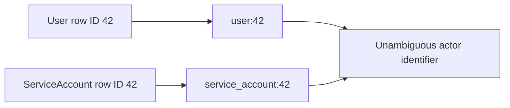
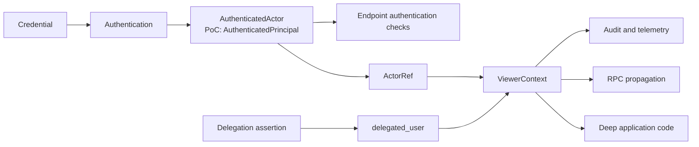
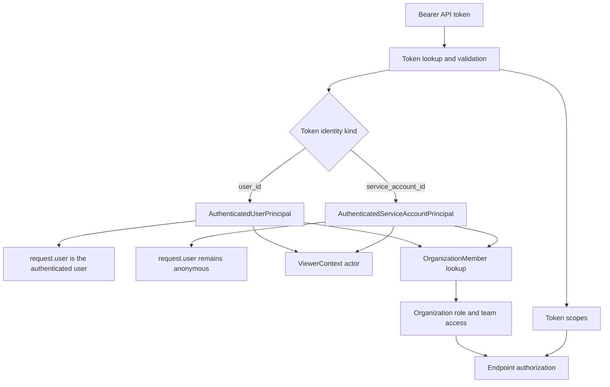
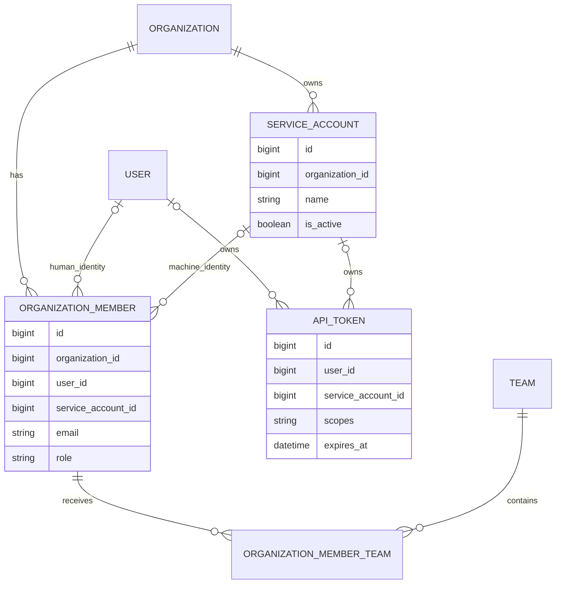
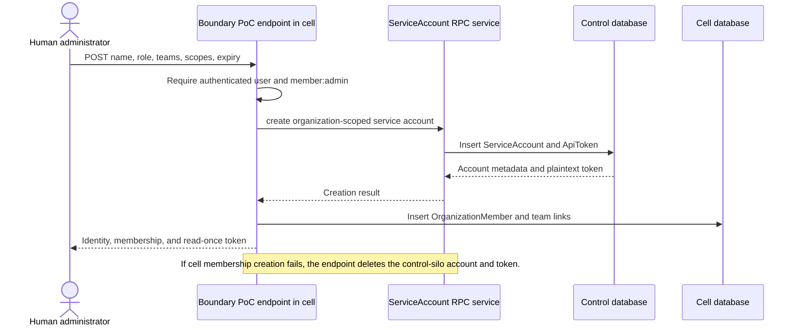
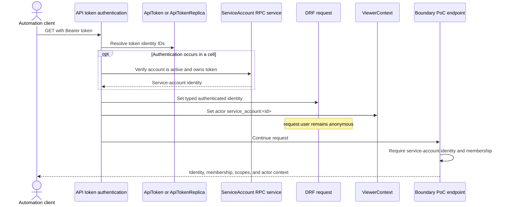
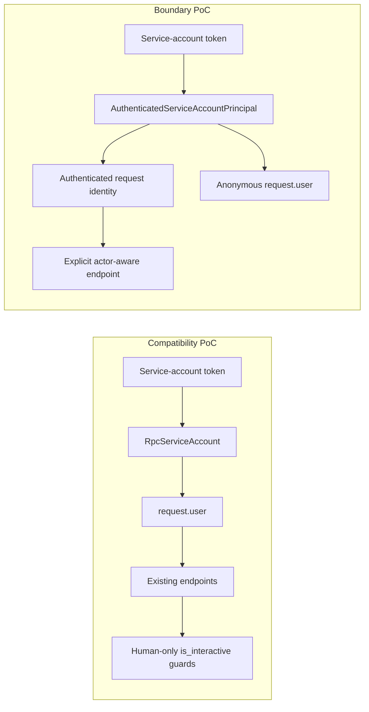
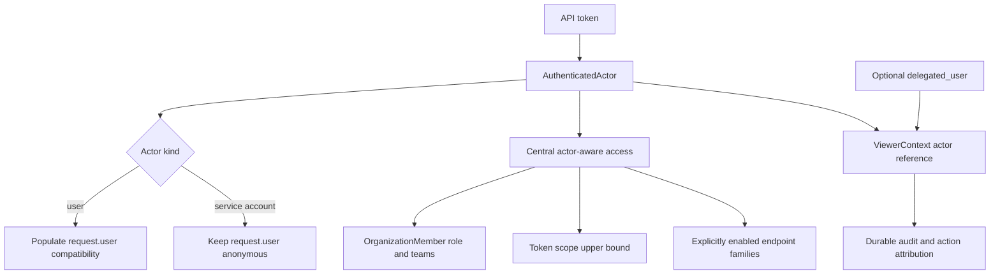

# Service Account Authenticated Identity Boundary Proof of Concept

| Field                     | Value                                                       |
| ------------------------- | ----------------------------------------------------------- |
| Status                    | Experimental proof of concept                               |
| Linear                    | ENG-8596                                                    |
| Branch                    | `feat/eng-8596-service-account-principals`                  |
| Date                      | September 15, 2026                                          |
| This experiment           | Authenticated Identity Boundary PoC                         |
| Implementation term       | `AuthenticatedPrincipal`                                    |
| Production recommendation | `ActorRef`, `AuthenticatedActor`, optional `delegated_user` |

## Summary

The earlier **Compatibility PoC** is sufficient to implement service accounts. It proves that
an organization-scoped, non-human identity can authenticate, hold an organization membership,
join teams, and receive ordinary Sentry permissions without being stored as a `User`.

This **Boundary PoC** tests a narrower architectural question: is it safer and less costly to
expand the semantic contract of `request.user` to include non-users, then defend that change
throughout the application, or to add one explicit boundary for the identity established by
authentication?

The central design choice is a typed **authenticated identity boundary**. The Boundary PoC
implements that boundary using security-domain “principal” terminology. Authentication validates
a credential, such as an API token, and produces one of these explicit implementation types:

- `AuthenticatedUserPrincipal`
- `AuthenticatedServiceAccountPrincipal`

Existing user authentication continues to populate `request.user`. Service-account
authentication deliberately leaves `request.user` anonymous and stores the service account in
the typed authenticated identity instead. Code that supports service accounts must therefore ask
for that identity rather than assuming every authenticated identity is a user.

The **Production Recommendation** is to call the abstraction
`AuthenticatedActor`, containing an `ActorRef`. “Principal” remains useful for describing the
Boundary PoC implementation and is a standard authentication term, but this proposal does not
require Sentry to adopt it as application-wide vocabulary.

Agent delegation remains a separate optional relationship: the agent stays the actor and the
represented user is carried as `delegated_user` without becoming an authorization source.

> **Recommendation:** use `ActorRef` and `AuthenticatedActor` in the production API. Do not
> introduce a separate application-wide principal concept. Treat the principal names on this
> branch as PoC implementation terminology.

## Names Used in This Document

| Name                      | Refers to                                                                                                 |
| ------------------------- | --------------------------------------------------------------------------------------------------------- |
| Compatibility PoC         | Earlier experiment at `6a9928ddc54`, using `ViewerActor` and an `RpcServiceAccount` compatibility bridge. |
| Boundary PoC              | This document's branch, `feat/eng-8596-service-account-principals`.                                       |
| Agent Delegation Proposal | Earlier “Non-user proxying auth” design introducing `actor` plus `delegated_user`.                        |
| Production Recommendation | `ActorRef`, `AuthenticatedActor`, and optional `delegated_user`.                                          |

This separates six concepts that have historically been easy to conflate:

| Concept             | Meaning in the Boundary PoC                                                     |
| ------------------- | ------------------------------------------------------------------------------- |
| Credential          | Secret presented by the caller, currently an API token.                         |
| Authenticated actor | Authentication invariant: the typed identity proven by authentication.          |
| Membership          | The identity's relationship to an organization, including role and teams.       |
| Actor reference     | Identity value: a typed reference to the entity responsible for an action.      |
| Delegated user      | Optional user context represented by a non-user actor; never authority itself.  |
| ViewerContext       | Context transport: ambient actor and tenancy data for the current unit of work. |

## “Principal” in the Boundary PoC

In authentication terminology, a principal is the answer to the question:

> **Which identity did Sentry authenticate for this request?**

It is not the token itself. A token is a credential owned by an identity. It is also not an
organization membership. A membership determines what the identity may do inside one
organization after it has been authenticated.

For example:

```text
Credential: Bearer sntryu_...
Principal:  service_account:481
Membership: organization 12, role "member", team "deploys"
Actor:      service_account:481
```

The Boundary PoC's implementation type definition is intentionally small:

```python
AuthenticatedPrincipal = AuthenticatedUserPrincipal | AuthenticatedServiceAccountPrincipal
```

Each implementation type exposes an `identifier` with both its type and database ID:

```text
user:42
service_account:42
```

The namespace is required because integer IDs are only unique within a model. A user and a
service account can both have ID `42`; the bare value `42` does not identify an actor without
also carrying its type.



## AuthenticatedActor, ActorRef, Delegated User, and ViewerContext

The Agent Delegation Proposal clarifies that delegation is a separate relationship rather than a
reason to replace the actual actor with a user. The recommended terms therefore separate four
responsibilities:

```text
AuthenticatedActor   Proof that authentication established an actor in this execution.
ActorRef             A namespaced identity value, such as service_account:481.
delegated_user       An optional user whose experience a non-user actor represents.
ViewerContext        Transport for actor, delegation, and tenancy information.
```

For a synchronous Seer agent request, the authenticated actor and actor identify the same agent;
the user is represented separately:

```text
authenticated actor = agent:abc
actor               = agent:abc
delegated_user      = user:42
```

The Boundary PoC names the authenticated wrapper `AuthenticatedPrincipal` and represents
`ActorRef` as separate kind and ID fields. `delegated_user` is proposed terminology rather than
an implemented field in either service-account PoC. Current agent-token behavior encodes that
relationship indirectly as `actor_type=AGENT` plus `user_id`.



The distinction between `AuthenticatedActor` and `ActorRef` is about guarantees, not usually
different identities. An `ActorRef` is not evidence that authentication occurred. Code can
construct one for an owner, assignee, system task, or integration without validating an external
credential. Likewise, `ViewerContext` can be propagated into a task or RPC after the original
credential and its scope restrictions are no longer present.

The recommended production shape is composition:

```python
@dataclass(frozen=True)
class ActorRef:
    kind: ActorKind
    id: int | str


@dataclass(frozen=True)
class UserRef:
    id: int


@dataclass(frozen=True)
class AuthenticatedActor:
    actor: ActorRef
    organization_id: int | None


@dataclass(frozen=True)
class ViewerContext:
    actor: ActorRef | None
    delegated_user: UserRef | None
    organization_id: int | None
    project_id: int | None
```

`delegated_user` may provide user-relative preferences, features, and transitional attribution,
but it must not independently grant authority. `Access` remains the authorization result built
from the delegating member's current authority, credential scopes, and organization boundary.

The Boundary PoC uses principal-named classes and stores `actor_type` and `actor_id` directly in
`ViewerContext`. That is sufficient to prove the authentication boundary and service-account
propagation. It does not mean the Production Recommendation uses those names or flattened fields.

Sentry's existing `sentry.types.actor.Actor` is not used for this purpose in the Boundary PoC. It
currently represents assignable users and teams and has broad owner, assignee, and
recipient usage. Expanding it into a general authentication actor would be a separate migration
with a substantially larger compatibility surface.

## What This Experiment Is Actually Testing

The two proofs of concept agree on most of the product and data model:

- `ServiceAccount` is a separate model rather than a special `User` row.
- `OrganizationMember` can belong to a user or a service account.
- Roles, teams, token scopes, lifecycle APIs, and audit work should be shared.

The disagreement is primarily where the authenticated identity enters application code.

```text
Compatibility PoC: credential -> ViewerActor -> request.actor
                                      └───────> RpcServiceAccount -> request.user compatibility
Boundary PoC:      credential -> AuthenticatedActor -> request.authenticated_actor
                                      └───────> ActorRef -> ViewerContext
```

The Compatibility PoC does not propose `request.user` as the long-term actor API. It makes
`request.actor` and `ViewerContext.actor` the preferred identity path, while broadening
`request.user` to hold `RpcServiceAccount` as a bridge for legacy call sites. That can be a valid
migration design, but it still changes the meaning of a mature interface. For example:

```python
if request.user.is_authenticated:
    obj.created_by_id = request.user.id
```

Historically, this implies that `request.user.id` is a real `User` ID. If a service-account
object can occupy `request.user`, the same code can store a service-account ID in a user field,
collide with an unrelated user that has the same numeric ID, violate a user foreign key, or
silently attribute the action to the wrong user.

User-compatible defaults such as `email = ""`, `has_2fa() == False`, or empty user roles have a
similar tradeoff: they increase compatibility, but can convert an obvious type error into valid
code with incorrect semantics. An `is_interactive` guard does not completely express the
distinction either. A human authenticating with an API token is still a human identity, while an
interactive or non-interactive execution mode is a separate property from identity kind.

The combined design keeps four concerns separate:

```text
identity value != authentication proof != user delegation != context transport
ActorRef          AuthenticatedActor        delegated_user     ViewerContext
```

- `ActorRef` identifies an entity with a namespaced kind and ID.
- `AuthenticatedActor` records that authentication established that identity for this request.
- `delegated_user` identifies the user experience represented by a non-user actor without
  becoming an authorization source.
- `ViewerContext` transports actor, delegation, and tenancy information to downstream code.

Agent delegation is orthogonal to the service-account comparison. Either PoC can adopt
`actor + delegated_user`; it does not require the authenticated actor and actor reference to
identify different entities. The reason to retain an authenticated wrapper is narrower: it
distinguishes an identity value from proof established at an authentication boundary.

This is not intended to create a second identity hierarchy. It is a small adapter at the
authentication boundary that makes non-user support explicit. The comparison is therefore:

| Approach                     | Default posture  | Main benefit                                             | Main risk or cost                                      |
| ---------------------------- | ---------------- | -------------------------------------------------------- | ------------------------------------------------------ |
| `request.user` compatibility | Allow by default | Existing endpoints work with fewer initial changes.      | User assumptions can silently accept the wrong entity. |
| Typed authenticated boundary | Deny by default  | Unsupported paths fail visibly and migrate deliberately. | Actor-aware authorization requires explicit adoption.  |

If the team chooses to redefine the request identity field to mean any authenticated entity,
that can still be sufficient. The safer version would be a typed `request.actor` or
`request.authenticated_actor`, rather than a duck-typed non-user stored in a user-named field.
At that point, the design is structurally close to the Boundary PoC; the remaining
difference is mostly naming and compatibility strategy.

## Architecture

The approach keeps authentication identity separate from organization authorization.



The important boundary is that authentication produces an `AuthenticatedActor`, while
authorization uses the actor's organization membership plus the credential's scopes. The Boundary
PoC implementation names that wrapper `AuthenticatedPrincipal`.

For the proof-of-concept endpoint, the reported effective scopes are:

```text
effective scopes = token scopes ∩ organization-member scopes
```

The experiment does not yet introduce a generalized authorization engine that applies this
intersection to every endpoint.

## Data Model

`ServiceAccount` is a control-silo model with an organization, name, active state, and one or
more API tokens. It is not a subclass, proxy, or special instance of `User`.

`OrganizationMember` is extended so that a membership can belong to either a user or a service
account. The existing role and team machinery can therefore be reused without making the
service account look like a person.



Database constraints encode the important invariants:

- An API token has exactly one owning identity: a user or a service account.
- An organization membership cannot reference both a user and a service account.
- A service-account membership does not have an invitation email.
- A service account has at most one membership in an organization.
- Service-account names are unique within an organization.

The service-account ID is also added to the API-token replica and organization-member mapping
so the identity can cross Sentry's control/cell boundary.

## Creating a Service Account

The private `POST` proof-of-concept endpoint is called by an authenticated human user with
`member:admin` access. It creates the control-silo identity and token first, then creates the
organization membership and team assignments in the cell.



The returned token is a credential for the new service-account identity. It is not a user token
that happens to be labelled as a bot.

## Authenticating as a Service Account

The authentication path recognizes an API token with `service_account_id`, verifies that the
account is active and belongs to the token, and constructs an
`AuthenticatedServiceAccountPrincipal`.



The Boundary PoC intentionally rejects service-account tokens on unrelated endpoints. This
contains the experiment and prevents existing endpoints from accidentally treating an anonymous
`request.user` as a fully supported machine identity.

## ViewerContext and Actor Identity

`ViewerContext` is the ambient context for the current unit of work. It lets deep application
code, audit helpers, task adapters, and hybrid-cloud RPC calls observe the responsible actor and
tenant without explicitly threading those values through every function call.

It is not proof that authentication occurred. A trusted request entrypoint can populate it from
an `AuthenticatedActor`, while a task, consumer, webhook, or system operation can establish a
context directly without an external credential.

`ViewerContext` previously carried a `user_id` and an actor type, which is insufficient for an
actor that is not a user. The Boundary PoC adds an independent `actor_id`.

For a human request:

```text
actor_type = user
actor_id   = 42
user_id    = 42
identifier = user:42
```

For a service-account request:

```text
actor_type = service_account
actor_id   = 481
user_id    = null
identifier = service_account:481
```

Keeping `actor_id` separate from `user_id` avoids making every actor pretend to be a user while
still providing one consistent identity for telemetry, auditing, background work, and future RPC
propagation.

In the Boundary PoC, the authenticated identity and actor reference identify the same
entity. The Boundary PoC implementation calls the former a principal:

```text
authenticated identity = service_account:481
ViewerContext actor     = service_account:481
```

The Agent Delegation Proposal keeps the same invariant for synchronous Seer work and represents
the user separately:

```text
authenticated identity = agent:abc
ViewerContext actor     = agent:abc
delegated_user          = user:42
```

The authenticated wrapper and actor reference become different states when identity is propagated
without the original credential. A task may retain:

```text
authenticated identity = none
ViewerContext actor     = agent:abc
delegated_user          = user:42
```

For that reason, endpoint authentication should read `request.authenticated_actor` in the
recommended design. It should not infer authentication from the presence of a `ViewerContext`
actor or `delegated_user`. The Boundary PoC uses its principal-named request helper for this
purpose.

## Why Not Expose the Service Account Through `request.user`?

Both proofs of concept use a separate `ServiceAccount` model. The difference is whether its
authenticated representation should implement enough of the user interface to occupy
`request.user`.

| Typed authenticated boundary                                                                  | User-compatible authenticated object                                                 |
| --------------------------------------------------------------------------------------------- | ------------------------------------------------------------------------------------ |
| Does not require fake email, password, profile, or person semantics.                          | Reuses code that already assumes every identity is a user.                           |
| Makes unsupported call sites fail visibly instead of silently acting like a human.            | Can reach broader endpoint compatibility sooner.                                     |
| Allows service-account lifecycle and policy to evolve independently.                          | Inherits user lifecycle, uniqueness, suspension, and profile behavior.               |
| Preserves the meaning of `request.user`.                                                      | Minimizes initial changes to middleware and permission code.                         |
| Requires actor-aware changes across authentication, authorization, audit, and RPC boundaries. | Risks long-term ambiguity about whether a “user” is a person or automation.          |
| Exposes migration work early, which is useful for sizing the real implementation.             | May defer migration cost but spread service-account exceptions throughout user code. |

The Boundary PoC is designed to measure whether the additional explicitness is worth the
compatibility work, not to claim that all endpoint migration has already been solved.

## Comparison Between the PoCs

The Compatibility PoC baseline is
[`6a9928ddc54`](https://github.com/getsentry/sentry/commit/6a9928ddc54bddee1b1bb9097bceaf20ad3dc93d),
created on August 28, 2026. It uses the same separate `ServiceAccount` model but makes
`RpcServiceAccount` implement enough of the user interface to become `request.user`.

The Boundary PoC was based on `acca281e47c` from September 11, 2026. The branches therefore have
different baselines, and the Compatibility PoC deliberately implements far more product behavior.
Raw size is useful for understanding migration surface but is not a feature-for-feature
productivity comparison.



### Quantitative Scope

| Measurement                                    | Compatibility PoC |                Boundary PoC |
| ---------------------------------------------- | ----------------: | --------------------------: |
| Total changed files                            |               162 | 33, including this document |
| Insertions and deletions                       |     +5,653 / -329 |                +1,559 / -25 |
| Implementation changes excluding this document |     +5,653 / -329 |                +1,132 / -25 |
| Files under `src/`                             |               116 |                          29 |
| Test files                                     |                38 |                           2 |
| Frontend files                                 |                 7 |                           0 |
| Files common to both approaches                |                26 |                          26 |
| Approach-specific files                        |               136 |                           7 |

The 26 common files are primarily the schema, migrations, service-account RPC, token replication,
organization-member mapping, authentication plumbing, fixtures, backups, and ViewerContext.
This indicates that most persistence and hybrid-cloud work is required regardless of how the
authenticated identity is exposed to application code.

The Compatibility PoC adds `is_interactive` references in 56 source files and direct
service-account branching in approximately 50 source files. This buys substantial endpoint
coverage, but it also demonstrates the compatibility surface created by placing a non-user object
in `request.user`.

### Comparison by Ticket Criterion

| Criterion                                       | Compatibility PoC                                                                                                                                                                                                                                                                                     | Boundary PoC                                                                                                                                                                                                                                                 | Assessment                                                                                                                                                                                                           |
| ----------------------------------------------- | ----------------------------------------------------------------------------------------------------------------------------------------------------------------------------------------------------------------------------------------------------------------------------------------------------- | ------------------------------------------------------------------------------------------------------------------------------------------------------------------------------------------------------------------------------------------------------------ | -------------------------------------------------------------------------------------------------------------------------------------------------------------------------------------------------------------------- |
| Schema and migration complexity                 | Adds `ServiceAccount`, nullable service-account ownership to `OrganizationMember`, `OrganizationMemberMapping`, `ApiToken`, and `ApiTokenReplica`, plus exclusivity constraints and a mapping index.                                                                                                  | Uses essentially the same schema. It additionally prevents service-account memberships from carrying invitation email state.                                                                                                                                 | The core schema cost is nearly identical and does not decide between the approaches. The Boundary PoC has a slightly stronger membership invariant; the Compatibility PoC has an additional composite mapping index. |
| Number of files and call sites                  | 162 files because it implements management APIs, UI, lifecycle operations, broad endpoint compatibility, durable attribution, and extensive tests.                                                                                                                                                    | 33 files because it intentionally enables only one private endpoint and no UI.                                                                                                                                                                               | The large difference primarily measures feature breadth. However, the 56 files requiring new `is_interactive` handling are direct evidence of user-emulation migration cost.                                         |
| Authentication and permission-layer complexity  | Authentication creates a typed `ViewerActor` exposed through `request.actor`, while also returning `RpcServiceAccount` through `request.user` as a compatibility bridge. `AuthenticatedToken` carries actor type and ID. Central `auth.access` resolves membership and caps access with token scopes. | Authentication returns an explicit service-account identity while leaving `request.user` anonymous. Its endpoint uses `require_user_principal` and `require_service_account_principal`. It has not integrated the typed identity into central `auth.access`. | The Boundary PoC isolates authentication proof more explicitly. The Compatibility PoC has a more complete actor-aware request and authorization path. The Production Recommendation should combine these properties. |
| Compatibility with existing user-only endpoints | High compatibility. Service accounts can use representative organization, project, team, issue, dashboard, discover, and explore paths after targeted changes.                                                                                                                                        | Deliberately rejects service-account tokens on every unrelated endpoint.                                                                                                                                                                                     | The Compatibility PoC proves utility sooner. The Boundary PoC makes unsupported behavior explicit and avoids accidentally entering user-only paths.                                                                  |
| Organization role, teams, and token scopes      | Uses the ordinary access layer. Tests demonstrate team-limited projects, open membership, scope-based write denial, team creation, and project creation.                                                                                                                                              | Creates ordinary membership and team rows and reports token scopes, member scopes, and their intersection. Central endpoint authorization is not yet derived from that intersection.                                                                         | The Compatibility PoC meets this requirement more completely. The Boundary PoC still needs actor-aware integration with `auth.access`.                                                                               |
| Audit and activity attribution                  | Adds a typed `ViewerActor`, writes service-account type and ID into audit data, leaves the user foreign key empty, and adds service-account action-log attribution for issue changes.                                                                                                                 | Propagates a namespaced actor through ViewerContext and exposes it from the inspection endpoint, but does not write a durable audit or activity record.                                                                                                      | The Compatibility PoC is stronger. Durable attribution remains an acceptance gap in the Boundary PoC.                                                                                                                |
| Hybrid-cloud ownership and replication          | Control-silo account and tokens, cell membership, token replica, organization-member mapping, actor-aware organization RPC context, and stale-replica lifecycle tests.                                                                                                                                | Same fundamental control/cell ownership and token replication. It revalidates the account and token through the service-account RPC but does not propagate the authenticated identity through the organization access RPC.                                   | Persistence topology is aligned. The Compatibility PoC has more complete cross-silo authorization and lifecycle coverage.                                                                                            |
| Creation, deletion, and failure recovery        | Creation uses compensating deletion if cell membership creation fails. It implements update, disable, token rotation, revocation, and deletion. Updates and deletion span control and cell writes without a distributed transaction, so later failures can still leave partial state.                 | Creation uses the same compensating deletion pattern. The RPC has deletion support, but the private endpoint does not expose lifecycle operations.                                                                                                           | Both need an outbox or explicit reconciliation strategy for production. The Compatibility PoC exercises more failure modes; neither makes multi-silo lifecycle atomic.                                               |
| Risk of entering human workflows                | Higher inherent risk because `RpcServiceAccount` implements user-like properties such as `is_authenticated`, `email`, `has_2fa`, and `get_username`, and is placed in `request.user`. The Compatibility PoC adds `is_interactive` guards and tests representative personal workflows.                 | Lower default risk because `request.user` stays anonymous and endpoints must explicitly accept a service-account authenticated identity.                                                                                                                     | The Boundary PoC is safer for SSO, SCIM, email, 2FA, notification, merge, and account-settings boundaries. Its cost is explicit endpoint migration.                                                                  |
| Incremental rollout and maintenance             | Can deliver broad compatibility quickly behind one feature flag, but long-term correctness depends on finding and maintaining every user-only assumption and compatibility guard.                                                                                                                     | Can roll out endpoint families explicitly and centralize human-only rejection, but initially supports little existing functionality.                                                                                                                         | Prefer explicit capability rollout over global user emulation. Add central actor-aware authorization to avoid duplicating membership logic per endpoint.                                                             |

### Acceptance Criteria Status

| Acceptance criterion                                                  | Status                            | Evidence or remaining work                                                                                                      |
| --------------------------------------------------------------------- | --------------------------------- | ------------------------------------------------------------------------------------------------------------------------------- |
| Experimental branch is based on current `origin/master`               | Met for the experiment baseline   | Based on `acca281e47c` from September 11, 2026.                                                                                 |
| User and service-account identities are statically distinguishable    | Met                               | The Boundary PoC's `AuthenticatedPrincipal` union has distinct user and service-account dataclasses.                            |
| Actor identifiers are namespaced and round-trip through serialization | Partial                           | Namespaced identifiers and ViewerContext serialization exist. Add a dedicated service-account serialization round-trip test.    |
| A service-account token authenticates without a synthetic `User`      | Met                               | Authentication leaves `request.user` anonymous and sets the typed authenticated identity.                                       |
| Effective access is bounded by membership and credential scopes       | Partial                           | The endpoint reports the intersection and rejects every other endpoint, but central access enforcement has not been integrated. |
| A human-only action rejects through a shared identity helper          | Met, with a test gap              | `POST` uses the Boundary PoC's `require_user_principal` helper; add a sufficiently scoped service-account token test.           |
| A durable action preserves typed service-account attribution          | Not met                           | ViewerContext propagation is demonstrated, but no audit, activity, or action-log record is written.                             |
| Human authentication uses the Boundary PoC's typed boundary           | Met for the Boundary PoC endpoint | Authenticated users are wrapped as `AuthenticatedUserPrincipal`; broad endpoint migration is outside the Boundary PoC.          |
| Findings compare both PoCs and recommend a production direction       | Met by this document              | The Production Recommendation follows below.                                                                                    |

The ticket should remain in progress until the partial and unmet items that materially affect the
architecture have either been implemented or explicitly removed from the experiment's acceptance
criteria.

### Recommended Production Direction

Use the Compatibility PoC's product and authorization work with the smallest
useful typed authentication boundary. This document recommends actor terminology for the
production API: `ActorRef` for the identity value and `AuthenticatedActor` for the authenticated
wrapper. The principal names remain an implementation detail of the Boundary PoC.

```python
@dataclass(frozen=True)
class ActorRef:
    kind: ActorKind
    id: int | str


@dataclass(frozen=True)
class UserRef:
    id: int


@dataclass(frozen=True)
class AuthenticatedActor:
    actor: ActorRef
    organization_id: int | None


@dataclass(frozen=True)
class ViewerContext:
    actor: ActorRef | None
    delegated_user: UserRef | None
    organization_id: int | None
    project_id: int | None
```

Then:

1. Keep the shared separate-model schema: organization-owned `ServiceAccount`, ordinary
   `OrganizationMember`, and exactly-one-identity `ApiToken` ownership.
2. Keep `request.user` reserved for humans and place the authenticated identity in
   `request.authenticated_actor`.
3. Adapt the Compatibility PoC's central `auth.access` work to accept `AuthenticatedActor` and
   resolve role, team access, and token-scope narrowing in one place.
4. Carry the same `ActorRef` in `ViewerContext`; it transports identity and tenancy context but
   does not itself prove authentication.
5. Adopt the Agent Delegation Proposal's optional `delegated_user` for agents acting on behalf of
   a user. It may provide user-relative context but must not grant authority or replace the actor.
6. Add centralized endpoint capabilities such as `requires_user` or
   `allows_service_account`, backed by shared authenticated-identity helpers, instead of
   scattering `getattr(request.user, "is_interactive", ...)` guards.
7. Reuse the Compatibility PoC's management API, lifecycle service methods, UI, stale-replica
   validation, and broader behavioral test matrix after the authentication boundary is changed.
8. Store durable attribution as actor type and actor ID, plus delegated user where applicable,
   while retaining nullable legacy user foreign keys during migration.
9. Use outbox-driven or reconciled cross-silo lifecycle operations before production rollout.



This direction preserves the Compatibility PoC's strongest result—ordinary Sentry permissions
can work for service accounts—while limiting the new abstraction to an authenticated identity
wrapper and a shared namespaced actor value. It does not require a parallel identity system or a
broad “principal” vocabulary migration.

### Remaining Experiments

To complete the architectural comparison rather than only the minimal authentication demo:

1. Integrate the Boundary PoC's `AuthenticatedPrincipal` implementation with `auth.access` and enable
   one representative project listing endpoint.
2. Demonstrate that team membership and token scopes jointly limit that endpoint.
3. Add one human-only endpoint test where a sufficiently scoped service-account token reaches the
   shared `require_user_principal` rejection.
4. Write one durable audit or action-log record using the namespaced service-account actor.
5. Add an agent `actor + delegated_user` propagation test proving that delegated user context does
   not restore user authentication or bypass `Access`.
6. Add ViewerContext serialization round-trip and stale-token-replica tests.
7. Recalculate the diff after those shared capabilities are present; that will be a more useful
   estimate of architectural overhead than the Boundary PoC's raw branch-size comparison.

## Boundary PoC Scope

Implemented:

- A control-silo `ServiceAccount` model and RPC service.
- User-or-service-account ownership for `ApiToken`.
- User-or-service-account ownership for `OrganizationMember`.
- Hybrid-cloud token replication and organization-member mapping.
- Typed authenticated user and service-account identity classes, currently named principals.
- Namespaced actor identifiers.
- Service-account propagation through `ViewerContext`.
- A feature-gated private endpoint for creation and self-inspection.
- Organization roles, team membership, token scopes, expiry, and active-state checks.

Deliberately not solved yet:

- General service-account support across existing API endpoints.
- A common actor-aware permission interface for all endpoints.
- UI, token rotation, token listing, revocation workflows, or lifecycle management.
- Audit-log schema and display changes for non-user actors.
- Generalized authenticated-identity propagation across every RPC, task, and event boundary.
- Replacement of flattened ViewerContext actor fields with a shared actor-reference value.
- Explicit `delegated_user` representation for agent requests and propagation.
- Unification with or migration of Sentry's existing user/team `Actor` abstraction.
- Multiple non-human actor types beyond service accounts.
- Replacement of the reused user-token classification with a dedicated token classification.
- Backward-compatible behavior for code that directly assumes `request.user` is authenticated.

## Questions This Experiment Should Answer

1. How many important authentication and authorization paths require `request.user` rather than
   a general authenticated actor?
2. Can organization roles and team membership be reused cleanly without user semantics leaking
   into service accounts?
3. Is a namespaced actor identifier sufficient for audit logs, RPCs, tasks, and telemetry, or do
   those systems need a richer structured actor object?
4. How should `actor + delegated_user` propagate without restoring user authentication or
   bypassing `Access`?
5. Where should compatibility adapters exist during a gradual endpoint migration?
6. Does explicit failure on unsupported endpoints produce a safer migration than making service
   accounts user-compatible from the beginning?
7. What additional cross-silo lifecycle and consistency behavior is required for production?
8. How does the total implementation and migration cost compare with the Compatibility PoC?

## Implementation Map

| Area                                        | File                                                                            |
| ------------------------------------------- | ------------------------------------------------------------------------------- |
| Boundary PoC authenticated identity helpers | `src/sentry/auth/principal.py`                                                  |
| Token authentication                        | `src/sentry/api/authentication.py`                                              |
| Viewer actor representation                 | `src/sentry/viewer_context.py`                                                  |
| Request ViewerContext middleware            | `src/sentry/middleware/viewer_context.py`                                       |
| Service-account model                       | `src/sentry/models/serviceaccount.py`                                           |
| Organization membership                     | `src/sentry/models/organizationmember.py`                                       |
| API-token ownership                         | `src/sentry/models/apitoken.py`                                                 |
| Service-account RPC                         | `src/sentry/auth/services/service_account/`                                     |
| Private experiment endpoint                 | `src/sentry/api/endpoints/organization_service_account_principal_poc.py`        |
| Endpoint integration test                   | `tests/sentry/api/endpoints/test_organization_service_account_principal_poc.py` |
| Authenticated identity test                 | `tests/sentry/auth/test_principal.py`                                           |
