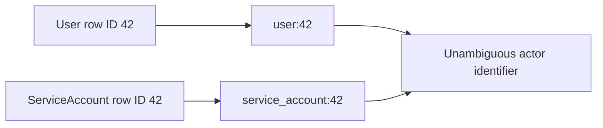
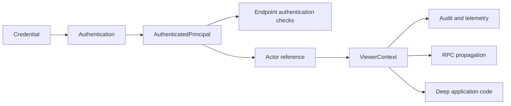
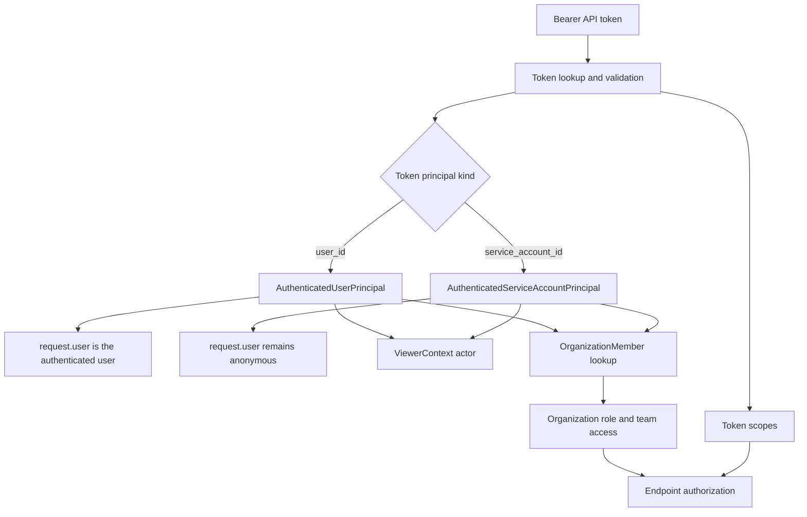
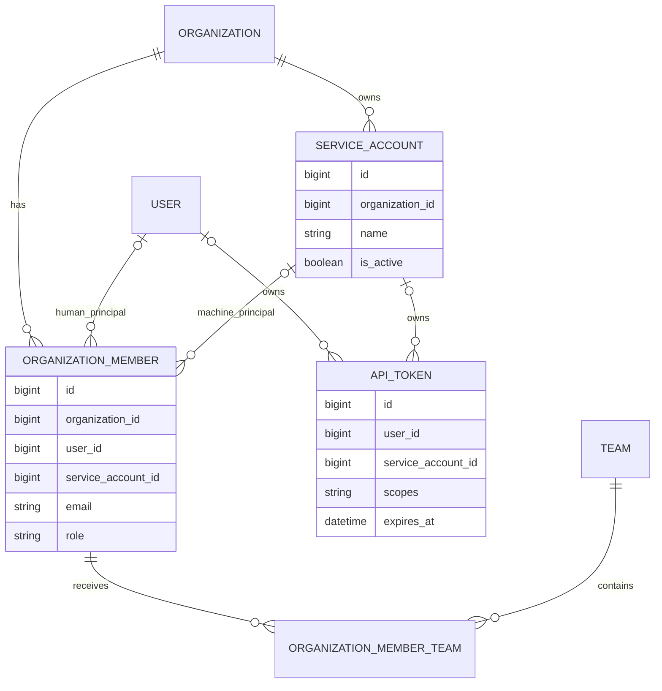
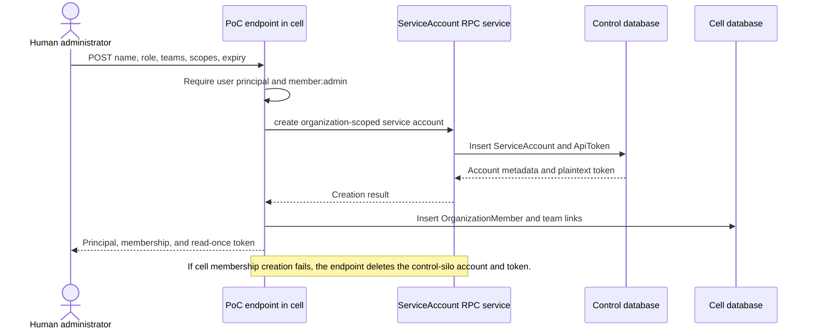
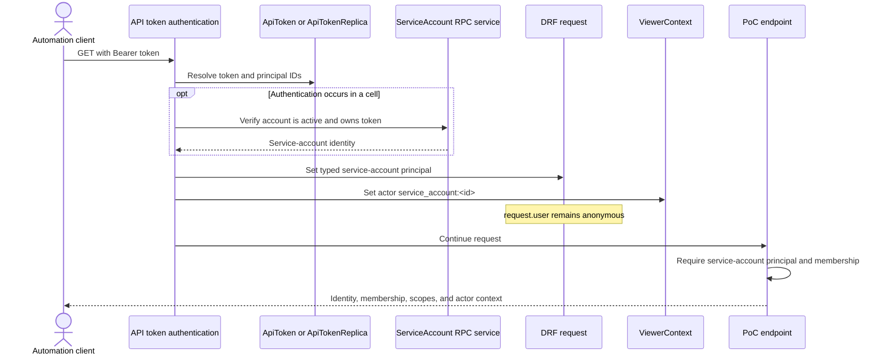

# Service Account Authenticated Principals Proof of Concept

| Field  | Value                                      |
| ------ | ------------------------------------------ |
| Status | Experimental proof of concept              |
| Linear | ENG-8596                                   |
| Branch | `feat/eng-8596-service-account-principals` |
| Date   | September 14, 2026                         |

## Summary

This proof of concept models a service account as an organization-scoped, non-human identity
that can authenticate, hold an organization membership, join teams, and receive permissions
without also being a Sentry `User`.

The central design choice is to introduce a typed **authenticated principal** abstraction.
Authentication validates a credential, such as an API token, and produces one of these explicit
identity types:

- `AuthenticatedUserPrincipal`
- `AuthenticatedServiceAccountPrincipal`

Existing user authentication continues to populate `request.user`. Service-account
authentication deliberately leaves `request.user` anonymous and stores the service account in
the typed principal instead. Code that supports service accounts must therefore ask for the
authenticated principal rather than assuming every authenticated identity is a user.

This separates four concepts that have historically been easy to conflate:

| Concept       | Meaning in this proof of concept                                              |
| ------------- | ----------------------------------------------------------------------------- |
| Credential    | Secret presented by the caller, currently an API token.                       |
| Principal     | The typed identity proven by successful authentication.                       |
| Membership    | The principal's relationship to an organization, including role and teams.    |
| Actor         | A typed reference to an entity responsible for or participating in an action. |
| ViewerContext | Ambient actor and tenancy information for the current unit of work.           |

## What “Principal” Means

A principal is the answer to the question:

> **Which identity did Sentry authenticate for this request?**

It is not the token itself. A token is a credential owned by a principal. It is also not an
organization membership. A membership determines what a principal may do inside one
organization after the principal has been authenticated.

For example:

```text
Credential: Bearer sntryu_...
Principal:  service_account:481
Membership: organization 12, role "member", team "deploys"
Actor:      service_account:481
```

The current type definition is intentionally small:

```python
AuthenticatedPrincipal = AuthenticatedUserPrincipal | AuthenticatedServiceAccountPrincipal
```

Each principal exposes an `identifier` with both its type and database ID:

```text
user:42
service_account:42
```

The namespace is required because integer IDs are only unique within a model. A user and a
service account can both have ID `42`; the bare value `42` does not identify an actor without
also carrying its type.



## Principal, Actor, and ViewerContext

These concepts overlap in the simplest request, but they are not interchangeable:

```text
Principal       The identity established by authentication.
Actor           A namespaced reference to an entity, such as service_account:481.
ViewerContext   The ambient execution context carrying actor and tenancy information.
```

Authentication produces the principal. The principal can be projected to an actor reference,
and that actor reference can be carried in `ViewerContext`:



The distinction matters because an actor reference is not evidence that authentication
occurred. Code can construct an actor for an owner, assignee, system task, or integration
without validating an external credential. Likewise, `ViewerContext` can be established by
non-request entrypoints such as tasks and consumers.

The likely production shape is composition rather than replacing the principal with
`ViewerContext`:

```python
@dataclass(frozen=True)
class ActorRef:
    kind: ActorKind
    id: int


@dataclass(frozen=True)
class AuthenticatedPrincipal:
    actor: ActorRef
    organization_id: int | None
    display_name: str


@dataclass(frozen=True)
class ViewerContext:
    actor: ActorRef | None
    organization_id: int | None
    project_id: int | None
```

The current proof of concept uses `actor_type` and `actor_id` directly in `ViewerContext` rather
than introducing `ActorRef`. That is sufficient to prove non-user propagation while keeping the
experiment focused. It does not commit the production design to keeping those flattened fields.

Sentry's existing `sentry.types.actor.Actor` is not used for this purpose in the proof of
concept. It currently represents assignable users and teams and has broad owner, assignee, and
recipient usage. Expanding it into a general authentication actor would be a separate migration
with a substantially larger compatibility surface.

## Architecture

The approach keeps authentication identity separate from organization authorization.



The important boundary is that authentication produces a principal, while authorization uses
the principal's membership plus the credential's scopes.

For the proof-of-concept endpoint, the reported effective scopes are:

```text
effective scopes = token scopes ∩ organization-member scopes
```

The experiment does not yet introduce a generalized authorization engine that applies this
intersection to every endpoint.

## Data Model

`ServiceAccount` is a control-silo model with an organization, name, active state, and one or
more API tokens. It is not a subclass, proxy, or special instance of `User`.

`OrganizationMember` is extended so that a membership can belong to either a user or a service
account. The existing role and team machinery can therefore be reused without making the
service account look like a person.



Database constraints encode the important invariants:

- An API token has exactly one principal: a user or a service account.
- An organization membership cannot reference both a user and a service account.
- A service-account membership does not have an invitation email.
- A service account has at most one membership in an organization.
- Service-account names are unique within an organization.

The service-account ID is also added to the API-token replica and organization-member mapping
so the identity can cross Sentry's control/cell boundary.

## Creating a Service Account

The private `POST` proof-of-concept endpoint is called by an authenticated human user with
`member:admin` access. It creates the control-silo identity and token first, then creates the
organization membership and team assignments in the cell.



The returned token is a credential for the new service-account principal. It is not a user token
that happens to be labelled as a bot.

## Authenticating as a Service Account

The authentication path recognizes an API token with `service_account_id`, verifies that the
account is active and belongs to the token, and constructs an
`AuthenticatedServiceAccountPrincipal`.



The proof of concept intentionally rejects service-account tokens on unrelated endpoints. This
contains the experiment and prevents existing endpoints from accidentally treating an anonymous
`request.user` as a fully supported machine identity.

## ViewerContext and Actor Identity

`ViewerContext` is the ambient context for the current unit of work. It lets deep application
code, audit helpers, task adapters, and hybrid-cloud RPC calls observe the responsible actor and
tenant without explicitly threading those values through every function call.

It is not proof that authentication occurred. A trusted request entrypoint can populate it from
an authenticated principal, while a task, consumer, webhook, or system operation can establish a
context directly without an external credential.

`ViewerContext` previously carried a `user_id` and an actor type, which is insufficient for an
actor that is not a user. The proof of concept adds an independent `actor_id`.

For a human request:

```text
actor_type = user
actor_id   = 42
user_id    = 42
identifier = user:42
```

For a service-account request:

```text
actor_type = service_account
actor_id   = 481
user_id    = null
identifier = service_account:481
```

Keeping `actor_id` separate from `user_id` avoids making every actor pretend to be a user while
still providing one consistent identity for telemetry, auditing, background work, and future RPC
propagation.

For the proof of concept, the principal and actor are the same entity:

```text
authenticated principal = service_account:481
ViewerContext actor      = service_account:481
```

They may diverge in a future delegation model:

```text
authenticated principal = service_account:481
effective actor          = user:42
```

For that reason, endpoint authentication should read the authenticated principal from the
request. It should not infer authentication from the presence of a `ViewerContext` actor.

## Why Not Model the Service Account as a User?

The typed-principal approach is more explicit than a user-shaped or proxy-user approach.

| Typed principal and separate model                                                                | User-shaped or proxy model                                                           |
| ------------------------------------------------------------------------------------------------- | ------------------------------------------------------------------------------------ |
| Does not require fake email, password, profile, or person semantics.                              | Reuses code that already assumes every identity is a user.                           |
| Makes unsupported call sites fail visibly instead of silently acting like a human.                | Can reach broader endpoint compatibility sooner.                                     |
| Allows service-account lifecycle and policy to evolve independently.                              | Inherits user lifecycle, uniqueness, suspension, and profile behavior.               |
| Preserves the meaning of `request.user`.                                                          | Minimizes initial changes to middleware and permission code.                         |
| Requires principal-aware changes across authentication, authorization, audit, and RPC boundaries. | Risks long-term ambiguity about whether a “user” is a person or automation.          |
| Exposes migration work early, which is useful for sizing the real implementation.                 | May defer migration cost but spread service-account exceptions throughout user code. |

This proof of concept is designed to measure whether the additional explicitness is worth the
compatibility work, not to claim that all endpoint migration has already been solved.

## Current Proof-of-Concept Scope

Implemented:

- A control-silo `ServiceAccount` model and RPC service.
- User-or-service-account ownership for `ApiToken`.
- User-or-service-account ownership for `OrganizationMember`.
- Hybrid-cloud token replication and organization-member mapping.
- Typed authenticated user and service-account principals.
- Namespaced principal and actor identifiers.
- Service-account propagation through `ViewerContext`.
- A feature-gated private endpoint for creation and self-inspection.
- Organization roles, team membership, token scopes, expiry, and active-state checks.

Deliberately not solved yet:

- General service-account support across existing API endpoints.
- A common principal-aware permission interface for all endpoints.
- UI, token rotation, token listing, revocation workflows, or lifecycle management.
- Audit-log schema and display changes for non-user actors.
- Generalized principal propagation across every RPC, task, and event boundary.
- Replacement of flattened ViewerContext actor fields with a shared actor-reference value.
- Unification with or migration of Sentry's existing user/team `Actor` abstraction.
- Multiple machine-principal types beyond service accounts.
- Replacement of the reused user-token classification with a dedicated token classification.
- Backward-compatible behavior for code that directly assumes `request.user` is authenticated.

## Questions This Experiment Should Answer

1. How many important authentication and authorization paths require `request.user` rather than
   a more general principal?
2. Can organization roles and team membership be reused cleanly without user semantics leaking
   into service accounts?
3. Is a namespaced actor identifier sufficient for audit logs, RPCs, tasks, and telemetry, or do
   those systems need a richer structured actor object?
4. Where should compatibility adapters exist during a gradual endpoint migration?
5. Does explicit failure on unsupported endpoints produce a safer migration than making service
   accounts user-compatible from the beginning?
6. What additional cross-silo lifecycle and consistency behavior is required for production?
7. How does the total implementation and migration cost compare with the existing prototype?

## Implementation Map

| Area                             | File                                                                            |
| -------------------------------- | ------------------------------------------------------------------------------- |
| Principal types and helpers      | `src/sentry/auth/principal.py`                                                  |
| Token authentication             | `src/sentry/api/authentication.py`                                              |
| Viewer actor representation      | `src/sentry/viewer_context.py`                                                  |
| Request ViewerContext middleware | `src/sentry/middleware/viewer_context.py`                                       |
| Service-account model            | `src/sentry/models/serviceaccount.py`                                           |
| Organization membership          | `src/sentry/models/organizationmember.py`                                       |
| API-token ownership              | `src/sentry/models/apitoken.py`                                                 |
| Service-account RPC              | `src/sentry/auth/services/service_account/`                                     |
| Private experiment endpoint      | `src/sentry/api/endpoints/organization_service_account_principal_poc.py`        |
| Endpoint integration test        | `tests/sentry/api/endpoints/test_organization_service_account_principal_poc.py` |
| Principal identity test          | `tests/sentry/auth/test_principal.py`                                           |
