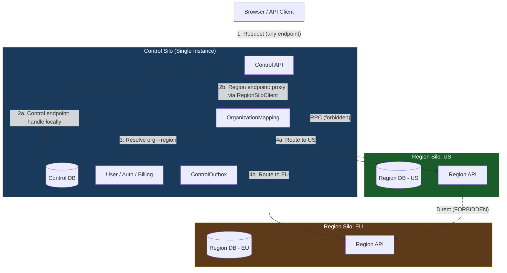
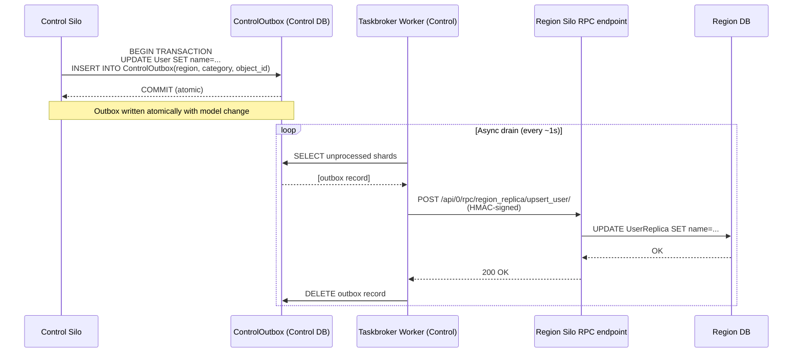
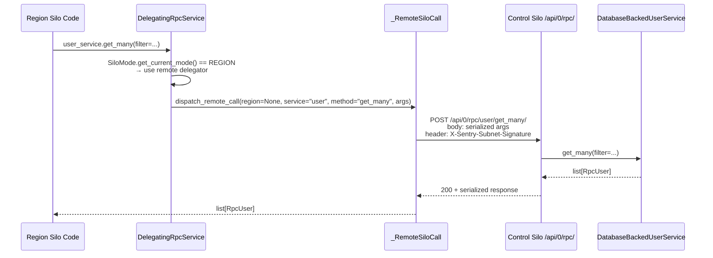
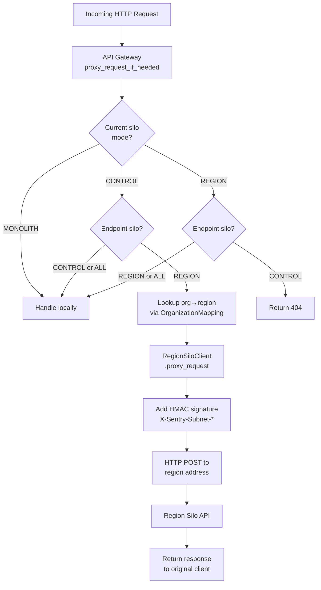
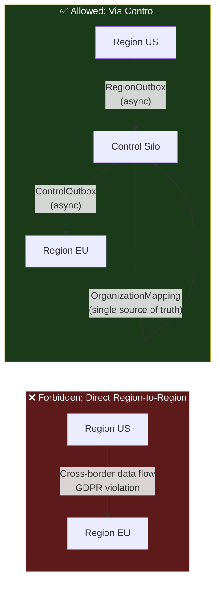

# Sentry Silo Architecture

Sentry uses a **hybrid cloud silo architecture** to support multi-region SaaS deployments with data residency guarantees. This is called "hybrid cloud" because a single global Control silo coexists with multiple isolated Region silos. The architecture is central to GDPR compliance, since it ensures customer event/project data never leaves its configured geographic region.

## What Each Silo Is and Does

### Control Silo (Single Global Instance)

- Manages **global, cross-tenant data**: users, authentication, billing, subscriptions, API token metadata, and organization-to-region mappings.
- Acts as the **routing authority**: knows which region each organization belongs to via `OrganizationMapping`.
- Proxies incoming requests to the appropriate region when needed.
- There is exactly **one** Control silo per Sentry SaaS deployment.

### Region Silo (Multiple Geographic Instances)

- Manages **customer-specific, jurisdiction-scoped data**: events, issues, projects, teams, and organization configurations.
- Each region is an independent deployment (e.g., `us`, `eu`, `de`) with its own database.
- Customer data in a Region silo **never leaves that region's database**.
- Multiple region silos can exist simultaneously; they are fully independent of each other.

### Monolith Mode

- A third mode used for **self-hosted Sentry** and local development.
- All data in a single database; all endpoints accessible. No routing or replication needed.
- Decorators like `@region_silo_model` are no-ops in this mode.

**Key files:**

- `src/sentry/silo/base.py` — `SiloMode` enum, `SiloLimit`, `FunctionSiloLimit`
- `src/sentry/types/region.py` — `Region` dataclass, `RegionDirectory`, `get_region_for_organization()`
- `src/sentry/silo/README.md` — local dev setup

## Where Each Silo Lives

| Area                | Path                                                      | Purpose                                                           |
| ------------------- | --------------------------------------------------------- | ----------------------------------------------------------------- |
| Silo core           | `src/sentry/silo/`                                        | Modes, client, safety, util, signatures                           |
| Hybrid cloud        | `src/sentry/hybridcloud/`                                 | Outboxes, RPC, API gateway, replica services                      |
| Model decorators    | `src/sentry/db/models/base.py`                            | `@control_silo_model`, `@region_silo_model`                       |
| Endpoint decorators | `src/sentry/api/base.py`                                  | `@control_silo_endpoint`, `@region_silo_endpoint`                 |
| DB routing          | `src/sentry/db/router.py`                                 | `SiloRouter` routes queries to correct DB                         |
| Cross-silo FKs      | `src/sentry/db/models/fields/hybrid_cloud_foreign_key.py` | `HybridCloudForeignKey`                                           |
| Region client       | `src/sentry/silo/client.py`                               | `RegionSiloClient` (Control→Region HTTP proxy)                    |
| API gateway         | `src/sentry/hybridcloud/apigateway/apigateway.py`         | Request routing/proxying                                          |
| RPC base classes    | `src/sentry/hybridcloud/rpc/service.py`                   | `RpcService`, `DelegatingRpcService`, `_RemoteSiloCall`           |
| RPC models          | `src/sentry/hybridcloud/rpc/__init__.py`                  | `RpcModel` Pydantic base for all RPC transfer objects             |
| Region resolvers    | `src/sentry/hybridcloud/rpc/resolvers.py`                 | `ByOrganizationId`, `ByOrganizationSlug`, `ByRegionName`, etc.    |
| RPC endpoint        | `src/sentry/api/endpoints/internal/rpc.py`                | `InternalRpcServiceEndpoint` — receives inbound RPC POST requests |

## How Silos Interact (And Why Regions Never Talk to Each Other)

### Interaction Mechanisms

#### A. Synchronous RPC (Control ↔ Region)

Region silos call Control silo services transparently via `RpcService`. When code in a Region silo calls `user_service.get_many(...)`, the `DelegatingRpcService` detects the silo boundary and POSTs to `/api/0/rpc/<service>/<method>/` on the Control silo. Responses are deserialized as Pydantic `RpcModel` objects.

- `src/sentry/hybridcloud/rpc/service.py` — `RpcService`, `DelegatingRpcService`, `_RemoteSiloCall`
- `src/sentry/hybridcloud/rpc/resolvers.py` — `ByOrganizationId`, `ByRegionName`, etc.

#### B. Async Outbox Replication (Eventual Consistency)

When a replicated model changes, an outbox record is written **atomically in the same transaction**. A Taskbroker task later drains the outbox and notifies the other silo via RPC.

- `RegionOutbox` (Region→Control): e.g., organization settings changed
- `ControlOutbox` (Control→Region): e.g., user profile updated, auth token created
- `src/sentry/hybridcloud/models/outbox.py`
- `src/sentry/hybridcloud/tasks/deliver_from_outbox.py`

> **Deep dive**: see [`outboxes.md`](outboxes.md) for the full model pattern, sharding mechanics, drain path details, locking behaviour, and common gotchas.

#### C. HTTP Proxying (Control → Region)

When Control receives a request for a `@region_silo_endpoint`, it uses `RegionSiloClient` to proxy the request to the correct region, determined by `OrganizationMapping`. All cross-silo HTTP requests are signed with HMAC-SHA256 using `SENTRY_SUBNET_SECRET`.

- `src/sentry/silo/client.py` — `RegionSiloClient`
- `src/sentry/silo/util.py` — `encode_subnet_signature()`, `verify_subnet_signature()`

#### D. HybridCloudForeignKey (Cross-Silo References)

References between silo-boundary models (e.g., a Region model referencing a Control-side User) use `HybridCloudForeignKey` — a `BigIntegerField` with no DB constraint. Cascade behavior (CASCADE, SET_NULL, DO_NOTHING) is handled by deletion tasks via tombstone records, not the database.

### Why Region Silos Never Communicate Directly

1. **Data residency**: EU data must stay in EU. If Region A (US) could call Region B (EU), EU data could flow into US infrastructure — a GDPR violation.
2. **Single source of truth**: Only Control knows the authoritative organization→region mapping. Without it, cross-region routing would be undefined.
3. **Consistency model**: The outbox pattern ensures changes flow through a single coordination point (Control), preventing split-brain scenarios.
4. **Security**: All inter-silo calls require HMAC signatures issued by the Control subnet. Region silos have no way to authenticate peer region requests.
5. **Auditability**: Routing all cross-region data through Control creates an auditable trail for compliance.

```
Region A cannot call Region B.
Region A  →  Control  →  Region B   ✓
Region A  →  Region B                ✗
```

## GDPR Compliance

The silo architecture is the primary mechanism for **data residency** compliance:

| Concern                             | How Silos Address It                                                                                                 |
| ----------------------------------- | -------------------------------------------------------------------------------------------------------------------- |
| Customer data stays in jurisdiction | Region silo has isolated database; data never replicated cross-region                                                |
| User identity is global             | User auth/PII in Control silo, accessed via RPC from regions; no PII copied to region DBs                            |
| Right to erasure                    | Deleting a User in Control triggers `ControlOutbox` → cascades to all regions via `HybridCloudForeignKey` tombstones |
| Org↔region binding                  | `OrganizationMapping` regions in Control are immutable once set; org data is locked to one region                    |
| Audit trail                         | All cross-silo mutations flow through outbox tables, which are retained until processed                              |

## How to Define Silo Resources

### New Model

```python
# src/sentry/models/mymodel.py
from sentry.db.models import region_silo_model   # or control_silo_model
from sentry.hybridcloud.outbox.base import ReplicatedRegionModel
from sentry.hybridcloud.outbox.category import OutboxCategory

@region_silo_model
class MyModel(ReplicatedRegionModel):
    category = OutboxCategory.MY_MODEL_UPDATE  # Add to OutboxCategory enum

    organization = FlexibleForeignKey("sentry.Organization")
    name = models.CharField(max_length=255)

    def handle_async_replication(self, shard_identifier: int) -> None:
        # Optional: called when this model is replicated to other silo
        pass
```

Every model **must** be decorated; tests enforce this (`tests/sentry/silo/test_base.py`).

### New Endpoint

```python
# src/sentry/api/endpoints/my_endpoint.py
from sentry.api.base import region_silo_endpoint   # or control_silo_endpoint / all_silo_endpoint

@region_silo_endpoint
class MyOrganizationEndpoint(OrganizationEndpoint):
    def get(self, request, organization):
        ...
```

Returns 404 automatically if accessed from the wrong silo. Every endpoint that is not decorated is assumed to be Region Silo scoped by default.

### New RPC Service (cross-silo call)

Every RPC service follows a **4-file pattern** inside `src/sentry/<domain>/services/<name>/`:

| File         | Purpose                                                                                  |
| ------------ | ---------------------------------------------------------------------------------------- |
| `model.py`   | `RpcModel` subclasses used as arguments and return values                                |
| `serial.py`  | Helpers to construct `RpcModel` objects from Django ORM instances                        |
| `service.py` | Abstract `RpcService` with decorated methods; creates the module-level delegation object |
| `impl.py`    | Concrete `DatabaseBacked*` subclass with real DB logic                                   |

**Control-silo service** (data lives in Control):

```python
# src/sentry/myapp/services/myservice/service.py
# Please do not use `from __future__ import annotations` — Pydantic needs runtime type reflection.

import abc
from sentry.hybridcloud.rpc.service import RpcService, rpc_method
from sentry.myapp.services.myservice.model import RpcThing
from sentry.silo.base import SiloMode

class MyService(RpcService):
    key = "my_service"          # unique slug; appears in /api/0/rpc/<key>/<method>/
    local_mode = SiloMode.CONTROL

    @classmethod
    def get_local_implementation(cls) -> "MyService":
        from .impl import DatabaseBackedMyService
        return DatabaseBackedMyService()

    @rpc_method
    @abc.abstractmethod
    def get_thing(self, *, id: int) -> RpcThing | None: ...

my_service = MyService.create_delegation()
# Callers in any silo: my_service.get_thing(id=42) — routing is automatic
```

**Region-silo service** (data lives in Region — every method needs a resolver):

```python
# src/sentry/myapp/services/myservice/service.py
import abc
from sentry.hybridcloud.rpc.resolvers import ByOrganizationId
from sentry.hybridcloud.rpc.service import RpcService, regional_rpc_method
from sentry.myapp.services.myservice.model import RpcThing
from sentry.silo.base import SiloMode

class MyRegionService(RpcService):
    key = "my_region_service"
    local_mode = SiloMode.REGION

    @classmethod
    def get_local_implementation(cls) -> "MyRegionService":
        from .impl import DatabaseBackedMyRegionService
        return DatabaseBackedMyRegionService()

    @regional_rpc_method(resolve=ByOrganizationId())
    @abc.abstractmethod
    def get_thing(self, *, organization_id: int, id: int) -> RpcThing | None: ...

my_region_service = MyRegionService.create_delegation()
```

> **Deep dive**: see [`rpc_services.md`](rpc_services.md) for the full 4-file layout, all region resolvers, authentication/signing details, wire format, retry behaviour, and common gotchas.

### New Cross-Silo Foreign Key

```python
from sentry.db.models.fields.hybrid_cloud_foreign_key import HybridCloudForeignKey

@region_silo_model
class MyModel(Model):
    # References a Control-side model; no DB constraint, cascade via tombstones
    user_id = HybridCloudForeignKey("sentry.User", on_delete="CASCADE")
```

## Diagrams

### Overall Silo Topology



### Outbox Replication Flow (Control → Region)



### RPC Call (Region → Control)



### Request Proxying (Control Acts as Gateway)



### Why Regions Don't Talk to Each Other (GDPR)


