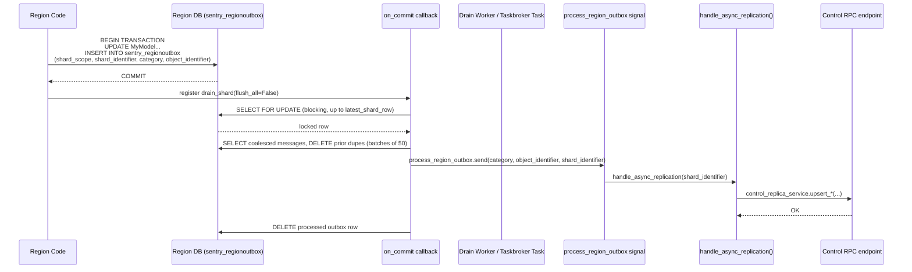
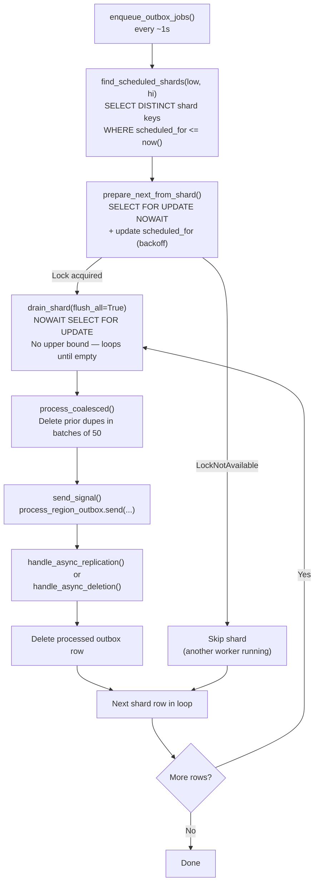

# Hybridcloud Outbox Deep Dive

This document covers the outbox replication system in depth: how the model mixins work, how sharding affects correctness and performance, how the two drain paths interact, and the failure modes that arise from common mistakes.

> **Quick reference**: For a one-page summary, see the "Async Outbox Replication" section in [`AGENTS.md`](AGENTS.md).
> For RPC service patterns, see [`rpc_services.md`](rpc_services.md).

## A. Overview

Outboxes exist to replicate model changes across silo boundaries **atomically** without distributed transactions. When a model changes in one silo, an outbox record is written in the **same database transaction** as the model change. A separate drain process later reads the outbox and calls RPC endpoints on the other silo. If the drain fails, the outbox record remains and will be retried.

**Two directions:**

- `RegionOutbox` (Region → Control): e.g., an organization's settings change; Control's replica must be updated.
- `ControlOutbox` (Control → Region): e.g., a user's profile updates; every region that has that user must be notified.

**Delivery guarantee:** At-least-once. The same signal can fire multiple times for a single logical change (due to retries or concurrent drains). All handlers **must be idempotent**.

## B. Key Classes

| Class                                 | File                 | Responsibility                                                             |
| ------------------------------------- | -------------------- | -------------------------------------------------------------------------- |
| `OutboxBase`                          | `models/outbox.py`   | Abstract base; fields, drain methods, locking, coalescing                  |
| `RegionOutboxBase` / `RegionOutbox`   | `models/outbox.py`   | Region→Control; shards on `(shard_scope, shard_identifier)`                |
| `ControlOutboxBase` / `ControlOutbox` | `models/outbox.py`   | Control→Region; shards on `(region_name, shard_scope, shard_identifier)`   |
| `ReplicatedRegionModel`               | `outbox/base.py`     | Mixin: intercepts save/update/delete, creates `RegionOutbox` automatically |
| `ReplicatedControlModel`              | `outbox/base.py`     | Mixin: creates one `ControlOutbox` per target region on save/update/delete |
| `RegionOutboxProducingModel`          | `outbox/base.py`     | Lower-level mixin; use when you need custom outbox creation logic          |
| `OutboxCategory`                      | `outbox/category.py` | Enum of 45 message types; governs which Django signal fires on drain       |
| `OutboxScope`                         | `outbox/category.py` | Enum of 13 scopes; determines what `shard_identifier` represents           |
| `outbox_context()`                    | `models/outbox.py`   | Context manager controlling whether outboxes flush on transaction commit   |

## C. The Replicated Model Pattern

### Region model (Region → Control)

Use `ReplicatedRegionModel` when a model lives in the Region silo and its changes need to reach Control.

```python
# src/sentry/models/team.py
from sentry.db.models import region_silo_model
from sentry.hybridcloud.outbox.base import ReplicatedRegionModel
from sentry.hybridcloud.outbox.category import OutboxCategory

@region_silo_model
class Team(ReplicatedRegionModel):
    category = OutboxCategory.TEAM_UPDATE  # registered in ORGANIZATION_SCOPE

    organization = FlexibleForeignKey("sentry.Organization")
    name = models.CharField(max_length=64)

    def payload_for_update(self) -> dict[str, Any] | None:
        # Optional: include hints so handlers can skip a DB lookup.
        # WARNING: outboxes are coalesced — only the *latest* payload survives.
        return {"slug": self.slug}

    def handle_async_replication(self, shard_identifier: int) -> None:
        # shard_identifier == self.organization_id (inferred by OutboxScope.ORGANIZATION_SCOPE)
        from sentry.hybridcloud.services.replica import control_replica_service
        control_replica_service.upsert_replicated_team(team_id=self.id)

    @classmethod
    def handle_async_deletion(
        cls, identifier: int, shard_identifier: int, payload: Mapping[str, Any] | None
    ) -> None:
        from sentry.hybridcloud.services.replica import control_replica_service
        control_replica_service.delete_replicated_team(team_id=identifier)
```

**Signal wiring** — in a `ready()` handler or module-level code:

```python
OutboxCategory.TEAM_UPDATE.connect_region_model_updates(Team)
```

This connects `process_region_outbox` to call `maybe_process_tombstone()`, then dispatch to `handle_async_replication()` or `handle_async_deletion()` depending on whether the object still exists.

### Control model (Control → Region)

Use `ReplicatedControlModel` when a model lives in the Control silo and its changes need to reach every relevant Region.

```python
# src/sentry/models/organizationslugreservation.py
from sentry.db.models import control_silo_model
from sentry.hybridcloud.outbox.base import ReplicatedControlModel
from sentry.hybridcloud.outbox.category import OutboxCategory

@control_silo_model
class OrganizationSlugReservation(ReplicatedControlModel):
    category = OutboxCategory.ORGANIZATION_SLUG_RESERVATION_UPDATE  # ORGANIZATION_SCOPE

    organization_id = BoundedBigIntegerField()
    slug = models.SlugField()

    def outbox_region_names(self) -> Collection[str]:
        # Must be overridden — returns the set of regions to notify.
        # Default implementation checks for organization_id or user_id attributes.
        return find_regions_for_orgs([self.organization_id])

    def handle_async_replication(self, region_name: str, shard_identifier: int) -> None:
        # region_name is the target region; shard_identifier == self.organization_id
        from sentry.hybridcloud.services.replica import region_replica_service
        region_replica_service.upsert_slug_reservation(
            region_name=region_name, slug_reservation_id=self.id
        )

    @classmethod
    def handle_async_deletion(
        cls,
        identifier: int,
        region_name: str,
        shard_identifier: int,
        payload: Mapping[str, Any] | None,
    ) -> None:
        from sentry.hybridcloud.services.replica import region_replica_service
        region_replica_service.delete_slug_reservation(
            region_name=region_name, slug_reservation_id=identifier
        )
```

**Signal wiring:**

```python
OutboxCategory.ORGANIZATION_SLUG_RESERVATION_UPDATE.connect_control_model_updates(
    OrganizationSlugReservation
)
```

### Fields to implement on `ReplicatedRegionModel`

| Method / Attribute                                             | Required? | Notes                                                               |
| -------------------------------------------------------------- | --------- | ------------------------------------------------------------------- |
| `category: OutboxCategory`                                     | Yes       | Class variable; must match a value registered in the right scope    |
| `handle_async_replication(shard_identifier)`                   | Usually   | Called when the object exists at drain time                         |
| `handle_async_deletion(identifier, shard_identifier, payload)` | Usually   | Called when the object is gone at drain time                        |
| `payload_for_update()`                                         | No        | Custom JSON coalesced with the outbox; **only the latest survives** |
| `outbox_type`                                                  | No        | Override `RegionOutbox` with a custom subclass                      |

### Fields to implement on `ReplicatedControlModel`

Same as above, plus:

| Method / Attribute                                                          | Required? | Notes                                                                 |
| --------------------------------------------------------------------------- | --------- | --------------------------------------------------------------------- |
| `outbox_region_names()`                                                     | Yes       | Returns `Collection[str]`; one `ControlOutbox` row created per region |
| `handle_async_replication(region_name, shard_identifier)`                   | Usually   | Extra `region_name` param vs. Region version                          |
| `handle_async_deletion(identifier, region_name, shard_identifier, payload)` | Usually   | Extra `region_name` param                                             |

## D. Sharding: How It Works and Why It Matters

### What a shard is

A **shard** is defined by the `sharding_columns` of the outbox model:

- `RegionOutbox`: `(shard_scope, shard_identifier)`
- `ControlOutbox`: `(region_name, shard_scope, shard_identifier)`

All outbox messages in the same shard are **processed serially** by one worker. Messages in different shards are **processed in parallel**. This is the key correctness and performance lever.

### Choosing the right `shard_identifier`

`OutboxScope` determines what `shard_identifier` means. `OutboxCategory.infer_identifiers()` in `category.py` walks the model for the correct field automatically when `shard_identifier` is not overridden:

| Scope                | Inferred `shard_identifier`                                       |
| -------------------- | ----------------------------------------------------------------- |
| `ORGANIZATION_SCOPE` | `organization_id` (or `model.id` if model is `Organization`)      |
| `USER_SCOPE`         | `user_id` (or `model.id` if model is `User`)                      |
| `APP_SCOPE`          | `api_application_id` (or `model.id` if model is `ApiApplication`) |
| `INTEGRATION_SCOPE`  | `integration_id` (or `model.id` if model is `Integration`)        |
| `API_TOKEN_SCOPE`    | `api_token_id` (or `model.id` if model is `ApiToken`)             |

**Rule**: use the natural owner of the data. For org-scoped data, `organization_id` is correct. For user-scoped data, `user_id`.

### DB contention from bad sharding

The `shard_identifier` is the **unit of serial processing**. If many unrelated objects share the same `shard_identifier`:

1. All their outbox rows fall in one shard.
2. Only one worker holds the `SELECT FOR UPDATE` lock at a time.
3. All other workers must wait or skip.
4. The shard grows faster than it drains.
5. `scheduled_for` backoff compounds lag: each failure doubles the delay (up to 1 hour).
6. In high-write scenarios this produces persistent lock contention on `sentry_regionoutbox` or `sentry_controloutbox`.

**Bad patterns to avoid:**

- `shard_identifier = 0` (or any constant) — collapses all messages into a single shard across the entire system.
- Using `auth_provider_id` as `shard_identifier` for data that could use `organization_id` — wrong granularity.
- Registering a new `OutboxCategory` in `ORGANIZATION_SCOPE` but accidentally passing `user_id` as `shard_identifier` — scope/identifier mismatch; also likely to group unrelated data together.
- Each scope should conceptually contain interdependent updates — messages in a shard should need to be serialized relative to each other, not just happen to share a field.

### Index alignment

The existing indexes on both outbox tables are designed for the sharding pattern:

**`sentry_regionoutbox` indexes:**

- `(shard_scope, shard_identifier, category, object_identifier)` — coalescing queries
- `(shard_scope, shard_identifier, scheduled_for)` — scheduling queries
- `(shard_scope, shard_identifier, id)` — lock range queries

**`sentry_controloutbox` indexes:**

- `(region_name, shard_scope, shard_identifier, category, object_identifier)`
- `(region_name, shard_scope, shard_identifier, scheduled_for)`
- `(region_name, shard_scope, shard_identifier, id)`

Queries that skip `shard_scope` or reorder columns do a sequential scan. Always filter by the full shard key in that order.

## E. Synchronous vs Asynchronous Drain Flows

### Post-commit synchronous drain

When `outbox_context(flush=True)` is active (the default), saving an outbox row registers a `transaction.on_commit` callback:

```
model.save()
  → ReplicatedRegionModel.prepare_outboxes()
    → outbox_context(transaction.atomic(...), flush=True)
      → RegionOutbox.save()
        → Validate scope/category match
        → transaction.on_commit(lambda: self.drain_shard())  ← registered here
  → Transaction commits
→ drain_shard(flush_all=False) runs OUTSIDE the transaction
  → Sets latest_shard_row = last row in shard (upper bound)
  → process_shard(latest_shard_row) — blocking SELECT FOR UPDATE (waits for any concurrent lock)
  → Processes messages up to the upper bound; ignores messages written concurrently
```

**Key property of `flush_all=False`**: sets an upper bound (`latest_shard_row`) so the drain terminates even if new messages arrive concurrently. Uses a **blocking** lock in `process_shard`.

> **Note**: Avoid relying on synchronous drains in application code. Most code should let the Taskbroker handle draining asynchronously. Synchronous drains are mainly useful when you need semi-consistent behavior (e.g., ensuring a replica is up-to-date before returning a response in tests).

### Taskbroker async drain (background catch-up)

```
enqueue_outbox_jobs() / enqueue_outbox_jobs_control()   [Taskbroker, runs every ~1s]
  → schedule_batch(outbox_model, concurrency=5)
    → Find min/max ID in outbox table
    → Emit drain_outbox_shards.delay(low, hi) × 5 tasks
      → process_outbox_batch(low, hi, outbox_model)
        → find_scheduled_shards(low, hi)   [DISTINCT shard keys WHERE scheduled_for <= now()]
        → For each shard: prepare_next_from_shard(shard_attrs)
            → SELECT FOR UPDATE NOWAIT  [skip if locked by another worker]
            → Update scheduled_for for all messages in shard (exponential backoff)
        → drain_shard(flush_all=True)
            → process_shard(None)   [no upper bound; NOWAIT SELECT FOR UPDATE]
            → Loops until no rows remain
```

**Key difference of `flush_all=True`**: no upper bound, so it drains everything. Uses **NOWAIT** in `process_shard` — if contended, the shard is skipped until the next scheduler cycle.

### When each path runs

| Path            | Trigger                                                  | `flush_all` in `drain_shard` | Lock in `process_shard`   |
| --------------- | -------------------------------------------------------- | ---------------------------- | ------------------------- |
| Post-commit     | `outbox_context(flush=True)` + `transaction.on_commit`   | `False` (has upper bound)    | Blocking (`nowait=False`) |
| Taskbroker task | `enqueue_outbox_jobs` every ~1s                          | `True` (no upper bound)      | NOWAIT (`nowait=True`)    |
| Manual (tests)  | `outbox_context(flush=False)` + explicit `drain_shard()` | either                       | either                    |

### `outbox_context()` explained

```python
# src/sentry/hybridcloud/models/outbox.py
@contextlib.contextmanager
def outbox_context(inner: Atomic | None = None, flush: bool | None = None):
    ...
    assert not flush or inner, "Must either set a transaction or flush=False"
```

- **`flush=True` (default)**: registers `on_commit` drain; **requires** an active `atomic()` block passed as `inner`.
- **`flush=False`**: disables auto-drain; caller is responsible for manual drain or relying on Taskbroker.
- The thread-local `_outbox_context.flushing_enabled` propagates across nested saves; inner contexts inherit the outer setting if not explicitly set.

## F. Locking and DB Contention

### Lock acquisition in `prepare_next_from_shard()`

Called by the Taskbroker path before draining. Uses `SELECT FOR UPDATE NOWAIT` inside a `savepoint=False` atomic block. If the lock is unavailable (another worker holds it), `LockNotAvailable` is caught and `None` is returned — the shard is skipped until the next scheduler cycle.

After acquiring the lock, it updates `scheduled_for` on all messages in the shard to implement exponential backoff:

```python
next_outbox.next_schedule(now)  # = now + min(last_delay * 2, 1 hour)
```

This prevents tight-loop retries on failing shards.

### Lock acquisition in `process_shard()`

The local `flush_all` inside `process_shard` is computed as `not bool(latest_shard_row)`:

- When called from the **Taskbroker path** (`drain_shard(flush_all=True)` → `latest_shard_row=None`): local `flush_all=True`, uses `SELECT FOR UPDATE NOWAIT`. If contended, returns `None` and the loop exits cleanly.
- When called from the **post-commit path** (`drain_shard(flush_all=False)` → `latest_shard_row=<row>`): local `flush_all=False`, uses blocking `SELECT FOR UPDATE`. The drain waits for any concurrent lock to release.

### Coalescing reduces lock hold time

Before firing the signal, `process_coalesced()` deletes all prior messages for the same `(shard_scope, shard_identifier, category, object_identifier)` in batches of 50, then deletes the final coalesced row after the signal fires. This limits the number of RPC calls and the duration of the lock hold.

### Why a hot shard is dangerous

- Every save to a model in the shard extends the lock-hold window.
- The Taskbroker `drain_outbox_shards` task backs up across worker slots if one shard is perpetually locked.
- Exponential backoff on `scheduled_for` grows queue lag.
- Monitor with `OutboxBase.get_shard_depths_descending()` — returns shards ordered by queue depth.

## G. Diagrams

### Full outbox lifecycle (Region → Control direction)



### Taskbroker async drain decision tree



## H. Gotchas

### 1. Must be in a transaction to flush

`outbox_context(flush=True)` (the default) asserts `inner is not None`. Saving an outbox with flushing enabled but without passing an `atomic()` block as `inner` raises `AssertionError: Must either set a transaction or flush=False`. The `RegionOutboxProducingModel.prepare_outboxes()` method wraps the save in `transaction.atomic(...)` automatically, so this is only an issue if you create outbox rows manually outside the mixin.

### 2. Handlers must be idempotent

At-least-once delivery means `handle_async_replication()` can fire multiple times for the same logical change. Always use upsert-style operations; never rely on the handler being called exactly once.

### 3. No outbox drain inside a transaction (tests)

`drain_shard()` calls `in_test_assert_no_transaction()`. Triggering a drain inside a `TestCase.atomic()` block raises. Either use `@pytest.mark.django_db(transaction=True)` or disable flushing with `outbox_context(flush=False)` and drain manually after the transaction.

### 4. ControlOutbox needs one row per region

`outboxes_for_update()` returns a **list** — one `ControlOutbox` per region name. Always use:

```python
ControlOutbox.objects.bulk_create(model.outboxes_for_update())
```

Not `.outbox_for_update().save()` (which is the `RegionOutbox` API).

### 5. Coalescing requires stable `object_identifier`

Messages are coalesced on `(shard_scope, shard_identifier, category, object_identifier)`. If your handler creates different `object_identifier` values for the same logical object, messages won't coalesce and every write generates a separate signal. This can produce large amounts of backpressure in high-volume scenarios.

### 6. Deleting a replicated model requires a tombstone

Deletion is signalled via the same outbox category. When the signal fires after deletion, `maybe_process_tombstone()` returns `None` because the object is gone from the DB, and `handle_async_deletion()` is called instead. Implement both `handle_async_replication()` and `handle_async_deletion()`.

### 7. Scope/category mismatch raises at save time

`OutboxScope.scope_has_category()` validates the combination on every `save()`. Assigning a category to the wrong scope raises `InvalidOutboxError` on the first save, not at registration time.

### 8. Adding a new `OutboxCategory`

1. Add the integer value to the `OutboxCategory` enum in `outbox/category.py`.
2. Add it to the correct `scope_categories()` set in `OutboxScope`.
3. Implement `handle_async_replication()` and `handle_async_deletion()` on the model.
4. Call `OutboxCategory.YOUR_CATEGORY.connect_region_model_updates(YourModel)` (or `connect_control_model_updates`) in a `ready()` handler.
5. Verify that `infer_identifiers()` will pick the correct `shard_identifier` for your model's fields, or pass it explicitly.
