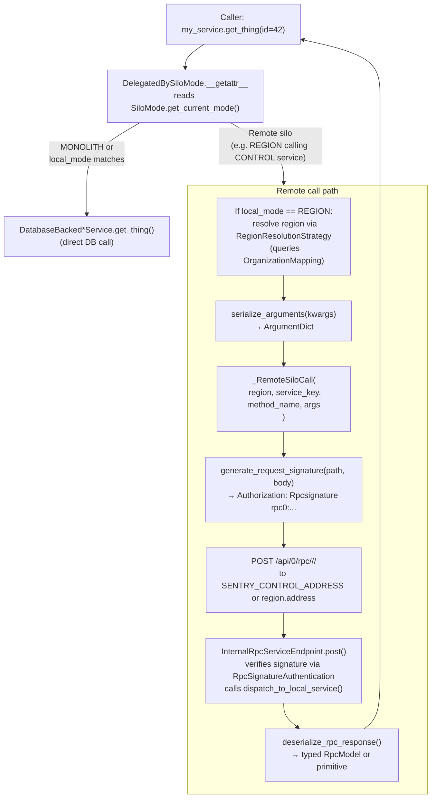

# RPC Services Deep Dive

This document covers everything you need to define, consume, or debug a Sentry RPC service. For silo architecture context, see [`AGENTS.md`](AGENTS.md).

---

## The 4-File Pattern

Every RPC service lives in a package under `src/sentry/<domain>/services/<name>/` and consists of four files:

| File         | Purpose                                                                                                 |
| ------------ | ------------------------------------------------------------------------------------------------------- |
| `model.py`   | Pydantic `RpcModel` subclasses used as arguments and return values                                      |
| `serial.py`  | Helper functions to construct `RpcModel` objects from Django ORM instances                              |
| `service.py` | Abstract `RpcService` subclass declaring the interface; creates the module-level delegation object      |
| `impl.py`    | Concrete `DatabaseBacked*` subclass with real DB logic; imported only from `get_local_implementation()` |

Example: `src/sentry/auth/services/auth/`

```
auth/
├── __init__.py     # re-exports from model.py and service.py
├── model.py        # RpcApiKey, RpcAuthProvider, ...
├── serial.py       # serialize_auth_provider(), serialize_api_key(), ...
├── service.py      # AuthService(RpcService); auth_service = AuthService.create_delegation()
└── impl.py         # DatabaseBackedAuthService(AuthService)
```

### `model.py`

```python
# Please do not use
#     from __future__ import annotations
# in modules such as this one where hybrid cloud data models or service classes are
# defined, because we want to reflect on type annotations and avoid forward references.

from sentry.hybridcloud.rpc import RpcModel

class RpcThing(RpcModel):
    id: int = -1
    organization_id: int = -1
    name: str = ""
```

### `serial.py`

```python
from __future__ import annotations

from sentry.myapp.services.myservice.model import RpcThing
from sentry.myapp.models import Thing

def serialize_thing(thing: Thing) -> RpcThing:
    return RpcThing(
        id=thing.id,
        organization_id=thing.organization_id,
        name=thing.name,
    )
```

### `service.py` (Control-silo service)

```python
# Please do not use
#     from __future__ import annotations
# (Pydantic needs runtime type reflection)

import abc
from sentry.hybridcloud.rpc.service import RpcService, rpc_method
from sentry.myapp.services.myservice.model import RpcThing
from sentry.silo.base import SiloMode


class MyService(RpcService):
    key = "my_service"          # unique; appears in /api/0/rpc/<key>/<method>/
    local_mode = SiloMode.CONTROL  # where the real data lives

    @classmethod
    def get_local_implementation(cls) -> "MyService":
        from .impl import DatabaseBackedMyService
        return DatabaseBackedMyService()

    @rpc_method
    @abc.abstractmethod
    def get_thing(self, *, id: int) -> RpcThing | None: ...

    @rpc_method
    @abc.abstractmethod
    def get_many(self, *, ids: list[int]) -> list[RpcThing]: ...


my_service = MyService.create_delegation()
# Callers in any silo: my_service.get_thing(id=42)
```

### `service.py` (Region-silo service)

```python
# Please do not use
#     from __future__ import annotations

import abc
from sentry.hybridcloud.rpc.resolvers import ByOrganizationId
from sentry.hybridcloud.rpc.service import RpcService, regional_rpc_method
from sentry.myapp.services.myservice.model import RpcThing
from sentry.silo.base import SiloMode


class MyRegionService(RpcService):
    key = "my_region_service"
    local_mode = SiloMode.REGION

    @classmethod
    def get_local_implementation(cls) -> "MyRegionService":
        from .impl import DatabaseBackedMyRegionService
        return DatabaseBackedMyRegionService()

    @regional_rpc_method(resolve=ByOrganizationId())
    @abc.abstractmethod
    def get_thing(self, *, organization_id: int, id: int) -> RpcThing | None: ...


my_region_service = MyRegionService.create_delegation()
```

### `impl.py`

```python
from __future__ import annotations

from sentry.myapp.models import Thing
from sentry.myapp.services.myservice.model import RpcThing
from sentry.myapp.services.myservice.serial import serialize_thing
from sentry.myapp.services.myservice.service import MyService


class DatabaseBackedMyService(MyService):
    def get_thing(self, *, id: int) -> RpcThing | None:
        try:
            return serialize_thing(Thing.objects.get(id=id))
        except Thing.DoesNotExist:
            return None

    def get_many(self, *, ids: list[int]) -> list[RpcThing]:
        return [serialize_thing(t) for t in Thing.objects.filter(id__in=ids)]
```

---

## Key Classes

| Class                        | File                            | Responsibility                                                                            |
| ---------------------------- | ------------------------------- | ----------------------------------------------------------------------------------------- |
| `RpcService`                 | `rpc/service.py`                | Abstract base; defines `key`, `local_mode`, `get_local_implementation()`                  |
| `DelegatingRpcService`       | `rpc/service.py`                | Runtime proxy; routes calls to local impl or `_RemoteSiloCall` based on `SiloMode`        |
| `DelegatedBySiloMode`        | `rpc/__init__.py`               | `__getattr__` dispatcher; lazily constructs the correct backend per silo mode             |
| `_RemoteSiloCall`            | `rpc/service.py`                | Serializes args, signs, POSTs to `/api/0/rpc/<service>/<method>/`, deserializes response  |
| `RpcMethodSignature`         | `rpc/service.py`                | Per-method contract; wraps Pydantic models for args and return; holds the region resolver |
| `RpcModel`                   | `rpc/__init__.py`               | Pydantic base for all RPC transfer objects; `orm_mode = True` by default                  |
| `InternalRpcServiceEndpoint` | `api/endpoints/internal/rpc.py` | Receives and dispatches inbound RPC POST requests                                         |
| `RpcSignatureAuthentication` | `api/authentication.py`         | Verifies HMAC signature before the endpoint dispatches                                    |

---

## Method Decorators

### `@rpc_method`

Marks a method as an RPC endpoint on **Control-silo** services (or Monolith). Required on every abstract method in an `RpcService` subclass with `local_mode = SiloMode.CONTROL`.

```python
@rpc_method
@abc.abstractmethod
def get_thing(self, *, id: int) -> RpcThing | None: ...
```

### `@regional_rpc_method(resolve=...)`

Required on every abstract method in services with `local_mode = SiloMode.REGION`. Must supply a `RegionResolutionStrategy` so the delegator knows which region to route the call to. Missing this raises `RpcServiceSetupException` at **class initialization time** (not call time).

```python
@regional_rpc_method(resolve=ByOrganizationId())
@abc.abstractmethod
def get_thing(self, *, organization_id: int, id: int) -> RpcThing | None: ...
```

The optional `return_none_if_mapping_not_found=True` flag causes the method to return `None` instead of raising `RegionMappingNotFound` when no `OrganizationMapping` row exists. Only valid on methods with `Optional[...]` return types.

```python
@regional_rpc_method(resolve=ByOrganizationId(), return_none_if_mapping_not_found=True)
@abc.abstractmethod
def get_thing(self, *, organization_id: int) -> RpcThing | None: ...
```

---

## Region Resolvers

All resolvers live in `src/sentry/hybridcloud/rpc/resolvers.py`. They look up the region by querying `OrganizationMapping` in the Control DB.

| Resolver                                    | When to use                                                           |
| ------------------------------------------- | --------------------------------------------------------------------- |
| `ByOrganizationId()`                        | Method receives `organization_id: int` (default param name)           |
| `ByOrganizationId(parameter_name="org_id")` | Method uses a different kwarg name for the org ID                     |
| `ByOrganizationSlug()`                      | Method receives `slug: str`                                           |
| `ByOrganizationIdAttribute("param_name")`   | Method receives an `RpcModel` that has an `organization_id` attribute |
| `ByRegionName()`                            | Method receives explicit `region_name: str`                           |
| `RequireSingleOrganization()`               | Single-org / self-hosted only; raises if multiple regions exist       |

Example with attribute resolver:

```python
@regional_rpc_method(resolve=ByOrganizationIdAttribute("filter"))
@abc.abstractmethod
def get_things(self, *, filter: RpcThingFilter) -> list[RpcThing]: ...
# filter.organization_id is used to resolve the region
```

---

## Authentication & Signing

RPC calls between silos are signed with HMAC-SHA256 using `settings.RPC_SHARED_SECRET` (a list to support key rotation):

- **Signing** (`generate_request_signature`): uses `secret[0]`, produces `rpc0:<hexdigest>` over `url_path:body`
- **Verification** (`compare_signature`): tries all secrets in order; allows seamless key rotation
- **Header**: `Authorization: Rpcsignature rpc0:<hexdigest>`
- **Verified by**: `RpcSignatureAuthentication` (a DRF authentication class) before `InternalRpcServiceEndpoint` dispatches

The signature covers both the URL path and the raw request body, so the signature cannot be replayed against a different endpoint.

```python
# generate_request_signature in rpc/service.py
signature_input = b"%s:%s" % (url_path.encode("utf8"), body)
secret = settings.RPC_SHARED_SECRET[0]
signature = hmac.new(secret.encode("utf-8"), signature_input, hashlib.sha256).hexdigest()
# → "rpc0:<hexdigest>"

# compare_signature tries every secret in the list
for key in settings.RPC_SHARED_SECRET:
    computed = hmac.new(key.encode("utf-8"), signature_input, hashlib.sha256).hexdigest()
    if hmac.compare_digest(computed, signature_data):
        return True
```

---

## Wire Format

**Request** (POST to `/api/0/rpc/<service_key>/<method_name>/`):

```json
{
    "meta": {},
    "args": { "<kwarg_name>": <serialized_value>, ... }
}
```

**Response** (200 OK):

```json
{
    "meta": {},
    "value": <serialized_return_value>
}
```

Serialization uses Pydantic. `RpcModel` subclasses have `orm_mode = True` in their `Config` class by default (inherited from `RpcModel`), so they can be constructed directly from Django ORM objects.

---

## RPC Delegation: Local vs Remote



---

## Retry & Error Handling

- **503 is retried** — configured via `Retry(status_forcelist=[503])` with `backoff_factor=0.1`. Default retry count from `options.get("hybridcloud.rpc.retries")`.
- **Per-method overrides** — `options.get("hybridcloud.rpc.method_retry_overrides")` and `"hybridcloud.rpc.method_timeout_overrides"` accept `{"service.method": count}` dicts.
- **Other errors**: any non-200 response raises `RpcRemoteException`. 400 logs a warning; 403 raises "Unauthorized service access"; everything else raises "Service unavailable".
- **Disabled methods** — `options.get("hybrid_cloud.rpc.disabled-service-methods")` can disable specific `"service.method"` strings, raising `RpcDisabledException`.

---

## Common Gotchas

1. **No `from __future__ import annotations`** in `model.py` or `service.py` — Pydantic needs runtime type reflection. Both files should have a comment at the top explaining this.

2. **Regional services must use `@regional_rpc_method`** — enforcement happens at class initialization (`__init_subclass__`), not at call time. If you define a method on a `local_mode = SiloMode.REGION` service with only `@rpc_method`, the class will raise `RpcServiceSetupException` when the module is imported.

3. **No RPC calls inside DB transactions in tests** — `_fire_test_request` calls `in_test_assert_no_transaction()`, which raises if there is an active transaction. Calling `my_service.get_thing()` inside a `TestCase` method that wraps everything in a transaction will fail. Call the service before opening a transaction, or use `@pytest.mark.django_db(transaction=True)`.

4. **Key rotation** — `RPC_SHARED_SECRET` is a list. Index `[0]` is used for signing; all entries are tried during verification. Add a new secret as `[1]`, deploy everywhere, then promote it to `[0]` and remove the old one.

5. **Only 503 is retried** — other HTTP errors (4xx, 5xx except 503) fail immediately with `RpcRemoteException`. Don't expect automatic retry on 500.

6. **`RegionMappingNotFound`** — if `OrganizationMapping` has no row for the given org, the resolver raises `RegionMappingNotFound`. Unless `return_none_if_mapping_not_found=True` is set on `@regional_rpc_method`, this propagates to the caller. Use that flag only on methods with `... | None` return types.

7. **`key` must be unique and stable** — it appears in the RPC URL. Changing `key` breaks in-flight calls during a rolling deploy. Conflicting keys raise `RpcServiceSetupException` when `create_delegation()` writes to the global registry.

8. **`impl.py` is lazy-imported** — `get_local_implementation()` must import the implementation class inside the function body to avoid circular imports. This is the one place where intra-function imports are expected.

9. \*\*Deployments are in Region -> Control order, meaning deprecations and modifications to the RPC signature must also be ordered with this in mind. Swapping a parameter on a Control RPC would look like:
   1. Creating a new **optional** parameter on the service method, making the old option optional, deploying the change fully to production.
   2. Make the old parameter optional, while updating the Control service handler code to use the new parameter by default, but gracefully handle the old case, deploying this change fully to production.
   3. Remove the old optional parameter and its usage from the Control service code.

---

## Finding Existing Services

RPC services are registered from these packages (see `list_all_service_method_signatures` in `rpc/service.py`):

```
sentry.auth.services
sentry.audit_log.services
sentry.backup.services
sentry.hybridcloud.services
sentry.identity.services
sentry.integrations.services
sentry.issues.services
sentry.notifications.services
sentry.organizations.services
sentry.projects.services
sentry.sentry_apps.services
sentry.users.services
```

To find all services:

```bash
grep -r "local_mode = SiloMode" src/sentry --include="*.py" -l
```

To find all region-scoped service methods:

```bash
grep -r "@regional_rpc_method" src/sentry --include="*.py" -l
```
