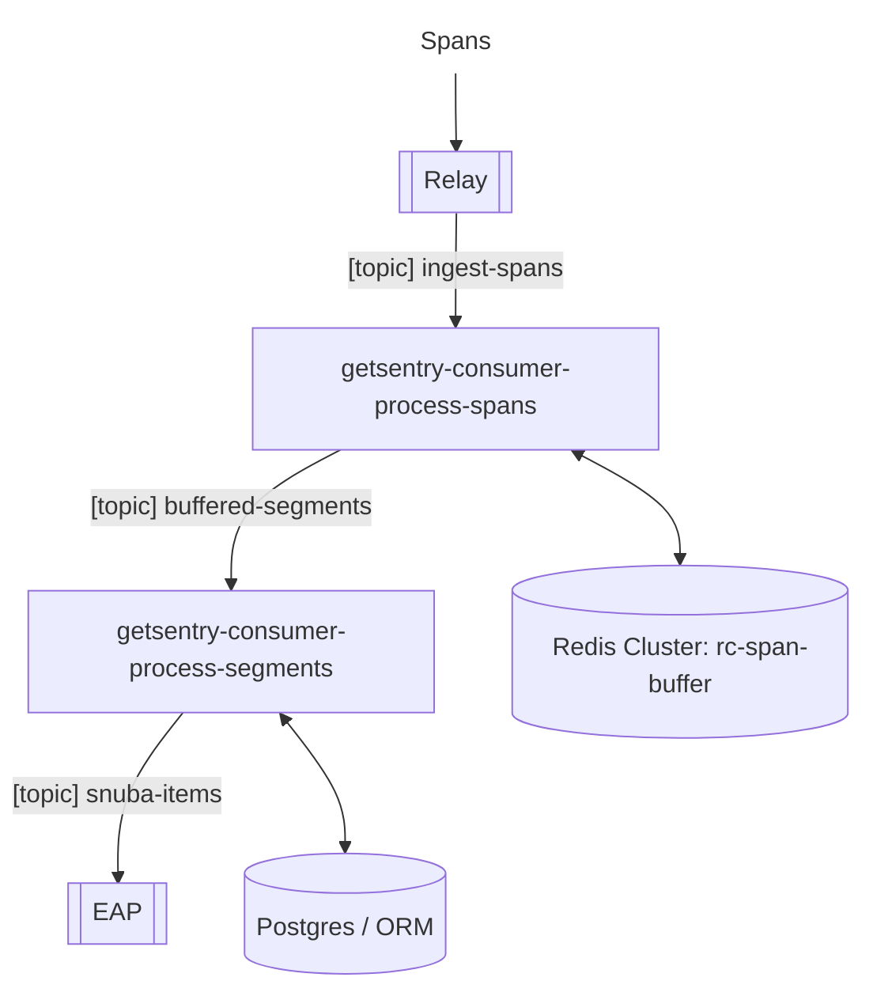
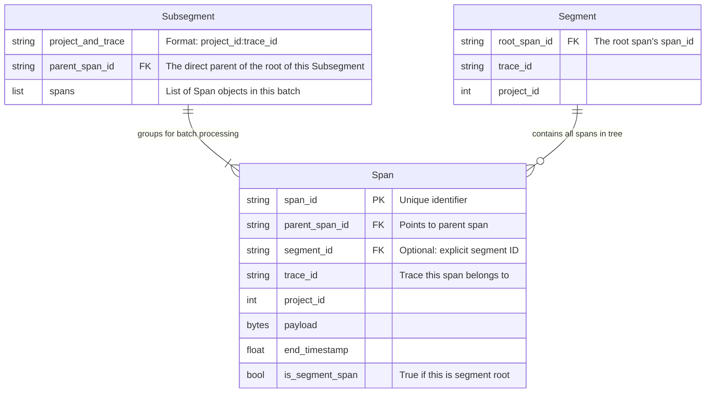

# Spans Ingestion Pipeline

This module and its submodules contain most of the Sentry logic for spans
ingestion and processing. Specifically it contains the Spans Buffer and the
Segments consumer.



The pipeline follows the following steps:

1.  Relay receives spans from the SDKs and performs some basic enrichment to
    identify segments
2.  The Spans Buffer ([`buffer.py`](buffer.py), consumer: `getsentry-consumer-process-spans`) receives spans and
    assembles segments (trees of spans similar to transactions which are needed
    to power the product logic that was transactions based). It uses a Redis
    cluster as its storage
3.  Segments reach the Segments Consumer `getsentry-consumer-process-segments`)
    which performs segment level enrichment and other operations like issue
    detection
4.  Segments are exploded into enriched spans again and sent to EAP via another
    Kafka topic.

# Assembling Segments

The Spans Buffer consumer receives spans in any order and assembles them into
segments. A Segment is a group of spans that have to be processed as a unit
in the following steps of the pipeline (like for issue detection).

A Segment represents a tree of spans.

Spans only have local knowledge. Each span identifies its direct parent in the
tree. So a span coming from the client does not necessarily know its segment.

Spans are in this form

```
    span1 = {"span_id": "a...", "parent_span_id": "b..."}
    span2 = {"span_id": "b...", "parent_span_id": "c..."}
    span3 = {"span_id": "c...", "parent_span_id": "d..."}
```

So, in order to assemble a segment from spans, we need to:

- navigate the tree upwards till the root to find the segment a span belongs to.
- be able to identify the root of a segment. There are a few conditions for this:
  - A span that does not specify a parent id is the root of a segment
  - A span with a segment marker provided by a client is the root of
    the segment.

The logic we use to assemble segments is divided between [`buffer.py`](buffer.py)
and [`add-buffer.lua`](../scripts/spans/add-buffer.lua). The first contains some additional
docs.

## Spans and buffer data model

This section explains the relationship between concepts and how data is stored
in Redis when assembling segments. This specifically addresses how these entities
are defined in [`buffer.py`](buffer.py) and [`add-buffer.lua`](../scripts/spans/add-buffer.lua).



**Span**

- This represents the Span data structure in the buffer.py module
- Most of the time it only identifies its direct parent via `parent_span_id`
- See the code in [`factory.py`](consumers/process/factory.py) to see how the fields are populated
- There are some scenarios where it can identify the segment:
  - is_segment_span: Tells us the span is the root of the segment. It is
    True if the Span does not have a parent (`parent_span_id` is None) or
    the payload coming from Relay contains the `is_segment` flag
  - `segment_id`, identifies the segment if this span is flagged as a root of
    a segment by the steps upstream in the pipeline: the payload from Relay
    contains the `sentry.segment.id` field.
  - If `span_id == parent_span_id` then this span is the root of the segment.
    Not sure if this is possible in the input from Relay but the [`buffer.py`](buffer.py)
    code resolves the parent_span_id as the `span_id` when `parent_span_id`
    is None.
  - If `parent_span_id` is None, this span should be the root of the trace.
    [TO BE VERIFIED]

**Segment**

- This is not an entity in the code. It is logically a group of spans that
  share transitively the same parent.
- It is entirely contained within a trace.
- It is also referred to as `set` in the LUA code

**Subsegment**

- This represents a batch of spans that transitively share the same parent.
- This is a subset of a segment that is processed as a batch when assembling
  the segment.
- As spans can reach the span buffer consumer in any order and as it would be
  inefficient to run the LUA script for each span, we group spans that definitively
  belong to the same segment in a batch and process them together.
- Spans in a subsegment are guaranteed to belong to the same segment. On the contrary
  it is not guaranteed that two subsegments belong to different segments. Subsegments
  are asembled without knowledge of the whole Segment tree, so the common parent
  between two subsegments may have not been received at the time of assembling them.

## Redis data model

The redis code that is used to assemble segments is in [`add-buffer.lua`](../scripts/spans/add-buffer.lua).
Redis keeps the content of a segment and its structure in a few keys described
later. The script receives a set of spans that represent a `Subsegment` from
the python code and:

1. Assigns them to the right segment by traversing the tree to the root or what
   we assume the root of the tree is at the moment the script is invoked. As
   we receive spans out of order we may receive the leaves before the root of
   the tree. We traverse the tree each time as high as we can
2. Assigns the appropriate timeouts to the segments to inform the flusher logic
   of when a segment should be flushed.
3. Merges the spans payload into the same segment sorted set and drops spans that
   are too old.

**Spans payload**

```
span-buf:z:{PROJECT_AND_TRACE}:{PARENT_SPAN_ID}
```

This is a sorted set that contains the spans payload corresponding to a segment
sorted by span timestamp.

- The python code stores the subsegments, while the LUA code merges subsegments
  along the way.
- The parent_span_id, which is part of the key, represent the root span of the
  segment.
- While we are still assembling the tree we may have multiple keys like this
  for subsegments. For each of them, the parent_span_id is the parent of the
  root of the subsegment.
- The parent span id represents the parent span of the root of the subsegment
- Each entry is the payload of a span.

**Redirect set**

```
span-buf:sr:{PROJECT_AND_TRACE}

Example:
- 3 segments a,b,c
- Segment a has parent_span_id = B
- Segment b has parent_span_id = C
- Segment C is the root
- Segment a contains span A, A1
- Segment b contains span B
- Segment c contains span C

my_project:my_trace_id:
    {
        C: C
        B: C
        A1: C
        A2: C
    }
```

This hash is needed to assign spans to segments no matter in which order they
arrive.

As new spans for a segments arrive they either

- are added to an existing segment by traversing the parent child relationship
  till we find the root of the segment
- represent a subtree that is higher in the segment with respect to the existing
  spans. In that case everything is merged and this hash is updated to represent
  the current state of the tree.

**Priority Queue**

This is a sorted set that contains the keys of the segments that we need to flush.
The score of each element is the timestamp the segment will expire at.

```
span-buf:q:{SHARD} or span-buf:q:{SLICE_ID}-{SHARD}
```

- The elements are the redis keys of the segments payload after being merged by
  the LUA scripts.
- This is used as a queue by the Flusher to find the oldest segment to be flushed.
