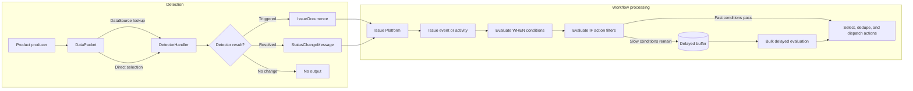

# Workflow Engine

The Workflow Engine evaluates detector data, creates or resolves issues, evaluates
workflows for issue events, and dispatches actions. It owns the Detector and Workflow
model graph and its execution paths while compatibility code continues to expose legacy
Rule and AlertRule API shapes.

This package contains two related pipelines:

1. **Detection** turns product-specific data into Issue Platform occurrences or status
   changes.
2. **Workflow processing** evaluates issue events against workflows and dispatches
   notifications or other actions.

These pipelines are asynchronous. `process_detectors` does not call
`process_workflows` directly. Detector output goes through Issue Platform ingestion;
the resulting issue event later enters workflow processing through event post-processing
or an issue activity.

The detection side below shows the common generic-source and stateful-handler path.
Product-specific producers can select detectors directly, and custom handlers do not
have to use durable transition state.

A detector is the common way in, but existing issue events can enter Workflow
processing directly through post-processing (error and issue-stream workflows).

## Start Here

| You're working on…                  | Read                                                                                            |
| ----------------------------------- | ----------------------------------------------------------------------------------------------- |
| Orienting / new to the system       | [Data model](docs/data-model.md), then [Execution](docs/execution.md) (skim)                    |
| A **condition** or its handler      | [Conditions](docs/conditions.md) (full)                                                         |
| A **detector**                      | [Adding detectors](docs/adding-detectors.md) (full), [Conditions](docs/conditions.md) as needed |
| Tracing a missing action            | [Execution](docs/execution.md) → “Observability and Debugging” checklist                        |
| Legacy alert endpoint compatibility | [Legacy API backport](docs/legacy_backport.md)                                                  |

## Core Concepts

### Data source and packet

A [`DataPacket`](models/data_source.py) wraps a product-specific payload and the ID of
the object that produced it. A [`DataSource`](models/data_source.py) stores a generic
reference to that object. [`DataSourceDetector`](models/data_source_detector.py) maps
the source to one or more detectors.

Data source behavior is registered by type in
[`data_source_type_registry`](registry.py). The registered handler knows how to load
the referenced model, enforce quotas, participate in deletion, and normalize IDs for
relocation.

### Detector

A [`Detector`](models/detector.py) describes what data to evaluate and can reference an
optional trigger [`DataConditionGroup`](models/data_condition_group.py). Its `type` is the slug of an
Issue Platform [`GroupType`](../issues/grouptype.py). The group type's
[`DetectorSettings`](types.py) selects the runtime detector handler, API validator,
configuration schema, and optional query filter.

Detector implementations usually live in the product module that owns the issue type,
not in this package. For example, uptime and metric issue handlers live in
[`sentry.uptime`](../uptime/grouptype.py) and
[`sentry.incidents`](../incidents/grouptype.py).

### Conditions and condition groups

Detectors and Workflows both use [`DataCondition`](models/data_condition.py) and
[`DataConditionGroup`](models/data_condition_group.py) and the same evaluation
primitives. Their input values, result contracts, access to batched condition data, and
missing-group behavior differ. [Conditions](docs/conditions.md) is the canonical source
for this shared layer and its subsystem-specific touchpoints.

### Workflow and action

A [`Workflow`](models/workflow.py) belongs to an organization and connects to detectors
through [`DetectorWorkflow`](models/detector_workflow.py). It can be global or limited
to one environment.

Each workflow has zero or more IF groups through
[`WorkflowDataConditionGroup`](models/workflow_data_condition_group.py). Actions are
attached to those groups through
[`DataConditionGroupAction`](models/data_condition_group_action.py). A passing IF group
makes its actions eligible to run.

Before dispatch, the engine applies the Workflow's repeat frequency and records fire
history. It then removes inactive actions, deduplicates actions with the same
`Action.get_dedup_key()`, and schedules one asynchronous task per retained action. The
task invokes the handler registered for the [`Action.Type`](models/action.py).

### State and history

The engine stores different kinds of runtime state for different purposes:

| State                                                                 | Storage    | Purpose                                                                  |
| --------------------------------------------------------------------- | ---------- | ------------------------------------------------------------------------ |
| [`DetectorState`](models/detector_state.py)                           | PostgreSQL | Durable priority and triggered state per detector and optional group key |
| Detector dedupe values and counters                                   | Redis      | Ordered-packet dedupe and priority threshold tracking                    |
| [`DetectorGroup`](models/detector_group.py)                           | PostgreSQL | Association between an Issue Platform group and its detector             |
| [`WorkflowActionGroupStatus`](models/workflow_action_group_status.py) | PostgreSQL | Last fire time for workflow/action/group repeat suppression              |
| [`WorkflowFireHistory`](models/workflow_fire_history.py)              | PostgreSQL | Workflow/group/event scheduling history                                  |
| Delayed workflow items                                                | Redis      | Work awaiting slow condition evaluation                                  |

See [Data model](docs/data-model.md) for ownership, constraints, and lifecycle details.

## Extension Points

The package initializes registries and signal receivers from
[`Config.ready`](apps.py). The primary extension points are:

| Extension         | Registration                                 |
| ----------------- | -------------------------------------------- |
| Detector type     | Define a `GroupType` with `DetectorSettings` |
| Data source type  | `data_source_type_registry.register(...)`    |
| Condition type    | `condition_handler_registry.register(...)`   |
| Action type       | `action_handler_registry.register(...)`      |
| Workflow activity | `workflow_activity_registry.register(...)`   |

Import-time registration only works when the owning module is imported during
application startup. Follow an existing product integration and add a focused test that
proves registry discovery.

## Package Map

| Path                                        | Responsibility                                                            |
| ------------------------------------------- | ------------------------------------------------------------------------- |
| [`models/`](models)                         | Persistent workflow graph, state, history, and compatibility associations |
| [`handlers/detector/`](handlers/detector)   | Detector contracts and stateful detector orchestration                    |
| [`handlers/condition/`](handlers/condition) | Registered condition implementations                                      |
| [`handlers/workflow/`](handlers/workflow)   | Activity handlers that start workflow processing                          |
| [`processors/`](processors)                 | Synchronous orchestration and evaluation logic                            |
| [`tasks/`](tasks)                           | Asynchronous boundaries for workflows, delayed work, and actions          |
| [`buffer/`](buffer)                         | Redis storage for delayed workflow evaluation                             |
| [`caches/`](caches)                         | Detector, workflow, and action-filter caches                              |
| [`endpoints/`](endpoints)                   | Native APIs, serializers, and validators                                  |
| [`defaults/`](defaults)                     | Default detector and workflow creation                                    |
| [`receivers/`](receivers)                   | Cache invalidation and project/organization lifecycle signals             |
| [`service/`](service)                       | Hybrid-cloud action service                                               |
| [`migration_helpers/`](migration_helpers)   | Legacy alert migration and dual-write support                             |

## Boundaries and Common Confusion

- Workflow Engine detectors are not the same as performance detectors in
  [`sentry.issue_detection`](../issue_detection/README.md). Performance detectors scan
  transaction spans through a separate runtime.
- A `GroupType` may have Workflow Engine detector configuration without using
  `process_detectors` for issue creation. Error, cron, issue-stream, and performance
  configuration detectors have specialized roles.
- A detector can use the generic `DataSource` lookup or a product-specific producer
  that calls `process_detectors` directly.
- Actions are asynchronous and are not guaranteed to execute in a user-defined order.
- Legacy alert models and APIs still coexist with Workflow Engine models. Do not infer
  current execution behavior from compatibility association tables.

## Recommended Tests

The most useful end-to-end references are:

- [`test_integration.py`](../../../tests/sentry/workflow_engine/test_integration.py) for
  detector, workflow, delayed-condition, and action integration.
- [`test_stateful.py`](../../../tests/sentry/workflow_engine/handlers/detector/test_stateful.py)
  for detector state, dedupe, grouping, and thresholds.
- [`test_workflow.py`](../../../tests/sentry/workflow_engine/processors/test_workflow.py)
  for workflow selection and evaluation.
- [`test_delayed_workflow.py`](../../../tests/sentry/workflow_engine/processors/test_delayed_workflow.py)
  for buffered condition evaluation.
- [`test_organization_project_detector_index.py`](../../../tests/sentry/workflow_engine/endpoints/test_organization_project_detector_index.py)
  for the detector API lifecycle.

The code and tests are authoritative when this documentation and implementation differ.
