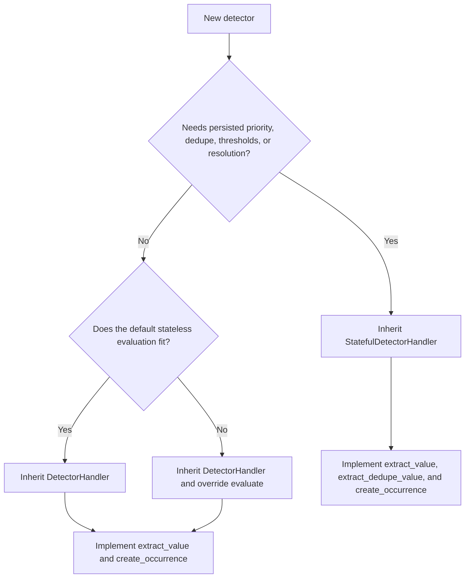
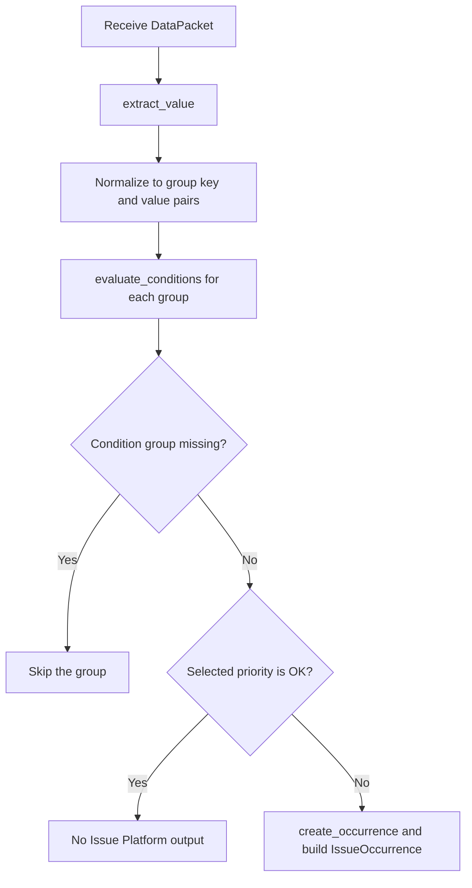

# Adding a Workflow Engine Detector

This guide is a code-oriented checklist for adding a detector that evaluates typed data
and emits Issue Platform occurrences or resolutions. Read the
[architecture overview](../README.md), [data model](data-model.md), and
[condition contract](conditions.md), then use the [execution guide](execution.md) to
trace the surrounding pipelines.

Detector implementations normally live in the product module that owns the data and
Issue Platform group type. Only shared abstractions, processors, and generic source or
condition handling belong in `sentry.workflow_engine`.

Before coding, identify:

- The owning product module
- The packet payload type
- The source of packet ordering
- Whether one packet contains one value or grouped values
- Trigger and recovery semantics
- The stable issue fingerprint
- The API creation/update requirements
- Expected packet volume and state cardinality

## Choose a Handler Abstraction



### Handler hierarchy

| Class                                                         | Role                                                                                                                                                                |
| ------------------------------------------------------------- | ------------------------------------------------------------------------------------------------------------------------------------------------------------------- |
| [`BaseDetectorHandler`](../handlers/detector/base.py)         | Abstract interface: `_evaluate`, `evaluate`, `extract_value`, and `create_occurrence`. Holds the detector and nothing else.                                         |
| [`DetectorHandler`](../handlers/detector/base.py)             | Shared implementation: condition-group loading, evaluation metrics, a default stateless `evaluate`, and shared evidence and event data. The base for new detectors. |
| [`StatefulDetectorHandler`](../handlers/detector/stateful.py) | `DetectorHandler` plus dedupe, priority thresholds, durable state, and resolution. Replaces the default `evaluate`.                                                 |

### `BaseDetectorHandler`

[`BaseDetectorHandler`](../handlers/detector/base.py) is the abstract interface. Do not inherit this directly.

The exception is [`ErrorDetectorHandler`](../../grouping/grouptype.py), a placeholder
that associates error issues with a detector. It does not get evaluated in the normal detector evaluation pipeline and its methods are all stubs.

### `DetectorHandler`

[`DetectorHandler`](../handlers/detector/base.py) is the base class for every detector
that does not need persisted state. It loads the detector's trigger condition group and
provides a default stateless `evaluate`. A concrete subclass implements `extract_value`
and `create_occurrence`.

#### Default stateless evaluation



Override these hooks to adjust the default evaluation:

| Hook                    | Default                                                                        |
| ----------------------- | ------------------------------------------------------------------------------ |
| `evaluate_conditions`   | Evaluate the trigger condition group and select the highest triggered priority |
| `get_issue_fingerprint` | `detector:<detector_id>`, plus `:<group_key>` for grouped detectors            |
| `get_event_id`          | `event_id` from the event data, otherwise a random UUID                        |
| `get_occurrence_id`     | UUID5 of the detector ID, group key, and event ID                              |

Override `evaluate` itself when the detector needs a different flow. See
[`PreprodSizeAnalysisDetectorHandler`](../../preprod/size_analysis/grouptype.py) for how to achieve this

### `StatefulDetectorHandler`

Prefer [`StatefulDetectorHandler`](../handlers/detector/stateful.py) for detectors that
evaluate ordered samples and transition among `OK`, `LOW`, `MEDIUM`, and `HIGH`.

It provides:

- Bulk state loading for grouped values
- Out-of-order and duplicate packet suppression
- Condition-group evaluation
- Priority threshold counters
- Durable priority transitions
- Occurrence creation for non-OK transitions
- Resolution messages for transitions to `OK`
- Shared metrics and evidence data

Uptime and metric issues are canonical examples.

## Design the Packet and Evaluation Value

[`DataPacket[T]`](../models/data_source.py) separates source identity from payload:

```python
@dataclass
class ExamplePacket:
    value: float
    sequence: int


packet = DataPacket(
    source_id=str(source.id),
    packet=ExamplePacket(value=42.0, sequence=123),
)
```

The payload type is what the producer knows. The evaluation value is what detector
conditions consume. They can differ.

Every handler implements `extract_value`. A stateful handler also implements
`extract_dedupe_value`:

```python
def extract_value(
    self, data_packet: DataPacket[ExamplePacket]
) -> float | dict[DetectorGroupKey, float]:
    return data_packet.packet.value


def extract_dedupe_value(self, data_packet: DataPacket[ExamplePacket]) -> int:
    return data_packet.packet.sequence
```

`extract_value` can return one value or a mapping of group key to value. Group keys
create independent Issue Platform fingerprints for one detector, and independent
detector state for stateful handlers.

`extract_dedupe_value` must return a positive integer whose ordering matches the source
stream. Missing Redis state is read as zero, so a first value of zero or less is skipped.
Good values include a source sequence or integer timestamp with sufficient resolution.
Do not use processing time when the producer can deliver older packets later. The Redis
watermark expires after seven days.

The dedupe value is extracted once per packet and applied to every group key. A fresh
value is committed even when no condition matches. Detectors that need independent
ordering per group or replay of previously non-matching packets require custom
orchestration.

### Group-key requirements

A `DetectorGroupKey` is `str | None`:

- Return one value for an ungrouped detector; the state key is `None`.
- Return a mapping for independent substreams.
- Use non-empty strings no longer than 200 characters. Do not use `""`: state-key
  construction and the database uniqueness constraint treat it like ungrouped `None`.
- Keep keys stable across trigger and recovery packets.
- Keep key cardinality bounded. Each key can create durable and Redis state plus an
  Issue Platform group.
- Do not put unbounded IDs or raw user-controlled values into group keys without a
  product-level retention and cardinality plan.
- Do not return an empty dictionary to mean "no groups." Both the default and stateful
  evaluations treat an empty dictionary as one ungrouped evaluation value. Override
  `evaluate` if a packet can legitimately contain no groups to evaluate.

## Implement Occurrence Creation

Every handler implements `create_occurrence` with this contract:

```python
def create_occurrence(
    self,
    evaluation: DataConditionGroupEvaluation,
    data_packet: DataPacket[ExamplePacket],
    priority: DetectorPriorityLevel,
) -> tuple[DetectorOccurrence, EventData]:
    ...
```

The [`DetectorOccurrence`](../handlers/detector/base.py) describes the Issue Platform
occurrence. `EventData` supplies event fields associated with it.

An abbreviated implementation looks like:

```python
def create_occurrence(
    self,
    evaluation: DataConditionGroupEvaluation,
    data_packet: DataPacket[ExamplePacket],
    priority: DetectorPriorityLevel,
) -> tuple[DetectorOccurrence, EventData]:
    occurrence = DetectorOccurrence(
        issue_title=f"{self.detector.name} triggered",
        subtitle="The monitored value crossed its threshold",
        evidence_data={"value": data_packet.packet.value},
        evidence_display=[],
        type=ExampleGroupType,
        level="error",
        culprit="",
        priority=priority,
    )
    event_data: EventData = {"platform": "other", "tags": {}}
    return occurrence, event_data
```

Use an existing product implementation for the exact event shape. The snippet is
illustrative and omits product-specific evidence. The returned dictionary must be
mutable.

The default evaluations supply defaults for `environment`, `platform`, `received`, and `tags`

The default evaluations overwrite `timestamp` and `project_id`.

Stateless and stateful handlers differ on the `event_id` field:

- The default `DetectorHandler.evaluate` uses a random or derived `event_id` and then generates an occurrence ID from it.
- `StatefulDetectorHandler` overwrites `event_id` with a random ID that is also used as
  the occurrence ID.

### Evidence

Evidence serves two audiences:

- `evidence_data` stores structured data used by APIs, grouping context, and issue
  rendering.
- `evidence_display` stores the human-readable evidence shown on the issue.

The stateful handler adds standard detector and condition evidence. Product-specific
evidence should be serializable, bounded in size, and avoid sensitive data.

### Fingerprints

#### Default evaluation

The default evaluation uses `get_issue_fingerprint(group_key)`:

```text
detector:<detector_id>
detector:<detector_id>:<group_key>
```

Overriding `get_issue_fingerprint` replaces the whole fingerprint.

#### Stateful evaluation

The stateful implementation always includes its detector state key:

```text
detector:<detector_id>
detector:<detector_id>:<group_key>
```

Override `build_issue_fingerprint` only when the product needs additional stable
grouping components. The engine appends the detector state key to trigger and resolution
fingerprints. Currently occurrence creation passes `group_key` to this override while
resolution calls it without that argument. Do not make custom components depend on the
argument unless resolution is updated and trigger/resolution tests cover the behavior.
Fingerprint changes can split or merge production issues and can break recovery.

Test the exact trigger and resolution fingerprints. For grouped detectors, explicitly
test that one key cannot resolve another key's issue.

## Configure Threshold Semantics

`StatefulDetectorHandler.thresholds` maps priority to the number of qualifying
evaluations required before transition:

```python
@property
def thresholds(self) -> DetectorThresholds:
    return {
        DetectorPriorityLevel.: self.detector.config["failure_threshold"],
        DetectorPriorityLevel.OK: self.detector.config["recovery_threshold"],
    }
```

The default threshold is one. For a detectors evaluation, the threshold will say we needs
to see X number of a non-OK evaluations to trigger the detector. An OK
evaluation clears non-OK counters before advancing the OK counter. An evaluation equal
to the current durable state clears accumulated counters. These rules are not simply an
independent consecutive-sample counter for every priority.

A detector that can trigger but never produce `OK` evaluations will not resolve through
the stateful handler.

For the StatefulDetectorHandler implementation, failing a non-OK condition does not resolve
the detector. To have the detector be considered resolved, the trigger group must resolve
to `DetectorPriorityLevel.OK`. This normally uses a passing condition with an `OK` result,
but an empty or passing `NONE` group can also trigger with no priority-bearing result and
use the default `OK` priority. A missing detector trigger group is invalid and produces no
state transition.

**NOTE**: `create_occurrence` does not receive the current group key. The base handler still adds
the key to `DetectorEvaluation.data` and the engine fingerprint. If product evidence
must contain the key, include it in the extracted evaluation value or implement and
test the required custom orchestration.

### Example Threshold Evaluation

Here's an illustration of how a threshold works; specifically how the `OK` result will
reset the threshold counts. Note that if it the priority is de-escalating, it does _not_
reset the threshold counts. See

#### Detector Threshold Settings

```python
@property
def thresholds(self) -> DetectorThresholds:
    return {
        DetectorPriorityLevel.HIGH: 2,
        DetectorPriorityLevel.LOW: 2,
        DetectorPriorityLevel.OK: 1
    }
```

#### Example Evaluation Results

##### Example 1 - Consecutive Triggers

```python
- DetectorPriorityLevel.HIGH
- DetectorPriorityLevel.HIGH
===> Detector is triggered at HIGH
```

##### Example 2 - OK resets thresholds

```python
- DetectorPriorityLevel.HIGH
- DetectorPriorityLevel.OK
- DetectorPriorityLevel.HIGH   # Note that the Detector does *not* trigger here
- DetectorPriorityLevel.OK
- DetectorPriorityLevel.HIGH
- DetectorPriorityLevel.HIGH
===> Detector is triggered at HIGH
```

##### Example 3 - De-escalation does _not_ reset thresholds

```python
- DetectorPriorityLevel.OK
- DetectorPriorityLevel.HIGH
- DetectorPriorityLevel.LOW
- DetectorPriorityLevel.HIGH
===> Detector is triggered at HIGH
```

##### Example 4 - Escalating detectors do _not_ reset thresholds

```python
- DetectorPriorityLevel.LOW
- DetectorPriorityLevel.HIGH
- DetectorPriorityLevel.LOW
===> Detector is triggered at LOW
- DetectorPriorityLevel.HIGH
===> Detector is triggered at HIGH
```

## Define the Issue and Detector Type

Create or extend a concrete [`GroupType`](../../issues/grouptype.py) in the owning
product's `grouptype.py`:

```python
@dataclass(frozen=True)
class ExampleGroupType(GroupType):
    type_id = 12345  # Allocate the real Issue Platform type ID.
    slug = "example_detector"
    description = "Example detector issue"
    category = GroupCategory.ERROR.value  # Choose the applicable category.
    released = False
    default_priority = PriorityLevel.HIGH
```

Use the Issue Platform documentation and existing group types to choose the type ID,
category, release controls, priority, auto-resolution, escalation behavior, and
notification configuration.

### Register detector settings

The group type describes the issue. The detector components live in a
[`DetectorSettings`](../types.py) subclass registered in
[`detector_settings_registry`](../registry.py) under the group type's slug:

```python
from sentry.workflow_engine.registry import detector_settings_registry
from sentry.workflow_engine.types import DetectorSettings


@detector_settings_registry.register(ExampleGroupType.slug)
class ExampleDetectorSettings(DetectorSettings):
    handler = ExampleDetectorHandler
    validator = ExampleDetectorValidator
    config_schema = {
        "$schema": "https://json-schema.org/draft/2020-12/schema",
        "type": "object",
        "properties": {
            "failure_threshold": {"type": "integer", "minimum": 1},
            "recovery_threshold": {"type": "integer", "minimum": 1},
        },
        "required": ["failure_threshold", "recovery_threshold"],
        "additionalProperties": False,
    }
```

Register the class, not an instance. The settings can also live in their own module, as long as that module is
imported during application startup.

[`DetectorSettings`](../types.py) fields are:

| Field           | Purpose                                                                 |
| --------------- | ----------------------------------------------------------------------- |
| `handler`       | Runtime `DetectorHandler` class                                         |
| `validator`     | Native detector API validator                                           |
| `config_schema` | Save-time JSON schema for `Detector.config`                             |
| `filter`        | Optional `Q` filter controlling user-visible detector rows of this type |

Both registrations happen at import time. The `GroupType` subclass registers itself
with the global Issue Platform registry when the class is created. The settings class
registers itself when its decorator runs. Sentry startup imports the root
`grouptype.py` of every installed Django app through
[`import_grouptype`](../../issues/grouptype.py). Put both classes there, or import a
nested implementation from that file, as
[`sentry.preprod.grouptype`](../../preprod/grouptype.py) does. Add a test that checks
both the group type and its settings resolve by slug after normal application startup.

## Implement API Validation

Subclass
[`BaseDetectorTypeValidator`](../endpoints/validators/base/detector.py) in the owning
product or under `workflow_engine/endpoints/validators` when the behavior is shared.

The base validator provides:

- Common detector fields
- Condition-result priority validation
- Detector config-schema validation
- Transactional creation and update
- Workflow connections
- Audit entries
- Scheduled deletion

Detector-specific validators commonly provide:

- A `data_conditions` validator
- Product-specific data-source fields and creators
- Cross-field validation
- Quota calculation
- Detector-specific cleanup

If for some reason there's not a consistent data_source or you need to opt-out of the data_source
to detector connections, then set `data_source_required = False`. This should only be when the detector
is intentionally created and resolved outside the generic data-source graph. Set `enforce_single_datasource = True`
when multiple sources would make the handler ambiguous.

_Do not create the detector graph piecemeal in an endpoint._ The base validator's
transaction coordinates condition groups, detector config validation, source mappings,
workflow connections, and audit logging.

## Connect a Data Source

Skip this section only when the validator intentionally sets
`data_source_required = False` and the producer has another reliable detector lookup.

### Reuse or register a source type

First determine whether an existing source type represents the producer object. If not,
define a source type constant and implement
[`DataSourceTypeHandler`](../types.py):

- `bulk_get_query_object`
- `related_model`
- `get_instance_limit`
- `get_current_instance_count`
- `get_relocation_model_name`

Register the handler with [`data_source_type_registry`](../registry.py). Update
`DataSource.__relocation_dependencies__` when the source references a model not already
listed. Add deletion, quota, relocation, and unknown-type tests appropriate to the new
source.

### Create the source graph

Native API creation expects validated source data to contain a product-specific creator.
The base validator calls that creator, creates the generic `DataSource`, and creates the
`DataSourceDetector` mapping in the detector transaction.

The resulting source identity must match the producer call:

```text
DataSource.type == query_type passed to process_data_packet
DataSource.source_id == DataPacket.source_id
```

Test this match end to end. A valid detector with a mismatched source type or stringified
ID will never be selected.

## Produce Packets

Use [`process_data_packet`](../processors/data_packet.py) when the producer has a generic
source mapping:

```python
process_data_packet(
    DataPacket(source_id=str(source.id), packet=payload),
    DATA_SOURCE_EXAMPLE,
)
```

Use [`process_detectors`](../processors/detector.py) directly only when the product path
already resolves the exact detector set and a generic lookup would add no value. Explain
and test that ownership boundary in the producer module. `process_detectors` does not
filter `enabled` or lifecycle status. Direct callers must define and test both
eligibility checks rather than assuming the generic source path's filtering applies.

Producer requirements:

- Preserve the source's natural ordering value.
- Expect retries and duplicate delivery.
- Avoid one database query per detector or group key.
- Keep packet payloads bounded.
- Record enough product metrics to distinguish missing input from detector rejection.
- Decide whether detector exceptions should fail, retry, or isolate one item in a batch.

## Configure Trigger Conditions

Detector trigger conditions return `DetectorPriorityLevel` values. The base API
validator rejects results that are not valid priority integers.

Prefer built-in operators when conditions compare the extracted value directly. Add a
[`DataConditionHandler`](../types.py) only when evaluation needs a richer comparison or
event context.

The complete shared evaluation contract and condition-handler extension path live in
[Conditions](conditions.md). In particular, handler-group placement is not enforced by
generic backend validation, and stateful Detector triggers do not participate in the
Workflow batched data-acquisition phase.

## Rollout and Operational Safety

Before enabling production issue creation:

- Keep a new `GroupType` unreleased until Issue Platform ingest, post-process, and UI
  behavior are intentionally enabled.
- Add a feature flag or runtime option when product rollout needs control beyond the
  Issue Platform release controls.
- Estimate packet throughput and group-key cardinality.
- Estimate PostgreSQL `DetectorState` growth and Redis counter usage.
- Verify occurrence and event payload sizes.
- Ensure fingerprints cannot collide with another detector or an experiment.
- Add metrics with bounded-cardinality tags.
- Verify deletion and missing-record behavior for queued work.
- Document whether old packets can arrive after configuration updates.
- Confirm recovery behavior before triggering real issues.

Detector rollout and Issue Platform type rollout are separate controls. A detector can
run without its resulting type being fully exposed, and a released group type does not
cause a producer to run.

## Implementation Checklist

### Design

- [ ] Confirm Workflow Engine is the correct detection system.
- [ ] Define the packet payload and evaluation value types.
- [ ] Choose the handler: `StatefulDetectorHandler` or `DetectorHandler`.
- [ ] For stateful detectors, choose an ordered, integer dedupe value.
- [ ] Decide whether results are grouped and bound group-key cardinality.
- [ ] Specify trigger, escalation, and recovery transitions.
- [ ] Specify stable trigger and resolution fingerprints.

### Issue type and handler

- [ ] Add or update the product `GroupType`.
- [ ] Register a `DetectorSettings` subclass in `detector_settings_registry` with
      handler, validator, and strict config schema.
- [ ] Implement the selected detector handler abstraction.
- [ ] Implement occurrence evidence and event data.
- [ ] Implement thresholds and recovery for stateful detectors.
- [ ] Verify registry discovery at startup.

### API and persistence

- [ ] Implement the detector-specific validator.
- [ ] Validate condition comparisons and detector config.
- [ ] Reuse or register a data source type.
- [ ] Create `DataSource` and `DataSourceDetector` through the validator path.
- [ ] Confirm cache invalidation covers every new processing relationship.
- [ ] Confirm deletion and relocation behavior.

### Producer

- [ ] Build the typed `DataPacket`.
- [ ] Call `process_data_packet` or deliberately resolve and call `process_detectors`.
- [ ] Match packet source identity to the persisted `DataSource`.
- [ ] Add bounded metrics and exception handling.

### Rollout

- [ ] Configure Issue Platform release controls.
- [ ] Add product flags or options if needed.
- [ ] Validate throughput, state cardinality, and payload sizes.
- [ ] Plan trigger and recovery monitoring.

## Test Matrix

| Area             | Required cases                                                              |
| ---------------- | --------------------------------------------------------------------------- |
| Value extraction | Normal packet, malformed or missing product data                            |
| Dedupe           | Stateful: new, duplicate, and out-of-order packets                          |
| Conditions       | Each configured priority and no-match/OK result                             |
| Thresholds       | Stateful: below threshold, transition at threshold, counter reset, recovery |
| Grouping         | Independent state and fingerprints for at least two group keys              |
| Occurrence       | Title, type, priority, evidence, event data, fingerprint                    |
| Resolution       | Stateful: same issue identity as trigger and correct status change          |
| Registry         | Group type, detector settings, source, and conditions resolve after startup |
| API              | Create, update, invalid config, invalid condition, delete, audit, rollback  |
| Data source      | Correct mapping, disabled detector exclusion, cache invalidation            |
| Producer         | Correct packet/source identity and exception behavior                       |
| Integration      | Issue Platform payload produced from representative product input           |
| Lifecycle        | Deleted detector/source and queued-work races                               |

Use existing factory methods rather than direct model creation in tests. The most useful
shared references are:

- [`test_base.py`](../../../../tests/sentry/workflow_engine/handlers/detector/test_base.py)
  for the default stateless evaluation
- [`test_stateful.py`](../../../../tests/sentry/workflow_engine/handlers/detector/test_stateful.py)
- [`test_data_packet.py`](../../../../tests/sentry/workflow_engine/processors/test_data_packet.py)
- [`test_detector.py`](../../../../tests/sentry/workflow_engine/processors/test_detector.py)
- [`test_organization_project_detector_index.py`](../../../../tests/sentry/workflow_engine/endpoints/test_organization_project_detector_index.py)
- [`test_integration.py`](../../../../tests/sentry/workflow_engine/test_integration.py)

## Recommended Implementations

| Implementation                                                                                        | Why to read it                                                              |
| ----------------------------------------------------------------------------------------------------- | --------------------------------------------------------------------------- |
| [`UptimeDetectorHandler`](../../uptime/grouptype.py)                                                  | Stateful trigger/recovery thresholds, source data, evidence, and API config |
| [`MetricIssueDetectorHandler`](../../incidents/grouptype.py)                                          | Stateful metric thresholds, anomaly payloads, and metric evidence           |
| Processing error handlers in [`processing_errors/grouptype.py`](../../processing_errors/grouptype.py) | Customized state transitions and asymmetric resolution                      |
| [`PreprodSizeAnalysisDetectorHandler`](../../preprod/size_analysis/grouptype.py)                      | Custom `DetectorHandler.evaluate` override                                  |

Copy architecture, not product assumptions. Each example has specialized producer,
state, and lifecycle behavior.
