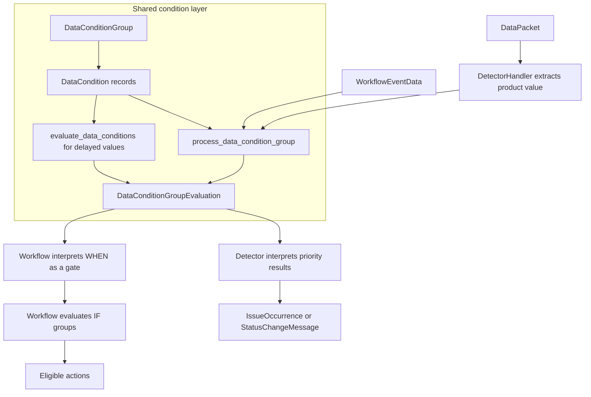

# Conditions in the Workflow Engine

Detectors and Workflows both store [`DataConditionGroup`](../models/data_condition_group.py)
and [`DataCondition`](../models/data_condition.py) records. Their immediate paths use
[`process_data_condition_group`](../processors/data_condition_group.py); delayed
Workflow processing evaluates slow conditions with
[`evaluate_data_conditions`](../processors/data_condition_group.py). They do not pass
the same values into that shared layer or interpret its results the same way.

Read this document before adding or changing a condition. It defines the shared
evaluation contract, the Detector and Workflow-specific behavior around it, and the
complete path for adding a condition type and handler.

## Architecture



The paths converge only in the shared condition layer. Detector output later reaches
Workflow processing through Issue Platform ingestion and issue post-processing; a
Detector evaluation does not invoke a Workflow directly. See
[`process_detectors`](../processors/detector.py) and
[`process_workflows`](../processors/workflow.py).

## Shared Condition Layer

### Persistent records

[`DataCondition`](../models/data_condition.py) stores:

| Field              | Contract                                                                    |
| ------------------ | --------------------------------------------------------------------------- |
| `type`             | A string represented by the [`Condition`](../models/data_condition.py) enum |
| `comparison`       | JSON passed to an operator or registered handler                            |
| `condition_result` | JSON used when a boolean comparison matches                                 |
| `condition_group`  | Required parent `DataConditionGroup`                                        |

[`DataConditionGroup`](../models/data_condition_group.py) stores an organization and a
logic type. Detector trigger groups, Workflow WHEN groups, and Workflow IF groups all
use this same model.

Those are intended roles, not exclusive database types. The schema independently
constrains each relation, but does not prevent one group from being referenced through
more than one role-bearing relation. Code that creates groups must preserve role
separation by convention.

### Condition dispatch

[`DataCondition.evaluate_value`](../models/data_condition.py) evaluates one condition:

1. `eq`, `gte`, `gt`, `lte`, `lt`, and `ne` use the built-in operators in
   `CONDITION_OPS`.
2. Every other `Condition` looks up a class in
   [`condition_handler_registry`](../registry.py) and calls
   `handler.evaluate_value(value, comparison)`.
3. A boolean handler/operator result is interpreted as a match:
   - `False` becomes `result=None` and `triggered=False`.
   - `True` is replaced by `get_condition_result()`, which converts a valid integer
     priority to `DetectorPriorityLevel`, preserves floats and booleans, leaves other
     integers unchanged, and rejects unsupported JSON shapes with `ConditionError`.
4. A non-boolean handler result passes through unchanged and does not receive this
   stored-result normalization.
5. The final evaluation is triggered when `result is not None`, not when the result is
   truthy.

The last two rules are important. A matched condition whose stored `condition_result` is
`False` has `triggered=True` and `result=False`. A Detector handler that directly returns
the raw integer `1` does not produce `DetectorPriorityLevel.LOW` and can be ignored by
the stateful priority filter. Consumers must use `.triggered` rather than `bool(result)`.

The return value is a
[`DataConditionEvaluation`](../processors/evaluations/condition.py). It carries the
condition, input data, result, triggered flag, and optional `ConditionError`.

### Group evaluation contract

The shared entry point is:

```python
def process_data_condition_group(
    group: DataConditionGroup,
    value: T,
    data_conditions_for_group: list[DataCondition] | None = None,
) -> tuple[DataConditionGroupEvaluation, list[DataCondition]]:
    ...
```

The first return item is the current group evaluation. The second is the list of slow
conditions that still require evaluation. It is not a list of every condition skipped
by short-circuiting.

If `data_conditions_for_group` is omitted, the processor uses prefetched conditions or
loads them through `get_data_conditions_for_group`. Bulk callers should pass already
loaded conditions to avoid per-group queries.

[`DataConditionGroup.Type`](../models/data_condition_group.py) has four values:

| Logic type          | Behavior                                                                      |
| ------------------- | ----------------------------------------------------------------------------- |
| `ANY`               | Evaluate all supplied conditions; pass when at least one is triggered         |
| `ANY_SHORT_CIRCUIT` | Stop and pass on the first triggered condition                                |
| `ALL`               | Evaluate all supplied conditions; pass only when every condition is triggered |
| `NONE`              | Stop and fail on the first triggered condition; pass when none trigger        |

An existing group with no conditions returns a clean, triggered evaluation for every
logic type. A passing `NONE` group has no passing condition evaluations in its result
data. An invalid stored logic type returns a non-triggered evaluation with a
`ConditionError`.

These behaviors are implemented by
[`evaluate_data_conditions`](../processors/data_condition_group.py) and
[`evaluate_condition_group_results`](../processors/data_condition_group.py).

### Inline and batched condition data

[`SLOW_CONDITIONS`](../models/data_condition.py) is a manual list of six event-frequency
and session condition types. A slow condition has the same `DataConditionHandler` and
evaluation-result contract as any other condition. "Slow" describes how its input data
is acquired: the required query is too expensive to run inline for each Workflow, so the
engine batches equivalent queries and gathers the data once for evaluation across the
buffered Workflows.

The classification is not inferred from `DataConditionHandler.Group`, subgroup, or
handler behavior. It only controls the split between inline evaluation and the batched
data-acquisition phase.

`process_data_condition_group` splits fast and slow conditions:

1. A group containing only slow conditions returns a provisional non-triggered result
   and all slow conditions.
2. Otherwise, fast conditions run first.
3. A fast result is conclusive when:
   - `ANY` or `ANY_SHORT_CIRCUIT` passes, or
   - `ALL` or `NONE` fails.
4. A conclusive result discards the remaining slow list.
5. A non-conclusive result returns the remaining slow conditions to the caller.

For event-driven Workflows, the delayed processor batches query generation, obtains the
query values, and calls the same `evaluate_data_conditions` function used by inline
group processing. This is a scheduling/data-fetch difference, not a second condition
semantics system. Activity-driven Workflows and stateful Detectors do not enqueue this
batched phase.

### Errors and taint

[`BaseWorkflowEngineEvaluation`](../processors/evaluations/base.py) keeps `result`,
`triggered`, and `error` separate. An evaluation with an error is _tainted_: the answer
may have been affected by a failed condition.

The `any`, `all`, and `none` combinators propagate errors only when the failed input
could affect the answer. For example, one clean true input makes `ANY` clean even when
another input failed; an `ANY` result of false remains tainted if any input failed.

The condition error boundary is intentionally narrow:

- Operator `TypeError`, missing handler registration, invalid stored result data, and a
  handler-raised `DataConditionEvaluationException` become tainted, non-triggered
  condition evaluations.
- An invalid stored condition-type string raises
  `DataConditionEvaluationException` from `DataCondition.evaluate_value`.
- Arbitrary exceptions raised by a handler are not converted to `ConditionError`.

An arbitrary exception therefore escapes the shared layer. Whether it is retried depends
on the Detector producer or Workflow task entrypoint; the condition framework itself
does not retry handler evaluation.

Neither Detector nor Workflow processing automatically suppresses every tainted result.
A tainted group whose `.triggered` value is decisive can still cause a state transition
or select actions. Handler code should raise `DataConditionEvaluationException` only for
known evaluation failures and must not rely on taint as a retry mechanism.

### Validation is layered

[`BaseDataConditionValidator`](../endpoints/validators/base/data_condition.py) performs
the complete API validation path:

- Validates the enum value and handler registration
- Validates comparison and result JSON against handler schemas
- Calls `handler.validate_comparison(comparison, organization)` when organization
  context is available

The model `pre_save` receiver in
[`receivers/data_condition.py`](../receivers/data_condition.py) is weaker. It validates
only comparison JSON for registered, non-operator handlers. It does not enforce result
schemas, contextual validation, or handler placement, and `bulk_create` bypasses the
signal.

Use the existing validators for API/model graph creation. Do not treat direct model
saves as equivalent validation.

## Detector and Workflow Touchpoints

| Concern                                          | Detector trigger                                                                                                                                 | Workflow WHEN                                                        | Workflow IF/action filter                                            |
| ------------------------------------------------ | ------------------------------------------------------------------------------------------------------------------------------------------------ | -------------------------------------------------------------------- | -------------------------------------------------------------------- |
| Owning relation                                  | `Detector.workflow_condition_group`                                                                                                              | `Workflow.when_condition_group`                                      | `WorkflowDataConditionGroup.condition_group`                         |
| Input passed to shared layer                     | Detector-specific value extracted from a `DataPacket`                                                                                            | `WorkflowEventData`                                                  | `WorkflowEventData`                                                  |
| Intended handler group                           | `DETECTOR_TRIGGER`                                                                                                                               | `WORKFLOW_TRIGGER`                                                   | `ACTION_FILTER`                                                      |
| Placement enforced by generic backend validation | No                                                                                                                                               | No                                                                   | No                                                                   |
| Expected result                                  | `DetectorPriorityLevel`                                                                                                                          | Gate, conventionally stored `True`                                   | Gate, conventionally stored `True`                                   |
| Consumer                                         | Detector handler selects priority/state transition                                                                                               | Decides whether Workflow continues                                   | Selects an attached action group                                     |
| Group not configured                             | Stateful handler treats it as invalid; no transition                                                                                             | `when_condition_group_id=None` passes                                | No IF groups means no actions are selected                           |
| Configured group row cannot be loaded            | Stateful handler treats it as invalid; no transition                                                                                             | Tainted and non-triggered                                            | Missing group rows are skipped by lookup/evaluation paths            |
| Existing empty group                             | Shared layer passes with no condition results; the stateful default priority is `OK`, so an already-triggered Detector can count toward recovery | Passes                                                               | Passes and selects attached actions                                  |
| Batched input acquisition                        | No batched phase; remaining conditions are logged and discarded                                                                                  | Event-driven processing batches data, then uses the shared evaluator | Event-driven processing batches data, then uses the shared evaluator |
| Activity behavior                                | Not applicable to detector evaluation                                                                                                            | No environment; no delayed phase                                     | No environment; no delayed phase                                     |

`DataConditionHandler.Group` drives the top-level control placement exposed through
[`OrganizationDataConditionIndexEndpoint`](../endpoints/organization_data_condition_index.py).
The intended conceptual split is:

- `group` identifies whether the control belongs to Detector or Workflow configuration.
- `subgroup` organizes the UI control within that subsystem, such as trigger or action
  filter placement.

The current enum shape does not represent that hierarchy literally. `Group` currently
combines subsystem and control phase through `DETECTOR_TRIGGER`, `WORKFLOW_TRIGGER`, and
`ACTION_FILTER`. `Subgroup` currently refines UI presentation with
`ISSUE_ATTRIBUTES`, `EVENT_ATTRIBUTES`, and `FREQUENCY`. The availability API serializes
those current values as `handlerGroup` and `handlerSubgroup`. Subgroup does not affect
evaluation.

Neither field determines the runtime input type or prevents a caller from storing a
handler in the wrong role. Matching the handler's input and result contract to its
placement is a convention-only invariant.

## Detectors

A [`Detector`](../models/detector.py) represents configured detection. A runtime handler
is selected through the detector type's [`DetectorSettings`](../types.py).

The common stateful path is
[`StatefulDetectorHandler.evaluate_impl`](../handlers/detector/stateful.py):

1. Extract one packet-wide positive integer dedupe value.
2. Extract one evaluation value or a mapping of `DetectorGroupKey` to value.
3. Load PostgreSQL detector state and Redis dedupe/counter state.
4. Skip a group key when the packet dedupe value is not newer.
5. Enqueue the new dedupe watermark _before_ condition evaluation.
6. Pass each extracted value to `process_data_condition_group`.
7. From a triggered group, keep triggered results that are actual
   `DetectorPriorityLevel` values and choose the maximum.
8. Apply priority threshold rules and persist state.
9. Produce an `IssueOccurrence` for a non-OK transition or a `StatusChangeMessage` for
   a transition to `OK`.

Detector-specific consequences:

- A fresh packet advances the Redis watermark even when no condition matches.
- One dedupe value applies to every group key extracted from that packet. Independent
  per-key ordering requires custom orchestration.
- A passing condition with `condition_result=DetectorPriorityLevel.OK` is the normal
  recovery signal. Failing all non-OK conditions does not imply recovery.
- Stateful Detector processing has no batched data-acquisition phase. Conditions that
  require it are logged as remaining work and discarded, so Detector trigger inputs must
  be available inline.
- A tainted triggered result can still update counters and produce a transition.
- PostgreSQL state, Redis state, and Issue Platform publication are not one transaction.
  `DetectorStateManager.commit_state_updates` writes PostgreSQL before Redis, and
  `process_detectors` publishes only after handler evaluation returns. A failure after
  state commit but before publication can cause a retry to be skipped by dedupe.

The output enters Issue Platform through
[`create_issue_platform_payload`](../processors/detector.py). Workflows run later from
the resulting issue event; they are not part of the detector state transaction.

## Workflows

A [`Workflow`](../models/workflow.py) is connected to detectors through
[`DetectorWorkflow`](../models/detector_workflow.py). Its conditions have two stages:

1. The optional WHEN group decides whether processing continues.
2. Each IF group is evaluated independently and selects the actions attached to that
   group through [`DataConditionGroupAction`](../models/data_condition_group_action.py).

Both stages pass equivalent [`WorkflowEventData`](../types.py) values to the shared
layer. Each stage creates a dataclass copy with its Workflow environment; the copies
share the event-local cache. The value contains a `GroupEvent` or `Activity`, the issue
group, optional state and escalation data, and an optional workflow environment.

[`process_workflows`](../processors/workflow.py) performs the surrounding lifecycle:

1. Resolve the event-specific and issue-stream detectors.
2. Load enabled Workflows connected to those detectors for the event environment.
3. Evaluate WHEN groups.
4. Evaluate IF groups for Workflows whose WHEN passed or remains pending slow work.
5. Buffer unresolved slow work for eligible `GroupEvent` processing.
6. Resolve attached actions for passing IF groups.
7. Hand passing action groups to the Workflow frequency, history, active-action,
   deduplication, and asynchronous dispatch path documented in [Execution](execution.md).

### Event and activity differences

| Input                   | `GroupEvent`                                                              | `Activity`                                                                            |
| ----------------------- | ------------------------------------------------------------------------- | ------------------------------------------------------------------------------------- |
| Task entry              | `process_workflows_event`                                                 | Activity handler resolves a concrete detector, then calls `process_workflow_activity` |
| Environment             | Event environment or global                                               | Global only (`workflow_env=None`)                                                     |
| Slow WHEN/IF conditions | Can be buffered for delayed processing                                    | Not buffered                                                                          |
| Preferred detector      | Occurrence evidence or default error detector, then issue stream fallback | Concrete detector supplied by the activity path                                       |

These differences are implemented in [`tasks/workflows.py`](../tasks/workflows.py),
[`get_environment_by_event`](../processors/workflow.py), and
[`get_preferred_detector`](../processors/detector.py).

## Adding a Condition Type and Handler

This walkthrough is verified against
[`FirstSeenEventConditionHandler`](../handlers/condition/first_seen_event_handler.py) and
[`test_first_seen_event_handler.py`](../../../../tests/sentry/workflow_engine/handlers/condition/test_first_seen_event_handler.py).
The example adds a fast Workflow WHEN condition. Differences for Detector triggers and
Workflow IF conditions are called out explicitly.

### 1. Choose the placement and contract

Before editing, decide:

- **Detector trigger:** What detector-specific value will the handler receive? Should it
  return a priority directly, or a boolean that maps to the stored priority result?
- **Workflow WHEN:** What property of `WorkflowEventData` gates the entire Workflow?
- **Workflow IF:** What property of `WorkflowEventData` gates one action group?
- **Batched Workflow WHEN or IF:** Does acquiring the evaluation input require an
  expensive query? If so, the condition handler itself is unchanged, but the delayed
  data-acquisition path must know how to batch and supply that input.

Do not make one handler accept unrelated Detector and Workflow input shapes. The generic
base class cannot enforce the runtime input type.

### 2. Add the enum value

Edit [`models/data_condition.py`](../models/data_condition.py):

```python
class Condition(StrEnum):
    # ...
    MY_NEW_CONDITION = "my_new_condition"
```

The enum feeds model choices and API validation. Storage is a `CharField`, not a database
enum. Run the repository's migration check rather than assuming whether a model-state
migration is required.

### 3. Implement and register the handler

For a fast Workflow WHEN condition, add
`handlers/condition/my_new_condition_handler.py`:

```python
from typing import Any

from sentry.workflow_engine.models.data_condition import Condition
from sentry.workflow_engine.registry import condition_handler_registry
from sentry.workflow_engine.types import DataConditionHandler, WorkflowEventData


@condition_handler_registry.register(Condition.MY_NEW_CONDITION)
class MyNewConditionHandler(DataConditionHandler[WorkflowEventData]):
    group = DataConditionHandler.Group.WORKFLOW_TRIGGER
    comparison_json_schema = {"type": "boolean"}
    condition_result_schema = {"type": "boolean"}
    label_template = "The new condition matches"

    @staticmethod
    def evaluate_value(event_data: WorkflowEventData, comparison: Any) -> bool:
        # `group.some_field` is illustrative; use a real Group property.
        return comparison and event_data.group.some_field
```

Required handler contract from [`DataConditionHandler`](../types.py):

| Member                              | Requirement                                                                                             |
| ----------------------------------- | ------------------------------------------------------------------------------------------------------- |
| `group`                             | Set the top-level Detector/Workflow control placement exposed to the UI                                 |
| `evaluate_value(value, comparison)` | Return a `DataConditionResult`; raise `DataConditionEvaluationException` for a known evaluation failure |
| `comparison_json_schema`            | Define accepted stored/API comparison JSON                                                              |
| `condition_result_schema`           | Define accepted stored/API result JSON; the inherited `{}` is permissive                                |
| `subgroup`                          | Optional UI-only categorization within the top-level group; it does not affect evaluation               |
| `label_template` or `render_label`  | Needed when the condition must render through legacy rule-shaped APIs                                   |
| `validate_comparison`               | Override for organization-scoped or cross-field validation that JSON Schema cannot express              |

For a Detector trigger, specialize the generic with the actual detector value type. A
boolean return maps to the stored `DetectorPriorityLevel`; a direct non-boolean
`DetectorPriorityLevel` return passes through. Detector API validation requires stored
condition results to be integers convertible to `DetectorPriorityLevel`.

For a Workflow IF condition, use `DataConditionHandler.Group.ACTION_FILTER`, continue to
accept `WorkflowEventData`, and set a subgroup when the automation UI needs to place it
under issue attributes, event attributes, or frequency.

### 4. Make the registration run at startup

Edit [`handlers/condition/__init__.py`](../handlers/condition/__init__.py):

```python
__all__ = [
    # ...
    "MyNewConditionHandler",
]

from .my_new_condition_handler import MyNewConditionHandler
```

This import is functional. [`Config.ready`](../apps.py) imports the condition package;
the package import executes the registration decorator. An enum and handler class that
are not imported remain unavailable at runtime.

A product-specific condition can live outside this package, but its owning app startup
must import the decorated module. Anomaly detection demonstrates this path through
[`incidents/handlers/condition`](../../incidents/handlers/condition) and
[`incidents/grouptype.py`](../../incidents/grouptype.py).

### 5. Decide whether manual lists apply

Registration does not update these lists automatically:

| List                                             | Add the condition when                                                                                     |
| ------------------------------------------------ | ---------------------------------------------------------------------------------------------------------- |
| [`SLOW_CONDITIONS`](../models/data_condition.py) | It uses the delayed Workflow query path; delayed query generation and result handling must also support it |
| `PERCENT_CONDITIONS`                             | It is a delayed percentage comparison                                                                      |
| `LEGACY_CONDITIONS`                              | It must be hidden from the condition availability endpoint                                                 |

A condition whose data must be acquired in the batched phase additionally needs a query
handler registered in
`slow_condition_query_handler_registry`. Implement the
[`BaseEventFrequencyQueryHandler`](../handlers/condition/event_frequency_query_handlers.py)
data-acquisition contract and register the condition in that module. This handler does
not replace `DataConditionHandler`; it gathers the values that are later passed through
the same condition evaluator. Without this registration,
[`generate_unique_queries`](../processors/delayed_workflow.py) cannot build a query and
the buffered condition cannot fire.

### 6. Verify API exposure and serialization

Once registered, the handler appears in
[`OrganizationDataConditionIndexEndpoint`](../endpoints/organization_data_condition_index.py)
under its `group`, unless it is in `LEGACY_CONDITIONS`. The endpoint exposes the type,
group, optional subgroup, and comparison schema.

Stored conditions serialize through
[`DataConditionSerializer`](../endpoints/serializers/data_condition_serializer.py).
Comparison dictionary keys are converted to the API's camelCase representation.

If `validate_comparison` resolves a user, team, integration, or other organization-owned
object, scope the lookup by the supplied organization. The generic validator does not
make an unscoped handler lookup safe.

### 7. Add focused backend tests

Add `tests/sentry/workflow_engine/handlers/condition/test_my_new_condition_handler.py`,
using [`ConditionTestCase`](../../../../tests/sentry/workflow_engine/handlers/condition/test_base.py).

Cover:

- Passing and non-passing values
- Exact result and `.triggered` behavior
- Missing or malformed runtime data
- Comparison JSON Schema acceptance and rejection
- Known failure conversion when using `DataConditionEvaluationException`
- Event versus activity behavior when relevant
- Organization scoping when `validate_comparison` or `render_label` loads objects
- Registry discovery through normal application startup

Add an explicit registration assertion without importing the implementation module in
the test:

```python
handler = condition_handler_registry.get(Condition.MY_NEW_CONDITION)
assert handler.__name__ == "MyNewConditionHandler"
```

Then test the placement:

- **Detector trigger:** create a detector condition with a priority result and assert the
  detector transition or `DetectorEvaluation` in
  [`test_detector.py`](../../../../tests/sentry/workflow_engine/processors/test_detector.py)
  or the owning product's handler test. If the condition needs a new extracted value,
  update and test the owning `DetectorHandler.extract_value` implementation.
- **Workflow WHEN:** assert the Workflow stops or proceeds in
  [`test_workflow.py`](../../../../tests/sentry/workflow_engine/processors/test_workflow.py).
- **Workflow IF:** in the same processor test, create the
  `WorkflowDataConditionGroup`/`DataConditionGroupAction` graph and assert only actions
  attached to passing groups are selected.
- **Slow Workflow WHEN or IF:** extend
  [`test_delayed_workflow.py`](../../../../tests/sentry/workflow_engine/processors/test_delayed_workflow.py)
  for query generation, WHEN gating or IF selection, preservation of passing IF groups,
  result combination, retry behavior, and cleanup.

Detector-specific comparison validation belongs in the owning subclass of
[`BaseDetectorTypeValidator`](../endpoints/validators/base/detector.py). The generic
condition handler alone cannot add detector packet data or detector-specific API fields.

### 8. Add optional compatibility and frontend support

These are separate decisions, not part of backend registration.

For legacy issue-alert compatibility, add forward and reverse translations in:

- [`migration_helpers/issue_alert_conditions.py`](../migration_helpers/issue_alert_conditions.py)
- [`migration_helpers/rule_conditions.py`](../migration_helpers/rule_conditions.py)

A native-only condition without reverse translation can disappear from a legacy
rule-shaped response.

For the automation builder, add the matching frontend enum and node implementation in a
separate frontend PR:

- [`static/app/types/workflowEngine/dataConditions.tsx`](../../../../static/app/types/workflowEngine/dataConditions.tsx)
- [`static/app/views/automations/components/dataConditionNodes.tsx`](../../../../static/app/views/automations/components/dataConditionNodes.tsx)

The backend comparison schema does not generate the complete editor; current conditions
have explicit frontend nodes, defaults, details, and validation.

## File Map

| Change                              | Files to inspect or edit                                                                                   |
| ----------------------------------- | ---------------------------------------------------------------------------------------------------------- |
| Add condition enum                  | `models/data_condition.py:Condition`                                                                       |
| Add shared handler                  | `handlers/condition/<name>_handler.py`                                                                     |
| Register at startup                 | Handler decorator and `handlers/condition/__init__.py`                                                     |
| Add product-owned handler           | Product handler package and owning app's startup import                                                    |
| Change evaluation semantics         | `models/data_condition.py`, `processors/data_condition_group.py`, evaluation classes                       |
| Change Detector consumption         | `handlers/detector/`, especially `stateful.py`                                                             |
| Change Workflow WHEN/IF consumption | `models/workflow.py`, `processors/workflow.py`                                                             |
| Add slow condition                  | `SLOW_CONDITIONS`, `event_frequency_query_handlers.py`, delayed query/result code, delayed processor tests |
| Change API validation               | `endpoints/validators/base/data_condition.py` and group/Detector/Workflow validators                       |
| Change availability metadata        | `endpoints/organization_data_condition_index.py` and handler serializer                                    |
| Add legacy compatibility            | `migration_helpers/issue_alert_conditions.py`, `migration_helpers/rule_conditions.py`                      |
| Add automation UI                   | Frontend condition enum, node registry, editor/details components, frontend tests                          |

## Conventions and Invariants

| Rule                                                                                       | Enforcement                                                                        |
| ------------------------------------------------------------------------------------------ | ---------------------------------------------------------------------------------- |
| Enum value, decorator key, stored `type`, and frontend enum use the same snake_case string | Convention only across backend/frontend                                            |
| A handler is imported before validation or evaluation                                      | Enforced only by startup wiring and tests                                          |
| Handler placement matches `handler.group`                                                  | Convention/UI discovery only; generic backend validation does not enforce it       |
| Handler `subgroup` changes only UI organization                                            | UI serialization/rendering; evaluation does not inspect it                         |
| Detector conditions produce valid priorities                                               | Enforced by Detector API validators; not fully enforced by direct model saves      |
| Workflow conditions use gate-like results, conventionally stored `True`                    | Convention; runtime checks non-`None`, not boolean type                            |
| Detector trigger conditions are fast                                                       | Convention required by `StatefulDetectorHandler`; remaining slow work is discarded |
| Comparison and result schemas reject unknown shapes                                        | Enforced only when handlers define strict schemas and callers use API validation   |
| Organization-owned IDs are scoped in `validate_comparison` and `render_label`              | Handler responsibility; not inferred by the framework                              |
| Group-role records are not reused across Detector, WHEN, and IF relations                  | Convention; no cross-role database constraint                                      |
| Slow/percent/trigger/legacy behavior is added to the corresponding manual list             | Convention plus focused tests                                                      |
| Actions are interpreted through `.triggered`, not result truthiness                        | Runtime contract in evaluation objects                                             |
| Handler generic input matches the value passed at its placement                            | Static annotation and convention; runtime dispatch does not check it               |
| Direct non-boolean handler results use the expected semantic type                          | Static annotation and focused tests; runtime accepts the broader result union      |
