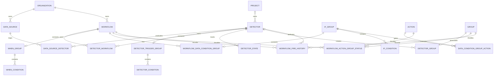

# Workflow Engine Data Model

This document describes the persistent graph used by the Workflow Engine. It focuses
on relationships, ownership, and invariants rather than repeating every Django field.
For runtime control flow, see [Execution](execution.md).

## Conceptual Graph

The diagram is conceptual. Some relationships use join models rather than direct
foreign keys, and compatibility models are omitted from the main graph. The abbreviated
names are condition roles, not model names: `WHEN_GROUP`/`WHEN_CONDITION` correspond to
the `DataConditionGroup`/`DataCondition` on `Workflow.when_condition_group`;
`IF_GROUP`/`IF_CONDITION` to those on `WorkflowDataConditionGroup.condition_group`;
`DETECTOR_TRIGGER_GROUP` to `Detector.workflow_condition_group`.

## Detection Graph

### `DataSource`

[`DataSource`](../models/data_source.py) belongs to an organization and generically
references a product model that emits detector input. The pair `(type, source_id)` is
globally unique; the organization is not part of that database constraint.

`type` selects a registered
[`DataSourceTypeHandler`](../types.py). The handler provides behavior that cannot be
expressed by the generic reference alone:

- Bulk-loading the referenced product objects
- Deletion relationships
- Organization quota calculation
- Relocation model naming

`source_id` is text because source models do not share a primary-key type. Callers must
use the registered handler instead of assuming which model it references.

Known examples include Snuba query subscriptions, uptime subscriptions, and cron
monitors. Adding a source type requires both registration and startup import coverage.

### `DataSourceDetector`

[`DataSourceDetector`](../models/data_source_detector.py) is the many-to-many mapping
between sources and detectors. `(data_source, detector)` is unique.

One source can feed multiple detectors. One detector can also be connected to source
records according to the owning product's model. Detector lookup by source is cached,
so mutations must preserve the receiver-driven invalidation path.

### `Detector`

[`Detector`](../models/detector.py) is the configured unit of detection. Important
relationships and fields are:

| Field or relationship      | Meaning                                                                                    |
| -------------------------- | ------------------------------------------------------------------------------------------ |
| `project`                  | Owning project for normal detectors; nullable for organization-wide issue-stream detectors |
| `type`                     | Slug of an Issue Platform `GroupType`                                                      |
| `workflow_condition_group` | Trigger conditions that map input to priority levels                                       |
| `config`                   | Detector-type-specific settings validated against `DetectorSettings.config_schema`         |
| `enabled`                  | User-controlled active/snoozed state                                                       |
| `status`                   | Lifecycle state, including pending deletion and plan-level disabling                       |

The detector type is registered outside this Django app. A concrete
[`GroupType`](../../issues/grouptype.py) supplies
[`DetectorSettings`](../types.py), which can define:

- Runtime handler
- API validator
- Configuration JSON schema
- Query filter for detector visibility

Do not add a second detector registry. `GroupType` registration is the detector-type
registry.

`Detector` does not enforce a database uniqueness constraint for project and type.
Default detector creation uses short distributed locks and idempotent lookups instead.

### Detector trigger conditions

The detector's `workflow_condition_group` points to a
[`DataConditionGroup`](../models/data_condition_group.py). The relation is nullable and
unique independently of the Workflow condition relations.

The field name is historical: this group belongs to detector evaluation even though it
is named `workflow_condition_group`.

## Conditions

### `DataCondition`

[`DataCondition`](../models/data_condition.py) contains:

| Field              | Meaning                            |
| ------------------ | ---------------------------------- |
| `type`             | Stored condition type              |
| `comparison`       | JSON comparison/configuration      |
| `condition_result` | JSON result configured for a match |
| `condition_group`  | Required parent group              |

### `DataConditionGroup`

[`DataConditionGroup`](../models/data_condition_group.py) owns an organization and a
stored logic type. Groups have three intended roles:

- Detector trigger group
- Workflow WHEN group
- Workflow IF/action-filter group

Role exclusivity is not enforced across these relations, and generic validators do not
enforce handler placement. Creation code must keep the roles separate by convention.
See [Conditions](conditions.md) for the canonical evaluation, validation, and placement
contracts.

## Workflow Graph

### `DetectorWorkflow`

[`DetectorWorkflow`](../models/detector_workflow.py) connects detectors to workflows.
The connection determines which workflows are candidates for an issue event associated
with that detector.

An issue event can select more than one detector for lookup:

- Its specific detector, when known
- The project's issue-stream detector
- An optional organization-wide all-projects issue-stream detector

This allows workflows to target a product-specific detector or the broader issue stream.

### `Workflow`

[`Workflow`](../models/workflow.py) is organization-scoped. Important fields are:

| Field or relationship  | Meaning                                                 |
| ---------------------- | ------------------------------------------------------- |
| `when_condition_group` | Optional trigger group evaluated before action filters  |
| `environment`          | `NULL` for all environments or one specific environment |
| `config.frequency`     | Repeat suppression interval in minutes                  |
| `enabled`              | Whether the workflow is eligible to run                 |

### `WorkflowDataConditionGroup`

[`WorkflowDataConditionGroup`](../models/workflow_data_condition_group.py) connects one
workflow to one IF/action-filter condition group. A condition group can belong to only
one workflow through this relationship.

### `DataConditionGroupAction` and `Action`

[`DataConditionGroupAction`](../models/data_condition_group_action.py) connects actions
to IF groups. [`Action`](../models/action.py) stores the action type and its handler-
specific configuration and data.

The action type selects a handler from
[`action_handler_registry`](../registry.py). Handlers are commonly implemented in the
owning integration or notification package rather than in `workflow_engine`.

An action can be reachable from more than one Workflow. The data model does not define
action execution order.

## Runtime State and History

### `DetectorState`

[`DetectorState`](../models/detector_state.py) stores durable detector status for a
detector and optional [`DetectorGroupKey`](../types.py). The group key lets one detector
track independent state for multiple values in a packet, such as separate endpoints.

The unique constraint treats a null group key as an empty value so that a non-grouped
detector has one state row.

Detector state is split across stores:

- PostgreSQL stores the durable priority and triggered status.
- Redis stores dedupe watermarks and priority threshold counters with a TTL.

The split is part of the runtime contract. For `StatefulDetectorHandler`, dedupe values
must be positive integers that increase with source order. The watermark defaults to
zero when absent and expires from Redis after seven days, so duplicate suppression is
not durable beyond that TTL.

### `DetectorGroup`

[`DetectorGroup`](../models/detector_group.py) associates an Issue Platform
[`Group`](../../models/group.py) with the detector that produced or owns it. The detector
foreign key can become null after deletion so existing issue history remains valid.

The association is normally created during Issue Platform ingestion. Compatibility
paths can backfill missing associations. Callers resolving a detector from an issue must
handle deleted or missing detector records.

### `WorkflowActionGroupStatus`

[`WorkflowActionGroupStatus`](../models/workflow_action_group_status.py) records when a
`(workflow, action, group)` tuple last passed repeat-frequency filtering. It is updated
before event-level deduplication and task execution, so it does not prove that an
external action completed.

### `WorkflowFireHistory`

[`WorkflowFireHistory`](../models/workflow_fire_history.py) stores a Workflow, issue
group, event ID, notification UUID, and optional detector. It has no action or delivery
outcome field. Rows are created before inactive-action filtering and event-level
deduplication, so they record pre-dispatch intent rather than a scheduled or successfully
delivered action.

## Compatibility Models

Compatibility association models map legacy issue and metric alert records to Detector,
Workflow, condition, action, and Issue Platform records. They are not part of normal
Detector or Workflow evaluation. See [Legacy alert API compatibility](legacy_backport.md)
for the model list and current mixed read/write behavior.

## Lifecycle and Invalidation

### Creation

Detector model API creation is coordinated by
[`BaseDetectorTypeValidator`](../endpoints/validators/base/detector.py). In one
transaction it creates or connects the detector's condition graph, product-specific
source object, generic data source, source mapping, and workflows.

Default detectors and workflows are created by [`defaults/`](../defaults) from project
and organization signal receivers. These functions must remain idempotent.

### Updates

Updates to detectors, workflows, conditions, source mappings, or action mappings can
invalidate cached processing graphs. Receivers in [`receivers/`](../receivers) generally
schedule invalidation with `transaction.on_commit()` so a cache cannot be repopulated
from uncommitted data.

Bypassing validators or relationship models can skip schema validation, audit logging,
or cache invalidation. Prefer the existing validator and service paths.

### Deletion

Detector API deletion marks the detector pending deletion and schedules a cell deletion
task. Related Issue Platform groups and historical fire records may outlive the detector.
Runtime lookup must therefore tolerate missing records.

Action cleanup for control-silo integration changes goes through the hybrid-cloud
[`ActionService`](../service/action/service.py).

## Scope and Relocation

Workflow Engine models live in the cell silo. Models participate in Sentry's relocation
framework according to their declared scopes. `DataSource` requires special
normalization because its generic `source_id` must be remapped using the registered
source handler's model name.

Do not infer organization ownership only through an arbitrary related ID. API lookups
must be explicitly scoped to the organization and permitted projects.

## Recommended Tests

- [`test_organization_project_detector_index.py`](../../../../tests/sentry/workflow_engine/endpoints/test_organization_project_detector_index.py)
  demonstrates transactional detector graph creation.
- [`test_detectors.py`](../../../../tests/sentry/workflow_engine/defaults/test_detectors.py)
  covers default creation and locking.
- [`test_workflows.py`](../../../../tests/sentry/workflow_engine/defaults/test_workflows.py)
  covers default workflow graphs.
- [`receivers/`](../../../../tests/sentry/workflow_engine/receivers) covers validation and
  cache invalidation.
- [`project_transfer.py`](../processors/project_transfer.py) contains project-transfer
  cloning and reconnection helpers; these currently have no dedicated processor test.
