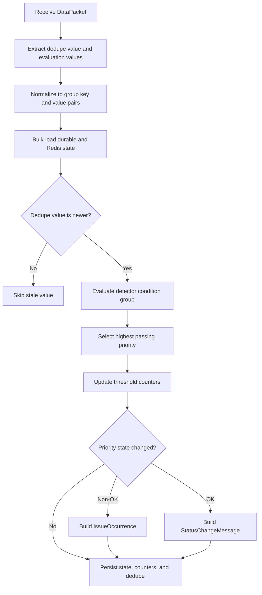
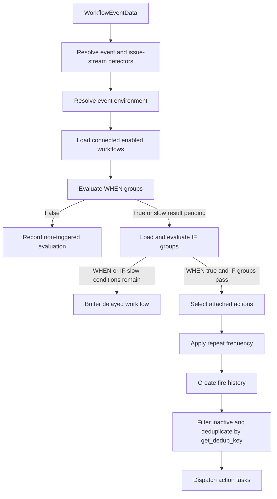

# Workflow Engine Execution

This document traces data through the Workflow Engine processors and asynchronous
boundaries. For persistent relationships, see [Data model](data-model.md). For an
implementation checklist, see [Adding detectors](adding-detectors.md).

## Two Pipelines

Detection and workflow processing are connected through Issue Platform, not by a direct
function call. Detector output is published to Issue Platform; the resulting issue event
later enters Workflow processing through post-processing or an activity. The overview
diagram is in the [module README](../README.md).

Existing issue events can enter at post-processing without first running a Workflow
Engine detector. This is how error and issue-stream workflows participate in the same
workflow pipeline.

## Detection Pipeline

### 1. Build a packet

A producer creates a typed [`DataPacket`](../models/data_source.py):

```python
DataPacket(source_id=str(source.id), packet=product_payload)
```

The packet's payload remains product-specific. The producer also supplies the source
type used to resolve `source_id`.

### 2. Resolve detectors

[`process_data_packet`](../processors/data_packet.py) is the generic entry point. It
calls [`process_data_source`](../processors/data_source.py), which resolves:

```text
(source type, source_id)
    -> DataSource
    -> DataSourceDetector
    -> Detector rows with enabled=True through the default manager
```

The lookup uses the detector-by-source cache and preloads trigger conditions. Cache
invalidation is connected to source, detector, and mapping updates.

The default manager excludes pending-deletion and deletion-in-progress rows, but this
path does not exclude every non-active status such as plan-level `DISABLED`.

Not every producer uses this generic lookup. Uptime, processing errors, and preprod
paths can identify detectors through product-specific data and call
[`process_detectors`](../processors/detector.py) directly. The handler contract is the
same after detector selection.

### 3. Evaluate each detector

`process_detectors` obtains `detector.detector_handler` from the detector's registered
`GroupType.detector_settings` and calls `evaluate(packet)`.

One packet can produce:

- No evaluation result
- One result for an ungrouped detector
- Multiple results keyed by `DetectorGroupKey`

A handler returns a mapping of group keys to `DetectorEvaluation` objects. An evaluation
can contain an `IssueOccurrence`, a `StatusChangeMessage`, or `None`;
`process_detectors` publishes only non-null results.

### 4. Stateful detector orchestration

Most threshold-based detectors inherit
[`StatefulDetectorHandler`](../handlers/detector/stateful.py):



The handler performs state I/O in bulk for grouped values. The exact transaction and
Redis pipeline behavior is implemented by `DetectorStateManager` in the same module.

Important semantics:

- Dedupe values must be positive integers that increase in event order. Equal or smaller
  values are ignored while the Redis watermark exists. The watermark defaults to zero
  when absent and expires after seven days.
- State is independent for each detector group key.
- Reaching a higher priority also increments applicable lower-priority counters.
- Thresholds describe how many qualifying evaluations, according to the priority
  counter rules, are needed before transition.
- A transition to a non-OK priority creates an occurrence.
- A transition to `OK` creates a status-change message.
- No state transition means no Issue Platform message.

Failing every non-OK condition does not infer recovery because a non-triggered group
produces no transition. Recovery requires a triggered group whose selected priority
remains `OK`. This normally comes from a passing condition with an `OK` result, but an
empty or passing `NONE` group can also trigger without a priority-bearing result and
therefore use the stateful handler's default `OK` priority. A missing trigger group is
invalid and produces no transition.

Custom detectors can inherit the smaller
[`BaseDetectorHandler`](../handlers/detector/base.py) or implement
[`DetectorHandler`](../handlers/detector/base.py) directly, but then they own more of
this orchestration.

### 5. Publish to Issue Platform

`process_detectors` passes detector results to
`create_issue_platform_payload` and
[`produce_occurrence_to_kafka`](../../issues/producer.py). The payload type distinguishes
occurrences from status changes.

Issue Platform ingestion creates or updates a group. The detector ID in occurrence
evidence allows ingestion to create a
[`DetectorGroup`](../models/detector_group.py) association. Resolution uses the stable
issue fingerprint to find the same group.

The Kafka boundary means detector evaluation succeeding does not imply that group
creation, workflow processing, or action dispatch has completed.

## Workflow Ingress

### Event post-processing

[`process_workflow_engine`](../../tasks/post_process.py) schedules the
[`process_workflows_event`](../tasks/workflows.py) task only for non-reprocessed jobs
with an event whose group is currently unresolved. The task rebuilds a
[`WorkflowEventData`](../types.py) from EventStore and Issue Platform data using
[`tasks/utils.py`](../tasks/utils.py). Resolution-driven processing enters through
supported issue activities instead.

### Issue activities

Issue activities invoke handlers through
[`invoke_workflow_activity_handlers`](../handlers/registry/invoke_activities.py).
Registered handlers receive an optional detector ID. A handler that schedules
[`process_workflow_activity`](../tasks/workflows.py) must first resolve a concrete
detector and pass its required detector ID with the activity and group.

Event and activity paths use `WorkflowEventData`, which contains:

- A `GroupEvent` or `Activity`
- The issue `Group`
- Optional group state and escalation information
- Optional workflow environment
- A per-event local cache for repeated lookups

They do not have identical scheduling. Activity processing has no workflow environment,
so it considers only global workflows. Activities do not enter batched condition data
acquisition; an activity whose WHEN or IF result still needs a slow query does not
continue through delayed processing.

## Workflow Pipeline

[`process_workflows`](../processors/workflow.py) is the main synchronous orchestrator
inside the workflow task.



### 1. Resolve event detectors

[`get_detectors_for_event_data`](../processors/detector.py) builds `EventDetectors`:

- For a `GroupEvent` with an occurrence, `event_detector` is resolved only from the
  occurrence's `detector_id` evidence; a missing or deleted ID yields no event detector.
  For an ordinary error event with no occurrence, the project's default error detector
  is used.
- `issue_stream_detectors` contains the project issue-stream detector and, when enabled,
  the organization all-projects detector.
- `preferred_detector` is the event detector when available, otherwise the first
  issue-stream detector.

The preferred detector is later supplied to actions that need detector context.
Detector deletion and older groups can leave associations missing, so lookup paths are
expected to degrade safely.

### 2. Resolve environment and workflows

The processor resolves the event environment, then
[`get_workflows_by_detectors`](../caches/workflow.py) loads workflows connected to any
selected detector. Eligible workflows must be enabled and either global
(`environment=None`) or connected to the event's environment.

The workflow cache is keyed by detector and environment. Relationship receivers
invalidate it after committed changes.

### 3. Evaluate WHEN conditions

[`evaluate_workflow_triggers`](../processors/workflow.py) evaluates each workflow's WHEN
group. A Workflow with no group passes. A conclusively false WHEN stops processing and
reports metrics/context; the returned per-Workflow result map can remain empty.

### 4. Evaluate IF groups

[`evaluate_workflows_action_filters`](../processors/workflow.py) loads IF groups from the
action-filter cache for workflows whose WHEN group passed or remains pending slow
evaluation. Fast IF results and remaining slow IF groups are retained with a pending
WHEN result so the combined work can be buffered.

Passing groups contribute their attached actions. A Workflow can therefore select
actions from multiple groups. A Workflow with no IF groups selects no actions.

The shared evaluation, fast/slow split, empty-group behavior, taint contract, and
Detector differences are documented once in [Conditions](conditions.md).

## Delayed Workflow Processing

The delayed path batches expensive conditions across workflows and issue groups.

```mermaid
sequenceDiagram
    participant Immediate as Immediate workflow processor
    participant Redis as Delayed workflow Redis
    participant Scheduler as Cohort scheduler
    participant Task as Delayed workflow task
    participant Snuba as Snuba
    participant Action as Action processor

    Immediate->>Redis: Store event and remaining condition IDs
    Scheduler->>Redis: Select due project cohorts
    Scheduler->>Task: Schedule project or project batch
    Task->>Redis: Load buffered items
    Task->>Snuba: Execute bulk queries
    Snuba-->>Task: Results by issue group
    Task->>Action: Fire passing groups
    Task->>Redis: Delete successfully processed items

    Note over Task,Snuba: Equivalent condition queries are collapsed into bulk queries;<br/>results are combined with fast results before firing.
```

### Buffering

[`DelayedWorkflowClient`](../buffer/batch_client.py) stores project IDs in sharded sorted
sets and each project's work in a hash. A hash field is keyed by workflow, issue group,
delayed WHEN and IF groups, and IF groups that already passed. Its value retains the
event or occurrence ID and original evaluation timestamp. Re-enqueuing the same field
overwrites that value, coalescing equivalent pending work rather than preserving every
event.

### Scheduling

The [`schedule_delayed_workflows`](../tasks/workflows.py) task acquires a global
scheduler lock around [`process_buffered_workflows`](../processors/schedule.py), which
divides projects into cohorts and schedules due work. Large project hashes are split into
batches so asynchronous task messages contain identifiers rather than large payloads.

### Evaluation

[`process_delayed_workflows`](../processors/delayed_workflow.py):

1. Parses buffered items.
2. Drops references to deleted workflows.
3. Loads remaining conditions.
4. Combines equivalent conditions into bulk queries.
5. Evaluates query results for each issue group.
6. Combines delayed results with fast results retained in the buffer key.
7. Reconstructs representative group events.
8. Sends passing action groups through the normal action path.
9. Deletes successfully processed Redis items.

Snuba rate limits are retried by the task. A missing per-group query result becomes a
tainted non-triggered evaluation. If a slow condition has no registered query handler,
no query is generated; processing can complete and remove the buffered item without
constructing that tainted result.

Malformed hash entries are excluded from the parsed event-key set and are not removed by
normal successful cleanup. They remain until expiry or manual cleanup.

## Action Selection and Dispatch

[`processors/action.py`](../processors/action.py) applies two different controls:

### Repeat frequency

[`WorkflowActionGroupStatus`](../models/workflow_action_group_status.py) tracks when each
workflow, action, and issue group tuple last passed the frequency check. It is updated
before event-level deduplication and task execution. A tuple is suppressed when it
passed within `Workflow.config.frequency` minutes, even if a later equivalent action was
deduplicated or an external handler failed.

### Event-level deduplication

`get_unique_active_actions` first removes actions whose status is not active, then keeps
one concrete action for each `Action.get_dedup_key()`. This is an implementation key,
not a guarantee that every semantically equivalent external side effect is recognized.
Invocation attribution comes from the concrete action retained for the key and does not
imply Workflow execution order.

### History and task dispatch

The processor updates frequency statuses and creates
[`WorkflowFireHistory`](../models/workflow_fire_history.py) rows before `fire_actions`
removes inactive actions and deduplicates by key. It then schedules
[`trigger_action`](../tasks/actions.py) for retained actions. Fire-history rows describe
scheduling, not successful external delivery, and can exist for actions that are later
filtered or deduplicated.

The action task:

1. Requires exactly one event ID or activity ID.
2. Rebuilds `WorkflowEventData`.
3. Loads the action and preferred detector.
4. Creates an [`ActionInvocation`](../types.py).
5. Calls the handler registered for the action type.

External integration calls therefore run outside the workflow evaluation task. Action
handlers must handle deleted integrations and other expected external-state changes.

## Processor Reference

| Processor                      | Input                      | Output                         | Side effects                                              | Async boundary             |
| ------------------------------ | -------------------------- | ------------------------------ | --------------------------------------------------------- | -------------------------- |
| `process_data_packet`          | Packet and source type     | Detector evaluations           | Source cache reads, detector state, Kafka payloads        | Called by product producer |
| `process_data_source`          | Packet and source type     | Packet and detectors           | Detector-source cache reads                               | None                       |
| `process_detectors`            | Packet and detector list   | Detector evaluations           | PostgreSQL/Redis state and Issue Platform Kafka           | Kafka after evaluation     |
| `process_data_condition_group` | Group and event/value      | Evaluation and slow conditions | Metrics and logs                                          | None                       |
| `process_workflows`            | `WorkflowEventData`        | Workflow evaluations           | Buffer writes, fire history, status updates, action tasks | Asynchronous action tasks  |
| `process_buffered_workflows`   | Delayed client             | None                           | Cohort metadata and delayed tasks                         | Asynchronous delayed tasks |
| `process_delayed_workflows`    | Project and optional batch | None                           | Snuba queries, action state/history, buffer cleanup       | Snuba and action tasks     |

## Failure and Consistency Model

- Database graph mutations and cache invalidation are coordinated with
  `transaction.on_commit()` where stale repopulation would be unsafe.
- Detector state and Issue Platform publication are not atomic. PostgreSQL and Redis
  state commit before `process_detectors` publishes, so a failure in between can cause a
  retry to be skipped by the committed dedupe watermark. See
  [Conditions](conditions.md) for the commit ordering.
- Issue Platform publication is asynchronous. There is no transaction spanning detector
  state, Kafka, group creation, workflow evaluation, and external actions.
- Workflow action frequency and deduplication reduce repeated side effects but do not
  provide a distributed exactly-once guarantee for an external provider.
- Delayed items are removed after successful processing so task retries can recover
  buffered work.
- Models referenced by queued work can be deleted before a task runs. Tasks and
  handlers must treat expected missing records as normal lifecycle races.

## Caches

| Cache                                                         | Purpose                                     | Approximate TTL |
| ------------------------------------------------------------- | ------------------------------------------- | --------------- |
| [`caches/detector.py`](../caches/detector.py)                 | Detectors connected to a data source        | 20 minutes      |
| [`caches/workflow.py`](../caches/workflow.py)                 | Workflows connected to detector/environment | 1 minute        |
| [`caches/action_filters.py`](../caches/action_filters.py)     | IF groups and actions for workflows         | 5 minutes       |
| Default detector cache in [`Detector`](../models/detector.py) | Default project/type lookup                 | 10 minutes      |

Treat receivers as part of the model mutation contract. A new relationship that affects
processing usually needs explicit invalidation coverage.

Receivers invalidate supported current relationship keys after commit. Updating a
`DataSource` type/source ID or a Workflow environment in place does not retain and
invalidate every old cache key; stale entries can therefore survive until TTL expiry.

## Observability and Debugging

The engine emits metrics for detector lookup/evaluation, condition evaluation, workflow
processing, delayed scheduling, caches, and actions. Logging helpers in
[`utils/log_context.py`](../utils/log_context.py) attach workflow and event context.

[`GroupedWorkflowEvaluationResult`](../processors/evaluations/workflow.py) can produce a
structured snapshot of workflow evaluations. Runtime options and feature flags control
sampling and direct logging.

When tracing a missing action, check the boundaries in order:

1. Was the source mapped to an enabled detector?
2. Did detector state transition and publish an Issue Platform message?
3. Was the resulting issue associated with the expected detector?
4. Did post-processing or activity handling schedule workflow evaluation?
5. Was the workflow connected, enabled, and valid for the environment?
6. Did WHEN and at least one IF group pass?
7. Was a slow condition buffered and later processed?
8. Was the action suppressed by frequency or event-level deduplication?
9. Was fire history created and the action task scheduled?
10. Did the action handler reject missing or invalid external configuration?

## Recommended Tests

- [`test_integration.py`](../../../../tests/sentry/workflow_engine/test_integration.py)
  covers the full detector and workflow paths.
- [`test_stateful.py`](../../../../tests/sentry/workflow_engine/handlers/detector/test_stateful.py)
  covers state transitions and Redis behavior.
- [`test_detector.py`](../../../../tests/sentry/workflow_engine/processors/test_detector.py)
  covers detector output and event detector selection.
- [`test_workflow.py`](../../../../tests/sentry/workflow_engine/processors/test_workflow.py)
  covers workflow evaluation.
- [`test_data_condition_group.py`](../../../../tests/sentry/workflow_engine/processors/test_data_condition_group.py)
  covers condition logic and fast/slow splitting.
- [`test_delayed_workflow.py`](../../../../tests/sentry/workflow_engine/processors/test_delayed_workflow.py)
  covers delayed queries and action firing.
- [`test_schedule.py`](../../../../tests/sentry/workflow_engine/processors/test_schedule.py)
  covers cohort scheduling and batches.
- [`test_actions.py`](../../../../tests/sentry/workflow_engine/tasks/test_actions.py)
  covers action task reconstruction and dispatch.
